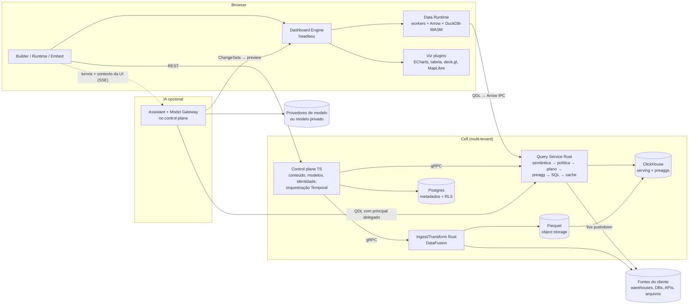

# BIWEB — Blueprint Arquitetural da Plataforma de BI

> Fundação técnica para uma plataforma de Business Intelligence web, multi-tenant, extensível, preparada para evoluir de uma primeira versão utilizável até escala comercial **sem reescrita estrutural**.
>
> Premissas: time médio/grande e misto · SaaS multi-tenant primeiro (dedicado/self-hosted depois) · postura de dados híbrida (live + import).
> Data: 2026-10-06 · Status: **Proposto** (para revisão e aceite dos ADRs na Fase 0).

---

## Sumário executivo (2 minutos)

**A arquitetura em uma frase:** dois monolitos modulares — **control plane em TypeScript** (isomórfico com o browser) e **data plane em Rust** (Arrow/DataFusion, com o compilador semântico também em WASM) — organizados em **cells multi-tenant**, com uma **semantic layer obrigatória** como única porta para os dados, um **Dashboard Engine declarativo e headless**, visualizações intercambiáveis por **contrato de plugin**, storage em **Parquet (verdade) + ClickHouse (serving) + warehouses do cliente (live)**, e um **copiloto de IA opcional** que orquestra essas mesmas capacidades com o principal do usuário, propondo mudanças como ChangeSets e narrando resultados determinísticos com evidências.



### Onze decisões que definem tudo
1. Dois planos (TS/Rust), monolitos modulares — [ADR-0001](architecture/adr/ADR-0001-two-plane-architecture.md)
2. Dashboard = documento JSON normalizado, versionado, com migrations — [ADR-0002](architecture/adr/ADR-0002-declarative-dashboard-document.md)/[0003](architecture/adr/ADR-0003-schema-authoring-and-migrations.md)
3. Semantic layer obrigatória + QDL (sem SQL no frontend) — [ADR-0005](architecture/adr/ADR-0005-mandatory-semantic-layer.md)/[0006](architecture/adr/ADR-0006-qdl-no-sql-in-frontend.md)
4. Segurança compilada no plano lógico (Cedar + RLS/CLS) e cache por SQL pós-política — [ADR-0017](architecture/adr/ADR-0017-cedar-authorization-compiled-data-policies.md)/[0020](architecture/adr/ADR-0020-secure-cache-fingerprint.md)
5. Um compilador semântico em Rust para servidor e browser (WASM) — [ADR-0008](architecture/adr/ADR-0008-bel-expression-language.md)
6. Parquet como verdade, ClickHouse como serving reconstruível — [ADR-0009](architecture/adr/ADR-0009-clickhouse-serving-parquet-truth.md)
7. Arrow ponta a ponta — [ADR-0010](architecture/adr/ADR-0010-arrow-wire-format.md)
8. Contrato de plugin de visualização; ECharts primário — [ADR-0011](architecture/adr/ADR-0011-visualization-plugin-contract.md)
9. Cells + tenant_id + RLS desde o primeiro commit — [ADR-0016](architecture/adr/ADR-0016-cells-and-multitenancy.md)
10. IA nativa e opcional: ferramentas sobre contratos existentes, principal delegado, ChangeSets com preview, Model Gateway com política de dados por tenant — [31](architecture/31-ai-assistant.md), [ADR-0033](architecture/adr/ADR-0033-ai-optional-orchestration-layer.md)–[0041](architecture/adr/ADR-0041-ai-quality-evals.md)
11. Complexidade só com gatilho: Kafka, K8s, Iceberg, CRDT, Trino, Zanzibar adiados — [30 · decisões adiáveis](architecture/30-roadmap.md#decisoes-adiaveis)

### Onde começar a ler
| Se você é... | Leia |
|---|---|
| Liderança / produto | [00 Executive summary](architecture/00-executive-summary.md) → [30 Roadmap e resultado](architecture/30-roadmap.md) |
| Arquiteto | [01 High-level](architecture/01-high-level-architecture.md) → [02 Domínio](architecture/02-domain-architecture.md) → [20 Contratos](architecture/20-api-and-contracts.md) → [ADRs](architecture/adr/README.md) |
| Frontend | [04](architecture/04-frontend-architecture.md) → [05](architecture/05-dashboard-engine.md) → [06](architecture/06-dashboard-builder.md) → [07](architecture/07-visualization-engine.md) → [13](architecture/13-browser-data-runtime.md) |
| Dados / backend | [03](architecture/03-data-architecture.md) → [09](architecture/09-ingestion-and-connectors.md) → [10](architecture/10-transformation-engine.md) → [11](architecture/11-semantic-layer.md) → [12](architecture/12-query-engine.md) |
| Segurança / plataforma | [16](architecture/16-multi-tenancy.md) → [17](architecture/17-security-and-permissions.md) → [23](architecture/23-infrastructure-and-deployment.md) → [24](architecture/24-testing-and-cicd.md) |
| IA / produto inteligente | [31 IA nativa](architecture/31-ai-assistant.md) → [schemas/assistant.ts](architecture/schemas/assistant.ts) → [28 Flows G–J](architecture/28-flows.md) → [ADRs 0033–0041](architecture/adr/README.md) |
| Quem vai implementar | [32 Épicos e prompts de implementação](architecture/32-epics-and-implementation-prompts.md) |

---

## Mapa: seção pedida → documento

### Estrutura de resposta (§51 do pedido)
| # | Seção | Documento |
|---|---|---|
| 1 | Executive Architecture Summary | [00](architecture/00-executive-summary.md#1-executive-architecture-summary) |
| 2 | Product capabilities map | [00](architecture/00-executive-summary.md#2-product-capabilities-map) |
| 3 | Architecture principles | [00](architecture/00-executive-summary.md#3-architecture-principles) |
| 4 | High-level architecture | [01](architecture/01-high-level-architecture.md) |
| 5 | Domain architecture | [02](architecture/02-domain-architecture.md) |
| 6 | Data architecture | [03](architecture/03-data-architecture.md) |
| 7 | Frontend architecture | [04](architecture/04-frontend-architecture.md) |
| 8 | Dashboard Engine | [05](architecture/05-dashboard-engine.md) |
| 9 | Dashboard Builder architecture | [06](architecture/06-dashboard-builder.md) |
| 10 | Visualization Engine | [07](architecture/07-visualization-engine.md) |
| 11 | Geospatial architecture | [08](architecture/08-geospatial.md) |
| 12 | Data ingestion | [09](architecture/09-ingestion-and-connectors.md#12-data-ingestion) |
| 13 | Transformation Engine | [10](architecture/10-transformation-engine.md) |
| 14 | Semantic Layer | [11](architecture/11-semantic-layer.md) |
| 15 | Query Engine | [12](architecture/12-query-engine.md) |
| 16 | Analytical storage | [03 §16](architecture/03-data-architecture.md#16-analytical-storage--avaliação-e-papéis) |
| 17 | Browser Data Runtime | [13](architecture/13-browser-data-runtime.md) |
| 18 | Rust/WASM architecture | [13 §18](architecture/13-browser-data-runtime.md#18-rustwasm-architecture) |
| 19 | Realtime architecture | [14](architecture/14-realtime.md) |
| 20 | Cache strategy | [12 §20](architecture/12-query-engine.md#20-cache-strategy) |
| 21 | Preaggregation strategy | [12 §21](architecture/12-query-engine.md#21-preaggregation-strategy) |
| 22 | Backend architecture | [15](architecture/15-backend.md) |
| 23 | Multi-tenancy | [16](architecture/16-multi-tenancy.md) |
| 24 | Security architecture | [17](architecture/17-security-and-permissions.md) |
| 25 | Permissions architecture | [17 §25](architecture/17-security-and-permissions.md#25-permissions-architecture) |
| 26 | Plugin architecture | [18](architecture/18-plugins.md) |
| 27 | Connector architecture | [09 §27](architecture/09-ingestion-and-connectors.md#27-connector-architecture) |
| 28 | Embedded analytics architecture | [19](architecture/19-embedded-analytics.md) |
| 29 | API architecture | [20](architecture/20-api-and-contracts.md) |
| 30 | Collaboration architecture | [21 §30](architecture/21-versioning-and-collaboration.md#30-collaboration-architecture) |
| 31 | Storage strategy | [03 §31](architecture/03-data-architecture.md#31-storage-strategy) |
| 32 | Job orchestration | [15 §32](architecture/15-backend.md#32-job-orchestration) |
| 33 | Observability | [22 §33](architecture/22-observability-lineage-governance.md#33-observability) |
| 34 | Data lineage | [22 §34](architecture/22-observability-lineage-governance.md#34-data-lineage) |
| 35 | Governance | [22 §35](architecture/22-observability-lineage-governance.md#35-governance-e-data-catalog) |
| 36 | Infrastructure | [23 §36](architecture/23-infrastructure-and-deployment.md#36-infrastructure) |
| 37 | Deployment architecture | [23 §37](architecture/23-infrastructure-and-deployment.md#37-deployment-architecture) |
| 38 | Testing strategy | [24 §38](architecture/24-testing-and-cicd.md#38-testing-strategy) |
| 39 | Repository architecture | [25](architecture/25-repository.md) |
| 40 | CI/CD | [24 §40](architecture/24-testing-and-cicd.md#40-cicd) |
| 41 | Scalability strategy | [23 §41](architecture/23-infrastructure-and-deployment.md#41-scalability-strategy) |
| 42 | Failure scenarios | [26 §42](architecture/26-failures-and-risks.md#42-failure-scenarios) |
| 43 | Technology evaluation | [27 §43](architecture/27-technology-evaluation.md#43-visão-geral-da-avaliação) |
| 44 | Technology decision matrix | [27 §44](architecture/27-technology-evaluation.md#44-technology-decision-matrix-resumo-ponderado) |
| 45 | Architecture risks | [26 §45](architecture/26-failures-and-risks.md#45-architecture-risks) |
| 46 | Architecture Decision Records | [adr/](architecture/adr/README.md) |
| 47 | Development phases | [30 §47](architecture/30-roadmap.md#47-development-phases-arquitetura-evolutiva) |
| 48 | Dependency map | [30 §48](architecture/30-roadmap.md#48-dependency-map) |
| 49 | Critical path | [30 §49](architecture/30-roadmap.md#49-critical-path) |
| 50 | Recommended starting implementation | [30 §50](architecture/30-roadmap.md#50-recommended-starting-implementation) |
| 51 | Final recommended technology stack | [30 §51](architecture/30-roadmap.md#51-final-recommended-technology-stack) |

### Demais itens do pedido
| Item | Documento |
|---|---|
| §2 Princípio central — Dashboard Engine (schema, versionamento, migrations, undo/redo, templates...) | [05](architecture/05-dashboard-engine.md) |
| §3 Revisão da cadeia de camadas | [01 §4.1](architecture/01-high-level-architecture.md#41-revisão-crítica-da-cadeia-proposta) |
| §14 Apache Arrow | [13 §17.2](architecture/13-browser-data-runtime.md#arrow) |
| §16 Web Workers / §17 WebGPU-WebGL | [13](architecture/13-browser-data-runtime.md) |
| §29 Versionamento | [21](architecture/21-versioning-and-collaboration.md) |
| §31 Design System | [04 §31](architecture/04-frontend-architecture.md#31-design-system) |
| §32 Performance budget e classes de workload | [23](architecture/23-infrastructure-and-deployment.md#32-performance-budget) |
| §41 Filas | [15](architecture/15-backend.md#41-pedido-filas-e-tarefas-assíncronas) |
| §42 Feature flags · §43 Edições | [24](architecture/24-testing-and-cicd.md#42-pedido-feature-flags) |
| §47 DDD / bounded contexts | [02](architecture/02-domain-architecture.md) |
| §48 Erros arquiteturais a evitar | [26](architecture/26-failures-and-risks.md#48-pedido-erros-arquiteturais-a-evitar--e-como-a-arquitetura-os-previne) |
| §52 Matrizes de decisão tecnológica | [27 §52](architecture/27-technology-evaluation.md#52-matrizes-de-decisão) |
| §53 Fluxos A–F | [28](architecture/28-flows.md) |
| §54 Diagramas Mermaid | ver tabela abaixo |
| §55 Escala (10 → 10.000 clientes) | [23 §55](architecture/23-infrastructure-and-deployment.md#55-escala--cenários-progressivos) |
| §56 Custo | [23 §56](architecture/23-infrastructure-and-deployment.md#56-custo) |
| §57 Princípio de processamento | [01 §57](architecture/01-high-level-architecture.md#57-principio-de-processamento) |
| §58 Contratos entre camadas | [20 §58](architecture/20-api-and-contracts.md#58-contratos) |
| §59 Schemas centrais | [29](architecture/29-schemas.md) + [schemas/](architecture/schemas/) |
| §60 Resultado final (rejeitadas, riscos, decisões agora/adiáveis, primeiro commit, ADRs) | [30 §60](architecture/30-roadmap.md#60-resultado-final) |

### IA nativa (incorporação de 2026-10-06)
| Item | Documento |
|---|---|
| Arquitetura da IA (papel, contexto, ferramentas, ações, segurança, custo, fases) | [31](architecture/31-ai-assistant.md) |
| Impacto por componente (mapa da incorporação transversal) | [31 §24](architecture/31-ai-assistant.md#24-impacto-por-componente) |
| Contratos novos | [schemas/assistant.ts](architecture/schemas/assistant.ts) + extensões em `common`, `query`, `semantic-model`, `dataset`, `visualization`, `plugin-manifest` |
| Contratos alterados | [20 §58](architecture/20-api-and-contracts.md#58-contratos) |
| ADRs novos e emendas | [adr/README](architecture/adr/README.md) |
| Fluxos G–J | [28](architecture/28-flows.md) |
| Roadmap, trilha de IA e caminho crítico | [30](architecture/30-roadmap.md) |
| Épicos e prompts de implementação | [32](architecture/32-epics-and-implementation-prompts.md) |

### Diagramas (§54)
| Diagrama | Onde |
|---|---|
| Arquitetura geral | [01 §4.2](architecture/01-high-level-architecture.md#42-arquitetura-geral-sistema-completo) |
| Fluxo de dados | [01 §4.3](architecture/01-high-level-architecture.md#43-fluxo-de-dados-visão-consolidada), [03 §6.1](architecture/03-data-architecture.md) |
| Query lifecycle | [12 §15.2](architecture/12-query-engine.md#152-query-lifecycle) |
| Dashboard lifecycle | [05 §8.7](architecture/05-dashboard-engine.md#87-dashboard-lifecycle) |
| Realtime | [14 §19.3](architecture/14-realtime.md#193-arquitetura) |
| Ingestion | [09 §12.2](architecture/09-ingestion-and-connectors.md#122-pipeline-de-ingestão-workflow-temporal) |
| Plugin architecture | [18 §26.2](architecture/18-plugins.md#262-arquitetura) |
| Frontend | [04 §7.2](architecture/04-frontend-architecture.md#72-separação-de-camadas-do-frontend) |
| Backend | [15 §22.2](architecture/15-backend.md#222-arquitetura-do-backend) |
| Multi-tenancy | [16 §23.2](architecture/16-multi-tenancy.md#232-cells--a-decisão-estrutural) |
| Deployment | [23 §37](architecture/23-infrastructure-and-deployment.md#37-deployment-architecture) |
| Context map (DDD) | [02 §5.3](architecture/02-domain-architecture.md#53-context-map) |
| ER dos schemas / modelo semântico | [29](architecture/29-schemas.md#relacionamentos), [11 §14.2](architecture/11-semantic-layer.md#142-modelo-conceitual) |
| Sequências dos fluxos A–F | [28](architecture/28-flows.md) |
| Arquitetura da IA, contexto, ciclo de vida de ChangeSet | [31](architecture/31-ai-assistant.md) |
| Sequências dos fluxos de IA G–J | [28](architecture/28-flows.md) |
| Insights Engine | [12 §15.5](architecture/12-query-engine.md#155-insights-engine-fase-4) |

---

## Estrutura deste diretório
```text
docs/
├── README.md                     ← você está aqui
└── architecture/
    ├── 00 … 32-*.md              ← blueprint por área (31 = IA nativa, 32 = épicos e prompts)
    ├── adr/                      ← 41 ADRs + índice
    └── schemas/                  ← sketches TypeScript das entidades centrais + exemplos JSON
```
