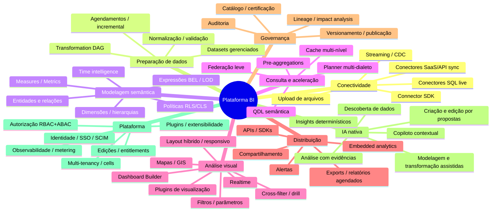

# 00 — Executive Summary, Capability Map e Princípios

> Seções do pedido: **§1 Executive Architecture Summary**, **§2 Product capabilities map**, **§3 Architecture principles**.

---

## 1. Executive Architecture Summary

### O que estamos construindo
Uma **plataforma** de BI (não uma aplicação), composta por cinco motores com contratos estáveis entre si:

| Motor | Responsabilidade | Onde roda | Linguagem |
|---|---|---|---|
| **Data Pipelines** | Conectar, extrair, normalizar e materializar dados | Data plane (workers) | Rust |
| **Semantic Layer** | Fonte única de regras de negócio (métricas, dimensões, relações, políticas) | Autoria no control plane; compilação no data plane e no browser (WASM) | TS (autoria) + Rust (compilador) |
| **Query Engine** | Traduzir perguntas semânticas em queries otimizadas, seguras, cacheadas e aceleradas | Data plane | Rust |
| **Dashboard Engine** | Interpretar documentos declarativos de dashboard em queries, estado e interações | Browser **e** servidor (isomórfico) | TypeScript |
| **Visualization Engine** | Renderizar dados via plugins intercambiáveis | Browser (+ render service para exports) | TypeScript |

### As decisões que definem a arquitetura

1. **Dois planos, cada um um monolito modular.** *Control plane* em **TypeScript (Node + Fastify)** — identidade, tenancy, conteúdo, autoria semântica, orquestração, entrega, governança. *Data plane* em **Rust** — compilador semântico, query service, conectores, ingestão/transformação, pre-aggregations, realtime gateway. Não há microservices no início; há **duas fronteiras de deploy justificadas** por perfis de carga e domínios de falha diferentes (uma query descontrolada não derruba o login). Ver [ADR-0001](adr/ADR-0001-two-plane-architecture.md).
2. **Dashboard = documento declarativo, normalizado e versionado** (JSON, IDs estáveis, fractional indexing, schema JSON canônico com migrations). O editor manipula o documento por **operações invertíveis** → undo/redo, diff, histórico e colaboração futura saem da mesma base. Ver [05](05-dashboard-engine.md).
3. **Semantic Layer obrigatória.** Widgets referenciam apenas objetos semânticos por ID. O frontend **nunca** gera SQL; envia uma **QDL** (Query Definition Language) semântica. Políticas de segurança (RLS/CLS) são **injetadas no plano lógico antes da otimização**. Ver [11](11-semantic-layer.md), [12](12-query-engine.md).
4. **Um único compilador semântico em Rust**, compilado para nativo (servidor) e **WASM** (browser: validação de fórmulas, autocomplete, queries locais via DuckDB-WASM). Essa é a razão concreta para Rust+WASM — não modismo.
5. **Storage em camadas:** PostgreSQL (metadados/OLTP) · **Parquet em object storage** (fonte da verdade dos dados importados, snapshots imutáveis) · **ClickHouse** (serving analítico, pre-aggregations, realtime, telemetria) · warehouses do cliente (live query). Ver [03](03-data-architecture.md).
6. **Arrow ponta a ponta para dados**: Arrow IPC na Query API, Arrow em memória no browser, atributos binários direto para a GPU (deck.gl). JSON para metadados e consumidores simples.
7. **Visualização por contrato de plugin** framework-agnóstico; **ECharts** como adapter primário, tabela/pivot próprios, **deck.gl + MapLibre** para mapas e larga escala. Nenhum tipo de biblioteca entra no documento. Ver [07](07-visualization-engine.md).
8. **Multi-tenancy por cells desde o primeiro commit**: indireção tenant→cell mesmo com uma só cell; `tenant_id` + Postgres RLS; dedicado = cell dedicada; self-hosted = uma cell instalada pelo cliente. Ver [16](16-multi-tenancy.md).
9. **Temporal** para workflows duráveis (syncs, refresh, exports, pre-aggs); **outbox transacional no Postgres** para eventos do control plane.
10. **IA nativa e opcional:** um copiloto contextual (criar, editar, analisar, descobrir, modelar, transformar) que **orquestra capacidades existentes** como ferramentas: QDL, ops do Dashboard Engine, semantic compiler, Insights Engine determinístico. A IA age com o principal delegado do usuário, propõe mudanças como **ChangeSets** com preview e passa por um **Model Gateway** único com política de dados por tenant. A plataforma funciona 100% sem IA. Ver [31](31-ai-assistant.md).
11. **Evolução sem reescrita:** cada fase do roadmap entrega componentes da arquitetura final (ex.: o primeiro gráfico já é um plugin; o primeiro conector já usa o Connector SDK interno; a primeira query já passa por planner + política + cache). Ver [30](30-roadmap.md).

### O que deliberadamente NÃO fazemos agora (mas a arquitetura prevê)
CRDT/multiplayer, Kubernetes, Kafka/NATS, busca vetorial, multi-provedor de IA/BYO model, ferramentas de IA de plugins, MCP, Apache Iceberg, tier DuckDB de serving, Trino/federação pesada, renderizadores WebGPU próprios, pre-aggregation automática, marketplace de plugins, GraphQL, multi-região, Zanzibar. Cada item tem **gatilho de adoção** documentado em [30-roadmap.md](30-roadmap.md#decisoes-adiaveis).

### Premissas
- Time médio/grande e misto (TS, backend, dados) → dedicar um time de data plane com 2–3 engenheiros Rust sênior.
- SaaS multi-tenant primeiro; dedicado/self-hosted para enterprise depois — **mesmo artefato**.
- Postura de dados **híbrida**: live query em warehouses do cliente + import para storage gerenciado.

---

## 2. Product Capabilities Map

### Capabilities × motor responsável × fase

| Capability | Motor/Contexto dono | Fase de entrada | Fase de maturidade |
|---|---|---|---|
| Conectar Postgres/MySQL/ClickHouse/Snowflake/BigQuery (live) | Connectivity + Query | 1 | 3 |
| Upload CSV/Excel/Parquet → dataset gerenciado | Pipelines | 1 | 3 |
| Conectores SaaS/REST declarativos | Connectivity | 3 | 5 |
| Transformation DAG visual | Pipelines | 3 | 6 |
| Modelo semântico (entidades, dims, measures, metrics, relações) | Semantic | 1 | 3 |
| BEL, LOD, time intelligence | Semantic | 3 | 5 |
| QDL + planner + RLS + cache | Query | 1 | 3 |
| Pre-aggregations declaradas | Query | 3 | 7 (automáticas) |
| Dashboard Builder (grid + stack) | Content / Builder | 2 | 3 (free layout) |
| Filtros, parâmetros, cross-filter, drill | Dashboard Engine | 2 | 3 |
| Mapas (choropleth, pontos, H3) | Visualization / Geo | 3 | 5 |
| Realtime | Realtime | 4 | 7 |
| Exports PNG/PDF/CSV/Excel + agendados | Delivery | 3 | 6 (PPTX) |
| Embedding iframe assinado | Sharing & Embedding | 3 | 5 (SDK JS/React) |
| Plugins de terceiros | Extensibility | 5 | 7 |
| Lineage / impact analysis | Governance | 2 (extração) | 6 (UI/catálogo) |
| SSO OIDC/SAML | Identity | 0 (via broker) | 6 (SCIM, ABAC) |
| Multiplayer | Collaboration | 7 | — |
| Viz Recommender ("Sugerir visualização", sem IA) | Visualization | 2 | 3 |
| Copiloto de IA: criar, editar, descobrir (AI v1) | Assistant | 3 | 5 |
| Insights determinísticos ("Explicar variação", anomalias) | Query & Acceleration | 4 | 6 |
| IA analista e modeladora (AI v2) | Assistant | 4 | 6 |
| IA em embeds, BYO model, MCP, ferramentas de plugins (AI v3) | Assistant + Extensibility | 5 | 6 |

---

## 3. Architecture Principles

Cada princípio é **verificável** — tem uma consequência concreta em código, revisão ou teste.

| # | Princípio | Consequência verificável |
|---|---|---|
| P1 | **Declarativo antes de imperativo.** Dashboards, modelos, pipelines e plugins são documentos validados por schema. | Todo documento tem `schemaVersion`, JSON Schema publicado e migrations testadas por corpus. |
| P2 | **Semântica é a única porta de entrada para dados.** | Query API rejeita qualquer request que não seja QDL; não existe endpoint "execute SQL" para viewers. |
| P3 | **Segurança é compilada, não filtrada depois.** | RLS/CLS injetadas no plano lógico; teste de propriedade: "nenhum plano físico sem predicado de política aplicável". |
| P4 | **Tenant é parte da identidade de tudo.** | `tenant_id` em toda PK; Postgres RLS ativo; chaves de cache, objetos S3, databases ClickHouse e namespaces de fila prefixados. |
| P5 | **Contratos antes de implementações.** | Fronteiras entre camadas definidas por JSON Schema / Protobuf / interfaces TS versionadas; nenhuma camada importa internals de outra. |
| P6 | **Mova computação para perto dos dados; mova pixels, não linhas.** | Agregação no banco; browser recebe resultados agregados com orçamento de linhas por widget. |
| P7 | **Processamento local só quando ganha.** | WASM/workers apenas para workloads com benchmark que comprove ganho (ver [01 §57](01-high-level-architecture.md#57-principio-de-processamento)). |
| P8 | **Sem vendor lock-in em pontos de alta volatilidade.** | Bibliotecas de gráficos atrás de adapters; engines analíticos atrás de dialetos; IdP atrás de OIDC/SAML; Kafka-API em vez de produto. |
| P9 | **Monolito modular primeiro; extrair por evidência.** | Módulos com fronteiras de pacote e testes de dependência (lint de imports); extração só com métrica (escala, falha, time). |
| P10 | **Imutabilidade para o que importa auditar.** | Revisões de dashboards/modelos e snapshots de datasets são imutáveis e content-addressed. |
| P11 | **Observável por construção.** | `traceparent` do browser ao SQL; todo widget→query→engine rastreável; métricas por tenant. |
| P12 | **Tudo que roda em background é idempotente.** | Jobs com chave de idempotência, checkpoints e publicação atômica. |
| P13 | **Mesma base para todas as edições e deployments.** | Edições via entitlements; dedicado/self-hosted = mesma imagem com outra configuração de cell. |
| P14 | **Complexidade precisa de um gatilho.** | Toda tecnologia sofisticada tem ADR com "por que agora" ou "gatilho de adoção". |
| P15 | **Acessibilidade e i18n são estruturais.** | Design system com React Aria; strings externalizadas desde o início (pt-BR, en). |
| P16 | **AI-native, AI-optional.** A IA orquestra capacidades da plataforma; nada no core depende dela. | Nenhum módulo core importa o Model Gateway; suíte E2E roda com a IA desligada; toda ferramenta declara a capacidade que encapsula. |
| P17 | **A IA nunca tem mais poder que o usuário e nunca muta sem passar pelos mecanismos normais.** | Principal delegado (`via: assistant`) em toda ferramenta; mudanças só via ChangeSet → `dashboard-core`; não existem ferramentas de publicar, compartilhar ou acessar credenciais. |
| P18 | **A IA narra; a plataforma calcula.** | Números em respostas vêm de QDL/Insights com citação; verificador de grounding nos evals. |
