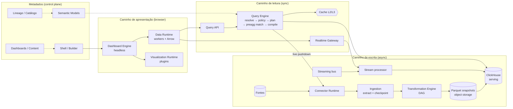
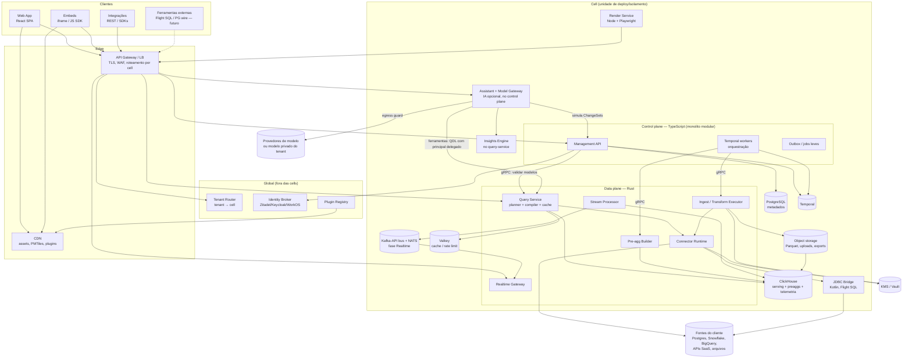
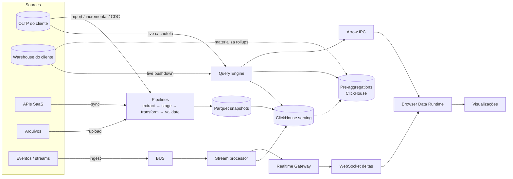

# 01 — High-Level Architecture

> Seções do pedido: **§4 High-level architecture**, revisão da cadeia de camadas (§3 do pedido), **§57 Princípio de processamento**.

---

## 4.1 Revisão crítica da cadeia proposta

A cadeia sugerida (`Fontes → Connectors → Ingestion → Normalization → Storage → Semantic → Query → Cache → API → Streaming → Browser Runtime → Dashboard Engine → Visualization → Builder → End User`) mistura **três eixos diferentes** numa linha única:

1. **Caminho de escrita de dados** (assíncrono, em lote/stream): conectar → extrair → transformar → materializar.
2. **Caminho de leitura/consulta** (síncrono, interativo): pergunta semântica → plano → execução → resultado.
3. **Caminho de apresentação** (browser): estado → queries → dados → pixels.

Problemas da cadeia linear:

- **Live query não passa por ingestão.** Em modo live, o Query Engine fala diretamente com o conector (pushdown). Uma cadeia linear sugere que todo dado é ingerido.
- **Cache e pre-aggregation não são camadas abaixo da API**: são **decisões do planner** (aggregate awareness, cache lookup por fingerprint). Tratar como camada leva a cache "burro" na frente da API, que vaza dados entre usuários com RLS diferente.
- **Streaming não fica entre API e browser**: é um caminho paralelo de escrita (bus → processor → storage) com um *gateway de leitura incremental* irmão da Query API.
- **Builder não fica "acima" da visualização**: Builder é um *editor do documento*; o Runtime interpreta o documento; a visualização é plugada no runtime. Builder e End User usam o **mesmo runtime**.
- **Semantic Layer não fica "acima do storage"** apenas: ela também descreve fontes live e é usada no browser (WASM) para validar e compilar.

### Cadeia revisada (três caminhos + metadados)

### Responsabilidade de cada camada

| Camada | Responsabilidade | NÃO é responsável por |
|---|---|---|
| **Connector Runtime** | Autenticação na fonte, descoberta de schema, leitura paginada/incremental, execução de SQL pushdown, rate limit, retries | Regras de negócio, transformação, cache |
| **Ingestion** | Planejar extrações, checkpoints, staging, idempotência, schema drift, publicação atômica de snapshots | Interpretar significado dos dados |
| **Transformation Engine** | Executar DAG declarativo (pushdown SQL ou DataFusion), validação, lineage por coluna | Definir métricas de negócio |
| **Managed Storage** | Snapshots Parquet (verdade) + tabelas de serving no ClickHouse + pre-aggs | Autorização de usuário final |
| **Semantic Layer** | Entidades, relações, dimensões, measures, metrics, políticas, formatos; compilação de expressões | Execução de queries |
| **Query Engine** | Resolver QDL, injetar políticas, planejar joins, escolher pre-agg/cache, compilar dialeto, executar, pós-processar | Renderização, estado de UI |
| **Query API / Realtime Gateway** | AuthN, rate limit, serialização Arrow/JSON, subscriptions, backpressure | Lógica de planejamento |
| **Data Runtime (browser)** | Cache L1, deduplicação, priorização e cancelamento de queries, decodificação Arrow, computação local (workers/WASM) | Construir SQL |
| **Dashboard Engine** | Interpretar documento: estado de filtros/parâmetros/seleções, gerar QueryRequests por widget, propagar interações | Desenhar pixels |
| **Visualization Runtime** | Montar plugins, entregar `DataFrameView`, traduzir eventos normalizados | Buscar dados |
| **Builder** | Editar o documento via comandos; inspector, árvore, layout | Executar dashboards de forma diferente do runtime |
| **Application Shell** | Navegação, auth de sessão, catálogo, administração | Lógica de dashboard |
| **Assistant (IA, opcional)** | Orquestrar ferramentas que encapsulam as capacidades acima; montar contexto a partir da UI; propor ChangeSets; narrar resultados com evidências | Acessar dados ou mutar documentos por caminho próprio; calcular números; ser dependência de qualquer camada |
| **Model Gateway** | Ponto único de chamadas a modelos: roteamento, egress guard, quotas, metering, telemetria | Lógica de produto |
| **Insights Engine** | Algoritmos determinísticos (comparação, decomposição de variação, anomalias, outliers) via QDL | Narrativa; acesso fora do planner |

---

## 4.2 Arquitetura geral (sistema completo)

**Leitura do diagrama**
- O **gateway** roteia por cell usando o Tenant Router (mapeamento cacheado). Dentro da cell, rotas `/api/v1/*` vão ao control plane, `/query/*` ao Query Service, `/realtime` ao Realtime Gateway.
- O control plane **nunca** acessa dados de clientes; ele orquestra. Credenciais são decifradas **somente** no data plane.
- O **Assistant** (IA) é um consumidor das mesmas APIs: consulta via QDL com o principal do usuário, propõe mudanças que o `dashboard-core` valida, e só fala com provedores de modelo pelo Model Gateway. Removê-lo não afeta nenhuma outra caixa do diagrama ([31](31-ai-assistant.md)).
- O Render Service é um *cliente* da própria plataforma (abre o runtime real em Chromium headless com token de serviço), garantindo que export = tela.

---

## 4.3 Fluxo de dados (visão consolidada)

---

## 57. Princípio de processamento — onde cada workload executa

### Critérios de decisão (em ordem)

1. **Segurança:** o browser só recebe linhas que o usuário pode ver. Nada que dependa de política é decidido no cliente.
2. **Volume vs resultado:** se o *input* é grande e o *output* é pequeno (agregação), execute perto dos dados.
3. **Reuso entre usuários:** se o mesmo resultado serve muitos usuários, compute no servidor e cacheie.
4. **Frequência de interação:** interações sub-100 ms repetidas sobre o **mesmo** conjunto pequeno → local.
5. **Custo de transferência:** bytes trafegados × frequência × egress.
6. **Capacidade do cliente:** dispositivos móveis/embeds de terceiros têm orçamento menor.
7. **Ganho medido:** WASM/GPU só com benchmark comprovando ganho sobre JS/servidor.

### Matriz de placement

| Workload | Local recomendado | Justificativa | Fallback |
|---|---|---|---|
| Agregações sobre milhões+ de linhas | **Analytical DB** (ClickHouse / warehouse) | Input enorme, output pequeno; vetorização no banco | Pre-aggregation |
| Joins entre fontes diferentes | **Backend (DataFusion)** sobre resultados já agregados; se pesado → importar | Federação leve evita Trino | Import/materialização |
| Totais, subtotais, pivots de resultados | **Backend** (pós-processamento DataFusion) | Consistência com semântica; reuso em export | — |
| Cross-filter sobre resultado já carregado (≤ ~100k linhas, mesma granularidade) | **Browser worker** (JS typed arrays) | Latência < 50 ms sem round-trip | Re-query |
| Reagregação local ("coarsening": mês→trimestre, remover dimensão aditiva) | **Browser worker** | Evita round-trip; só válido para measures aditivas | Re-query |
| Dataset local do usuário (arquivo no browser, offline) | **Browser: DuckDB-WASM em worker** | Dado nunca sai da máquina; SQL completo | Upload para servidor |
| Validação/autocomplete de fórmulas BEL | **Browser: Rust compiler em WASM** | Feedback instantâneo; mesma gramática do servidor | Validação server-side |
| Ordenação/formatação de tabelas pequenas | **Main thread / worker** | Trivial | — |
| Downsampling de séries (LTTB) e binning | **Analytical DB** quando possível; **worker** para dados locais | Reduz bytes trafegados | — |
| Agregação espacial (H3, geohash) | **Analytical DB** | Funções H3 nativas; output pequeno | Worker (h3 WASM) para datasets locais |
| Point-in-polygon para destaque de seleção | **Worker / WASM** (resultado já em memória) | Interativo | Servidor |
| Renderização de > ~50k pontos | **GPU** (deck.gl WebGL2/WebGPU) | Canvas/SVG não escalam | Agregação no servidor |
| Transformações de ingestão (arquivos/APIs) | **Workers backend (DataFusion)** | Volume e reprodutibilidade | — |
| Transformações sobre dados já no ClickHouse/warehouse | **Pushdown SQL** | Não movimentar dados | DataFusion |
| Janelas de agregação em streaming | **ClickHouse MVs incrementais / stream processor** | Estado contínuo, compartilhado | — |
| Exports PDF/PNG | **Render service** | Fidelidade com o runtime real | — |
| Raciocínio/linguagem da IA | **Provedor via Model Gateway** (ou modelo privado) | Apenas contexto permitido pela política de IA; dados minimizados | IA desligada |
| Cálculos usados em respostas da IA (comparações, variações, anomalias) | **Insights Engine → Analytical DB** | Determinístico, reprodutível, sob RLS | — |
| Validação de saídas da IA (QDL, BEL, ops, DAG) | **Compiladores existentes** (servidor; WASM no browser para feedback) | Mesma validação de qualquer edição humana | — |
| Preview de propostas da IA | **Browser (`dashboard-core`)** | Renderiza com o runtime real, sem gravar | — |
| Recomendação de visualização | **Viz Recommender (TS, browser ou servidor)** | Regras sobre manifests; sem modelo | — |
| Excel/CSV grandes | **Worker backend (Rust)** streaming | Memória constante | — |
| Detecção de anomalia / forecasting | **Backend/DB** (fase futura) | Modelo e dados no servidor | — |

### Anti-padrões explicitamente proibidos
- Enviar dados "crus" ao browser para agregar lá quando o banco pode agregar.
- Cachear resultados no browser de forma persistente (IndexedDB) com dados sensíveis sem criptografia/expiração — dados ficam só em memória por padrão.
- Aplicar RLS no cliente.
- Usar WASM para operações que JS faz em < 16 ms sobre o volume real.
