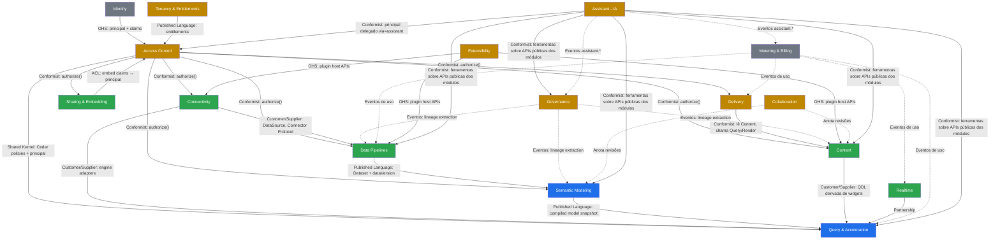

# 02 — Domain Architecture (DDD)

> Seções do pedido: **§5 Domain architecture**, **§47 Domain-Driven Design**.

---

## 5.1 Revisão da lista candidata

A lista proposta (Identity, Tenant, Data Connections, Data Ingestion, Datasets, Semantic Models, Queries, Dashboards, Visualizations, Sharing, Embedding, Jobs, Billing, Governance, Plugins) tem três problemas:

1. **"Jobs" não é um bounded context.** É mecanismo de infraestrutura (subdomínio genérico). Cada contexto possui seus próprios workflows (sync, refresh, export) executados pela infraestrutura de orquestração.
2. **"Visualizations" não é um contexto de backend.** É uma capability de frontend + catálogo de plugins (pertence a *Extensibility*); o backend só valida config contra o `configSchema` do plugin.
3. **"Data Ingestion" e "Datasets" separados geram acoplamento conversacional excessivo**: o ciclo de vida de um dataset gerenciado (sync → snapshot → publicação) é uma unidade transacional. Unificamos em **Data Pipelines**, mantendo **Managed Data** (armazenamento/snapshots) como sub-módulo.
4. **"Sharing" e "Embedding"** compartilham modelo (grants, tokens, links, contexto externo) → um contexto.
5. Faltavam **Delivery** (exports, agendamentos, alertas), **Access Control** (separado de Identity), **Metering**, **Collaboration** e **Realtime**.

## 5.2 Bounded contexts

| Contexto | Tipo de subdomínio | Responsabilidade | Agregados principais | Plano |
|---|---|---|---|---|
| **Identity** | Genérico (delegado ao broker) | Usuários, grupos, sessões, API keys, service accounts, federação SSO/SCIM | User, Group, ApiKey, ServiceAccount, Session | Control |
| **Tenancy & Entitlements** | Suporte | Tenants, organizations, workspaces, edição/plano, quotas, cell placement, feature entitlements | Tenant, Workspace, Entitlement, Quota | Control (+ Global router) |
| **Access Control** | Suporte (crítico) | Políticas Cedar, grants em objetos, hierarquia de recursos, avaliação de autorização | Policy, Grant, ResourceNode | Control + lib compartilhada no data plane |
| **Connectivity** | Core | Data sources, credenciais (refs), tipos de conector, health, descoberta de schema | DataSource, ConnectorType, SchemaSnapshot | Control (metadados) + Data (runtime) |
| **Data Pipelines** | Core | Datasets gerenciados, syncs, DAGs de transformação, snapshots, schema drift | Dataset, Pipeline, SyncRun, Snapshot | Control (definição/orquestração) + Data (execução) |
| **Semantic Modeling** | **Core (diferencial)** | Modelos semânticos, metrics, políticas de dados, pre-agg declaradas, compilação/validação | SemanticModel (revisões), Metric | Control (autoria) + Data (compilador) |
| **Query & Acceleration** | **Core (diferencial)** | Planejamento, execução, cache, pre-aggregations materializadas, admission control, **Insights Engine** (algoritmos determinísticos de análise sobre QDL) | QueryPlan (efêmero), PreAggregation (materialização), CacheEntry | Data |
| **Content** | **Core** | Dashboards, páginas, revisões, folders, templates, blocos reutilizáveis, temas | Dashboard (revisões), Folder, Template, Theme | Control |
| **Sharing & Embedding** | Core | Compartilhamento, links públicos, configs de embed, tokens assinados, contexto externo | Share, EmbedConfig, EmbedSession | Control |
| **Delivery** | Suporte | Exports, relatórios agendados, alertas, subscriptions, destinos (email, Slack, webhook, S3) | Schedule, Alert, ExportJob, Destination | Control (+ render service) |
| **Realtime** | Core (fase 4) | Streams, tópicos, subscriptions, janelas, gateway | Stream, Subscription | Data |
| **Governance** | Suporte | Lineage, catálogo, certificação, ownership, deprecação, access requests, auditoria | LineageGraph, CatalogEntry, AuditEvent, AccessRequest | Control |
| **Extensibility** | Suporte | Registry, instalações por tenant, permissões de plugins, compatibilidade | Plugin, PluginVersion, Installation | Global (registry) + Control |
| **Metering & Billing** | Genérico | Eventos de uso, agregação por tenant, limites, integração com billing externo | UsageRecord, Invoice (externo) | Control + ClickHouse |
| **Assistant** (IA) | Suporte (diferencial de experiência) | Copiloto contextual: conversas, montagem de contexto, Tool Registry, propostas (ChangeSets), política de IA, Model Gateway, metering de IA. **Não possui dados de negócio próprios**: orquestra os outros contextos | Conversation, Turn, Proposal (ChangeSet), AIPolicy, ToolDefinition | Control |
| **Collaboration** | Suporte (futuro) | Comentários, menções, presença, revisões/aprovações, change requests | Comment, Thread, Review, ChangeRequest | Control |

Subdomínios genéricos de infraestrutura (não são contextos): **Orchestration** (Temporal), **Notifications**, **Feature Flags**, **Observability**.

## 5.3 Context map

Legenda de relacionamento: **OHS** = Open Host Service; **ACL** = Anti-Corruption Layer; **Shared Kernel** = código compartilhado versionado; **Published Language** = schema publicado (JSON Schema / Protobuf).

## 5.4 Regras de integração entre contextos

1. **Comunicação síncrona** entre módulos do mesmo plano: chamadas a *interfaces públicas do módulo* (nunca a tabelas de outro módulo). Lint de dependências bloqueia imports cruzados de internals.
2. **Comunicação assíncrona**: *domain events* via **outbox transacional** (`outbox` table no Postgres, mesma transação da mudança) → dispatcher → consumidores internos (governança, metering, cache invalidation, webhooks). Eventos versionados (`dashboard.published.v1`).
3. **Entre planos**: gRPC com Protobuf versionado (`proto/`), nunca acesso direto ao banco do outro plano. O data plane lê metadados por **snapshots publicados** (ex.: modelo semântico compilado, identificado por revisão) cacheados localmente — o Query Service não consulta o Postgres no caminho quente.
4. **Propriedade de dados**: cada tabela do Postgres pertence a exatamente um módulo (schema Postgres por contexto: `identity.*`, `content.*`, `semantic.*`...).

### Eventos de domínio principais

| Evento | Produtor | Consumidores |
|---|---|---|
| `datasource.schema_changed` | Connectivity | Pipelines (drift), Governance (impacto) |
| `dataset.snapshot_published` | Pipelines | Query (invalidação por `dataVersion`), Acceleration (refresh preaggs), Delivery (alertas data-driven) |
| `semantic_model.published` | Semantic | Query (carregar snapshot), Governance (lineage), Content (validação de dashboards dependentes) |
| `dashboard.published` | Content | Governance (lineage), Delivery (reagendar), Cache warmup |
| `grant.changed` / `policy.changed` | Access Control | Query (invalidar cache de decisão), Sharing |
| `query.executed` (telemetria) | Query | Metering, Governance (uso), Acceleration (recomendação de rollups) |
| `tenant.entitlements_changed` | Tenancy | Todos (via cache de entitlements) |
| `assistant.turn.completed` / `assistant.query.executed` | Assistant | Governance (auditoria), Metering (tokens/custo) |
| `assistant.proposal.created/applied/discarded/undone` | Assistant | Governance (auditoria), métricas de qualidade da IA |
| `ai_policy.changed` | Assistant / Tenancy | Model Gateway (cache de política), Tool Registry |

## 5.5 Módulos internos por plano

**Control plane (TypeScript)** — `apps/control-plane/src/modules/`:
`identity`, `tenancy`, `access`, `connectivity`, `pipelines`, `semantic`, `content`, `sharing`, `delivery`, `governance`, `extensibility`, `metering`, `collaboration` (futuro), `assistant` (orquestrador, contexto, Tool Registry, propostas, conversas — Fase 3), `model-gateway` (Fase 3), `platform` (outbox, flags, audit, notifications).

Cada módulo: `api/` (rotas REST), `app/` (casos de uso), `domain/` (entidades, invariantes), `infra/` (repositórios, clientes), `events/` (contratos publicados), `index.ts` (interface pública).

**Data plane (Rust)** — crates: `semantic` (tipos + BEL + compilador), `query-planner`, `sql-dialects`, `query-service` (bin), `connector-sdk`, `connectors/*`, `transform-engine`, `ingest-executor` (bin), `preagg`, `insights` (Fase 4, usado pelo `query-service`), `realtime-gateway` (bin), `policy` (Cedar + avaliação de políticas de dados), `arrow-utils`, `telemetry`.
