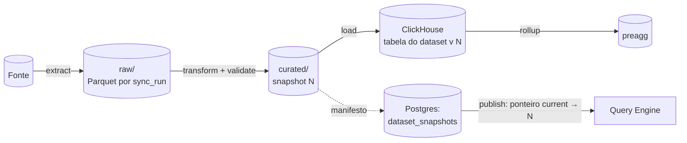

# 03 — Data Architecture, Analytical Storage e Storage Strategy

> Seções do pedido: **§6 Data architecture**, **§16 Analytical storage**, **§31 Storage strategy**, §13 (database), §14 (Arrow — visão de formato), §22 (PostgreSQL), §38 (object storage), §39 (Parquet).

---

## 6.1 Modelo de dados em camadas

| Camada | Tecnologia | Conteúdo | Propriedade | Mutabilidade |
|---|---|---|---|---|
| **Metadados da plataforma** | PostgreSQL | tenants, usuários, grants, dashboards (revisões), modelos semânticos, conexões, schedules, lineage, audit (recente), outbox | Control plane | Mutável (revisões imutáveis) |
| **Raw / staging** | Object storage (Parquet) | Extrações brutas por `sync_run_id`, uploads originais | Data Pipelines | Imutável, expira por política |
| **Curated (fonte da verdade)** | Object storage (Parquet) + manifesto no Postgres | Snapshots de datasets gerenciados após transformação/validação | Data Pipelines | Imutável por snapshot |
| **Serving** | ClickHouse | Tabelas carregadas dos snapshots, otimizadas (ORDER BY, projeções) | Query & Acceleration | Recriável a partir do curated |
| **Acceleration** | ClickHouse | Pre-aggregations (inclusive de fontes live) | Query & Acceleration | Recriável |
| **Realtime** | Kafka-API + ClickHouse | Eventos recentes, janelas | Realtime | Append-only, retenção |
| **Cache** | Valkey (+ memória) | Resultados Arrow por fingerprint | Query | Efêmero |
| **Telemetria/uso** | ClickHouse | Query logs, eventos de uso, métricas de dashboards | Platform | Append-only, TTL |
| **Exports/artefatos** | Object storage | PDFs, CSVs, PNGs, thumbnails | Delivery | Expira |
| **Fontes live** | Warehouses/DBs do cliente | Dados do cliente consultados sob demanda | Cliente | — |
| **IA — conversas e propostas** | PostgreSQL (`assistant.*`) | Conversas, turnos, chamadas de ferramenta **por referência** (queryId), ChangeSets pendentes, `AIPolicy` | Assistant | Retenção por política (ou efêmero) |
| **IA — uso e telemetria** | ClickHouse | Tokens, custo, latência, eventos de qualidade | Platform | Append-only, TTL |
| **IA — busca de metadados** (sob gatilho) | PostgreSQL + pgvector | Embeddings **apenas de metadados** (nunca de dados de negócio) | Assistant | Recriável por revisão |

**Princípio:** *Serving e Acceleration são caches materializados.* Toda tabela no ClickHouse pode ser reconstruída a partir do curated (Parquet) ou da fonte. Isso permite trocar/reescalar o engine de serving, mover tenants entre cells e fazer disaster recovery sem backups gigantes do ClickHouse.



---

## 16. Analytical storage — avaliação e papéis

### Critérios
custo · complexidade operacional · cardinalidade alta · ingestão contínua · concorrência (user-facing) · latência p95 · real-time · joins · agregações · multi-tenancy · storage separado de compute · oferta cloud gerenciada · self-hosted viável · licença.

### Comparação

| Engine | Pontos fortes | Limitações relevantes | Papel |
|---|---|---|---|
| **ClickHouse** | Agregações vetorizadas muito rápidas; ingestão contínua; MergeTree com ORDER BY/projeções; MVs incrementais; funções geo/H3; quotas, settings profiles e row policies nativos; single binary; ClickHouse Cloud (storage/compute separados); Apache 2.0 | Joins grandes melhoraram mas ainda exigem cuidado; muitos milhares de tabelas por cluster aumentam overhead de parts/metadados; updates/deletes são caros (usar ReplacingMergeTree/lightweight deletes) | **Serving engine principal**, pre-aggs, realtime, telemetria |
| **DuckDB** | Embarcado, zero ops, excelente para arquivos (CSV sniffer, Parquet, Excel, JSON), SQL completo, **versão WASM**, extensão spatial | Single-node, um escritor; não é servidor concorrente multi-tenant | **Browser** (datasets locais); **workers** (perfil/sniffing de arquivos); **tier de serving para datasets pequenos/frios** (fase Scale, sob gatilho) |
| **StarRocks** | MPP com joins fortes, MV com rewrite automático, catálogos lakehouse (Iceberg) | Operação mais complexa (FE/BE), ecossistema menor, menos oferta gerenciada | **Alternativa registrada** — reavaliar se workloads importados forem dominados por joins grandes |
| **Apache Druid** | Realtime + OLAP com rollup na ingestão | Operação complexa (vários processos), joins limitados, modelo rígido de ingestão | Rejeitado |
| **Apache Pinot** | Latência baixa com QPS muito alto user-facing | Operação complexa, joins limitados | Rejeitado (ClickHouse cobre) |
| **Trino** | Federação sobre muitas fontes, lakehouse | Sem storage; latência interativa pior; cluster JVM para operar | **Adiado** — conector opcional para federação pesada / BYO lake |
| **DataFusion** | Biblioteca Rust extensível, Arrow nativo | Não é um banco de serving | **Motor embarcado** do query engine (pós-processamento, federação leve) e do transformation engine |
| **BigQuery / Snowflake / Databricks** | Escala elástica gerenciada | Custo por query imprevisível para serving de SaaS multi-tenant; lock-in | **Somente como fontes live do cliente** (e alvo de pushdown) |
| **PostgreSQL** | OLTP excelente | Não escala como warehouse colunar | Metadados; fonte live do cliente; **não** é warehouse |

### Decisão
- **ClickHouse** como engine de serving gerenciado (ClickHouse Cloud no SaaS inicial; self-host via operador em cells dedicadas/self-hosted).
- **Multi-engine por design, mono-engine por operação**: o Query Engine fala dialetos (ClickHouse, Postgres, Snowflake, BigQuery, Databricks, DuckDB, MySQL, T-SQL...), mas a plataforma **opera** apenas um engine analítico próprio (ClickHouse) até um gatilho justificar outro.

### Multi-tenancy no ClickHouse
- **Database por tenant** (`t_<tenant>`), tabela por dataset (`ds_<id>_v<snapshot>` com view estável `ds_<id>` apontando para a versão corrente → publicação atômica por `EXCHANGE TABLES`/troca de view).
- **Usuário ClickHouse por tenant** com settings profile (`max_memory_usage`, `max_execution_time`, `max_threads`, `max_concurrent_queries_for_user`) e quotas → isolamento de recursos aplicado pelo próprio engine, além do admission control do Query Service.
- Tabelas compartilhadas com `tenant_id` só para dados da plataforma (telemetria, uso).
- **Gatilho de mudança:** contagem de tabelas/parts por cluster ou custo de datasets pequenos → introduzir *tier DuckDB* (Parquet servido por DuckDB embarcado no Query Service, com cache local) para datasets abaixo de um limiar, e/ou mais clusters por cell.

---

## 31. Storage strategy

### PostgreSQL (metadados)
- Versão gerenciada (RDS/Aurora ou Cloud SQL). Um database por cell, **schema por bounded context**.
- Toda tabela de tenant: PK `(tenant_id, id)`, FK compostas, índices liderados por `tenant_id`.
- **Row Level Security** habilitado em todas as tabelas de tenant: `USING (tenant_id = current_setting('app.tenant_id')::text)`; a aplicação executa `SET LOCAL app.tenant_id` por transação; usuário de aplicação sem `BYPASSRLS`.
- Documentos (dashboards, modelos) em `jsonb` **dentro de tabelas de revisão imutáveis** (`content.dashboard_revisions(tenant_id, id, dashboard_id, parent_id, hash, schema_version, body jsonb, author_id, created_at, message)`), com ponteiros em `content.dashboards(draft_revision_id, published_revision_id)`.
- Audit log: últimos N dias no Postgres (consultas operacionais), espelhado para ClickHouse/objeto (retenção longa, exportável).
- Migrations **expand/contract** (compatíveis com a versão anterior do código), ferramenta única no control plane.
- Escala: réplicas de leitura → particionamento de tabelas grandes (audit, revisões) → mais cells. Citus/sharding só se uma cell não comportar o maior tenant (improvável, já que dados analíticos não ficam aqui).

### Object storage
| Opção | Uso |
|---|---|
| **S3** (ou GCS/Azure Blob conforme nuvem escolhida) | SaaS — padrão |
| **MinIO** / qualquer S3-compatível | Self-hosted |
| **Cloudflare R2** | Avaliar para **assets públicos/PMTiles/exports baixados** (sem egress) |

Abstração única (API S3) no código; layout:
```
s3://<cell-bucket>/
  tenants/<tenant_id>/
    uploads/<upload_id>/original.<ext>
    raw/<dataset_id>/<sync_run_id>/part-*.parquet
    curated/<dataset_id>/snapshots/<snapshot_id>/<partition>/part-*.parquet
    exports/<export_id>/...
    plugins-data/...
  platform/
    pmtiles/  backups/  telemetry-archive/
```
Criptografia: SSE-KMS; chave por tenant (enterprise/BYOK). Lifecycle: raw expira (ex.: 7–30 dias, configurável), exports expiram, curated mantém N snapshots + política de retenção.

### Parquet (§39)
- **Por quê:** colunar, compressão eficiente (ZSTD), estatísticas por row group/página (min/max/null count) para predicate pushdown, ecossistema universal (ClickHouse, DuckDB, DataFusion, Spark, Trino), schema embutido.
- **Particionamento:** por tempo (`date=YYYY-MM`) quando houver dimensão temporal dominante; evitar partições minúsculas (alvo de arquivos 128–512 MB; compaction em background).
- **Ordenação dentro do arquivo** pelas chaves de filtro mais frequentes → estatísticas efetivas.
- **Schema evolution:** colunas novas nullable (compatível); renomes via mapeamento por *field id* no manifesto; mudança de tipo cria nova versão de schema do dataset com migração explícita.
- **Iceberg — decisão adiada para a Fase 3** com critérios: (a) necessidade de acesso externo ao lake do cliente (BYO lakehouse), (b) commits concorrentes no mesmo dataset, (c) maturidade suficiente de `iceberg-rust` e de um REST catalog leve (ex.: Lakekeeper). Até lá, **manifesto próprio no Postgres com semântica equivalente** (snapshot = lista de arquivos + schema + estatísticas), desenhado para conversão direta em metadados Iceberg.

### Classificação de dados (transversal)
Cada campo de dataset tem `classification` (`public`/`internal`/`confidential`/`restricted`/`pii`/`sensitive`), sugerida na descoberta/upload e confirmada pelo owner, herdada pela semantic layer. Ela alimenta governança, CLS automática e o egress guard da IA ([ADR-0037](adr/ADR-0037-ai-data-access-policy.md)). Nenhum armazenamento novo é criado para a IA: ela usa Postgres e ClickHouse existentes; dados de negócio nunca são copiados para stores de IA.

### Valkey (cache / coordenação)
Cache de resultados (L3), rate limiting, semáforos de concorrência por tenant, sessões de embed curtas, presença (futuro). **Nunca** fonte da verdade. Valkey escolhido por licença BSD (distribuição self-hosted sem ambiguidade) e suporte gerenciado.

---

## 14 (resumo). Formatos

| Fronteira | Formato | Motivo |
|---|---|---|
| Fonte → ingestão (conectores) | Arrow RecordBatches | Colunar, tipado, zero conversões entre Rust crates |
| Staging/curated | Parquet | Armazenamento eficiente, estatísticas |
| Query Engine ↔ engines | Arrow (ADBC/Flight/native → Arrow) | Evita row-by-row |
| Query API → browser | **Arrow IPC stream** (default) / JSON | Ver [13](13-browser-data-runtime.md#arrow) |
| Metadados/documentos | JSON (JSON Schema) | Legível, versionável, diffable |
| Interno control↔data | Protobuf (gRPC) | Contratos tipados, evolução compatível |
