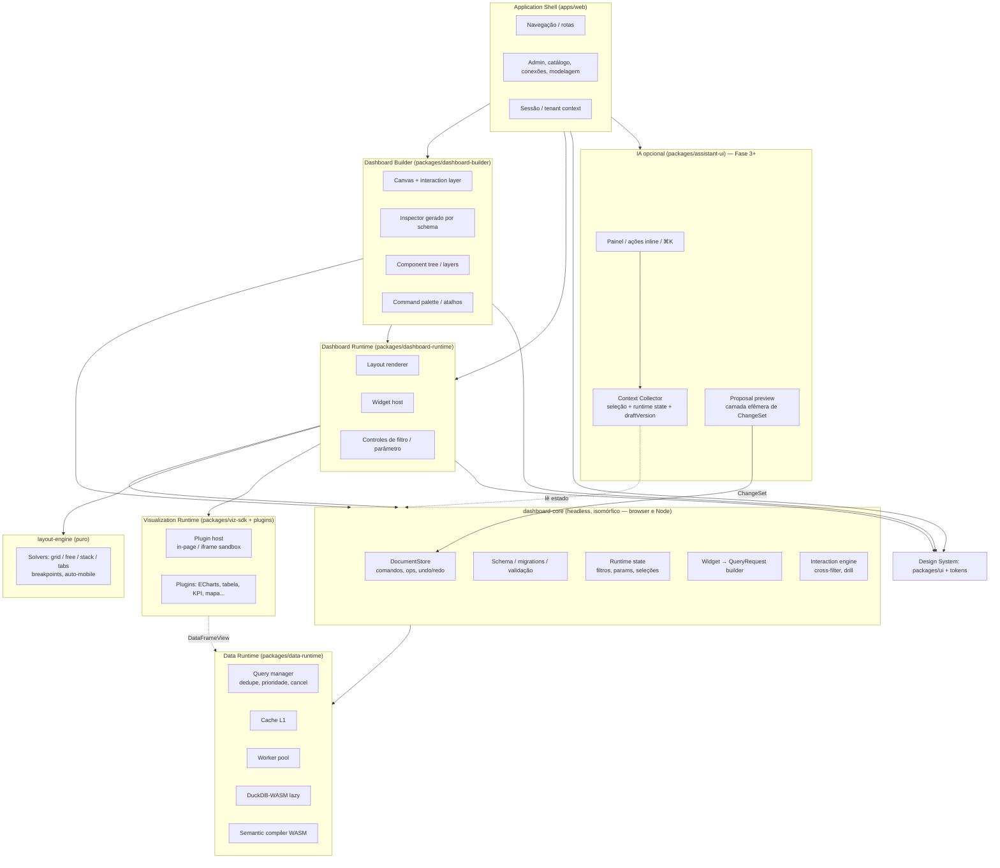

# 04 — Frontend Architecture e Design System

> Seções do pedido: **§7 Frontend architecture**, §4 do pedido (tecnologias e requisitos), **§31 Design System** (pedido).

---

## 7.1 Avaliação de tecnologias

| Tecnologia proposta | Avaliação | Decisão |
|---|---|---|
| **React** | Maior ecossistema, contratação, React 19 (concurrent rendering, transitions), React Compiler reduz memoização manual. Ponto fraco: re-render em árvores grandes — mitigado mantendo estado quente **fora** do React (stores externos + `useSyncExternalStore` com seletores). Alternativas: **Solid** (reatividade fina, ecossistema pequeno), **Svelte 5** (runes, ecossistema menor para editor complexo), **Vue** (bom, menor ecossistema enterprise de editores), **Angular** (pesado para embed). | **React** |
| **TypeScript** | Obrigatório; `strict`, tipos gerados dos schemas. | **Sim** |
| **Zustand** | Excelente para estado de UI efêmero; **inadequado como modelo do documento** (precisamos de comandos, inverso, patches, validação, migrations). | **Zustand para UI efêmera**; `DocumentStore` próprio para o documento |
| **Web Workers** | Necessários para decodificação Arrow, computação local e DuckDB-WASM. | **Sim**, via Worker Pool ([13](13-browser-data-runtime.md)) |
| **WebAssembly** | Valor concreto: compilador semântico compartilhado e DuckDB-WASM. Kernels próprios só após profiling. | **Sim, escopo restrito** |
| **WebGL** | deck.gl/MapLibre; ECharts GL opcional. | **Sim** (via bibliotecas) |
| **WebGPU** | Suporte crescente; deck.gl/luma.gl evoluindo. Não justificamos renderizadores próprios agora. | **Via deck.gl quando disponível**; próprio adiado |
| **ECharts** | Ver [07](07-visualization-engine.md). | Adapter primário |
| **MapLibre GL / deck.gl** | Ver [08](08-geospatial.md). | **Sim** |

Complementos escolhidos: **TanStack Query** (cache de dados da Management API), **TanStack Router** (rotas tipadas; ou React Router v7 — decisão menor), **Vite** (build; Rolldown quando estável), **React Aria Components** (acessibilidade), **Tailwind v4** + CSS variables (tokens), **Vitest** + **Playwright**, **i18n** com ICU MessageFormat (FormatJS), **Sentry** + web-vitals.

**IA (Fase 3+):** pacote `assistant-ui` (painel, chips de contexto, markdown seguro, citações, preview de propostas) e **Context Collector** no runtime/builder. Streaming de turnos por SSE (`fetch` streaming). Nenhum SDK de provedor de modelo no frontend: o browser só fala com a Assistant API ([31](31-ai-assistant.md)).

**SPA, não SSR/Next.js:** a aplicação é autenticada, altamente interativa e embutível; SSR de páginas não traz SEO nem ganho relevante e complica embeds. Páginas públicas de marketing ficam fora deste repositório. A renderização server-side necessária (exports) é feita pelo **render service** com o mesmo runtime.

---

## 7.2 Separação de camadas do frontend

### Regras de dependência (lint obrigatório)
- `dashboard-core` **não importa React** nem DOM → roda no Node (control plane: alertas, relatórios, cache warmup, lineage) e no render service.
- `dashboard-runtime` não importa `dashboard-builder` (o embed e o modo view carregam só o runtime).
- Plugins de visualização dependem **apenas** de `viz-sdk` (contrato) — nunca de `dashboard-core`.
- `data-runtime` não conhece widgets; conhece `QueryRequest` e frames.
- `assistant-ui` depende de `dashboard-core` (para preview e aplicação de ChangeSets) e do runtime; **nenhum pacote core depende de `assistant-ui`**. Builds sem IA (Community/air-gapped) simplesmente não incluem o chunk.

### Bundles
| Entry | Conteúdo | Meta |
|---|---|---|
| `app` | Shell + runtime + builder (lazy) | Shell inicial pequeno; builder carregado ao editar |
| `embed` | Runtime + data runtime + plugins sob demanda | Sem builder, sem admin |
| `plugins/*` | Um chunk por plugin (ECharts, deck.gl, MapLibre isolados) | Carregados só se o dashboard usa |
| `duckdb` | DuckDB-WASM + worker | Carregado só no Flow E |
| `assistant` | `assistant-ui` + renderer de markdown seguro | Carregado na primeira abertura do painel/ação de IA; ausente se a IA estiver desabilitada no tenant |

---

## 7.3 Gerenciamento de estado

| Tipo de estado | Onde vive | Tecnologia |
|---|---|---|
| Documento do dashboard (persistente) | `DocumentStore` (dashboard-core) | Store imutável normalizado + comandos → ops (JSON-Patch-like com inverso), Immer para produção estrutural |
| Estado de runtime (filtros ativos, parâmetros, seleções, drill path, página atual) | `RuntimeState` (dashboard-core) | Store observável; serializável para URL/bookmark/embed |
| Estado efêmero do editor (seleção de nós, hover, painel aberto, zoom do canvas) | Zustand | Seletores finos |
| Dados de servidor (listas, metadados, permissões) | TanStack Query | Cache + invalidação por eventos |
| Resultados de queries | Data Runtime (fora do React) | Cache L1 por fingerprint; `useSyncExternalStore` |
| Estado interno de um plugin | O próprio plugin | Encapsulado |
| Conversa ativa, stream do turno, propostas pendentes | `assistant-ui` (store próprio) | Propostas aplicadas viram transações no `DocumentStore`; nada da IA escreve direto no documento |

Hooks expostos aos componentes: `useWidgetData(widgetId)`, `useRuntimeState(selector)`, `useDocument(selector)`, `useEditor(selector)` — todos seletores sobre stores externos.

---

## 7.4 Requisitos funcionais × responsável

| Requisito | Componente |
|---|---|
| Drag-and-drop, resize, snapping, grids, guidelines | Builder: interaction layer + layout-engine |
| Múltiplas páginas, tabs, painéis, grupos, containers, widgets aninhados | Documento (árvore de nós) + layout-engine |
| Componentes customizados | Plugins de visualização/ação |
| Temas, design tokens, configuração visual | Tokens de runtime + `theme` do documento |
| Responsivo, breakpoints, edição desktop / visualização mobile | `placement` por breakpoint + derivação automática |
| Fullscreen, apresentações | Runtime: modos `fullscreen`, `presentation` (páginas como slides, autoplay) |
| Filtros, parâmetros, navegação entre dashboards | RuntimeState + Interaction engine |
| Ações entre widgets, drill-down/through, cross-filtering, seleção, brushing | Interaction engine (eventos normalizados `VizEvent` → `InteractionDefinition`) |
| Zoom, hover, tooltips | Plugin (capability) + tokens de tooltip |
| Contexto (menu de contexto, "ver dados", "explicar") | Runtime: context menu com ações registradas (inclui ações de IA quando habilitada: Explicar, Melhorar, Explicar variação) |
| Assistência por IA ligada à seleção | `assistant-ui` + Context Collector ([31 §6](31-ai-assistant.md#6-contexto)) |

---

## 31. Design System

### Camadas
1. **Tokens (DTCG / W3C Design Tokens format)** em `packages/tokens` → **Style Dictionary** gera CSS variables, tipos TS e tokens para ECharts/deck.gl.
   - *Primitivos*: paleta, escalas tipográficas, espaçamento (base 4px), raios, sombras, durações.
   - *Semânticos (app)*: `surface.*`, `text.*`, `border.*`, `accent.*`, `danger.*`, `focus.ring`.
   - *Runtime de dashboard (separados!)*: `dash.background`, `dash.widget.surface`, `dash.title.*`, `viz.palette.categorical[0..n]`, `viz.palette.sequential.*`, `viz.palette.diverging.*`, `viz.axis.*`, `viz.grid.*`, `viz.tooltip.*`. Estes são os únicos tokens que temas de dashboard e embeds podem sobrescrever.
2. **Primitivas acessíveis**: **React Aria Components** (foco, teclado, ARIA, i18n, RTL, datas) — escolhido sobre Radix por cobertura maior de padrões complexos (grid, tree, combobox, date picker, drag-and-drop acessível) e internacionalização.
3. **Componentes da plataforma** (`packages/ui`): Button, Input, Select, Combobox, Dialog, Popover, Menu, Tabs, Tree, DataGrid leve, Toast, Tooltip, ColorPicker, ExpressionEditor (CodeMirror 6 + linguagem BEL via WASM), FieldPicker, Inspector forms gerados de JSON Schema.
4. **Padrões compostos**: painéis do builder, inspector, explorer de campos, editores de filtro.

### Tema e dark mode
- `data-theme="light|dark"` no root da app; dashboards têm **tema próprio independente** (um dashboard pode ser claro dentro da app escura — e o embed herda o tema escolhido pelo host).
- Paletas de visualização validadas para contraste (WCAG) e daltonismo; paleta categórica distinta para dark.

### Acessibilidade
- Meta: **WCAG 2.2 AA** para app e runtime.
- Visualizações: cada plugin expõe `ariaSummary` e "ver como tabela" (o runtime oferece alternativa tabular para qualquer widget com dados).
- Navegação por teclado no builder (mover/redimensionar com setas + modificadores; atalhos documentados e remapeáveis).
- Testes: axe em CI (componentes e páginas), testes de teclado com Playwright.

### Compartilhamento entre superfícies
| Superfície | Usa |
|---|---|
| Application UI | tokens app + ui |
| Dashboard Builder | tokens app (cromo do editor) + tokens runtime (canvas) |
| Dashboard Runtime | tokens runtime apenas (+ ui mínimos para controles de filtro, estilizados por tokens runtime) |
| Embedded | idem runtime; host pode injetar tokens via SDK |
| Assistente de IA | tokens app (painel) + tokens runtime (mini-visualizações de evidência) |
