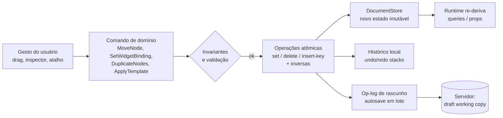
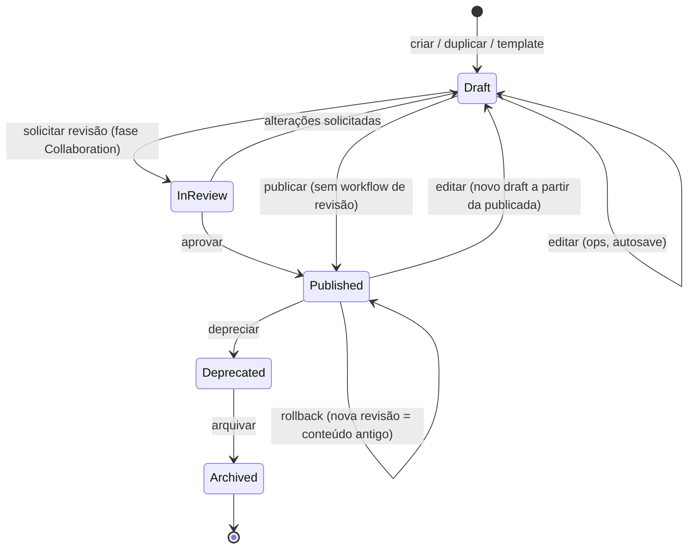
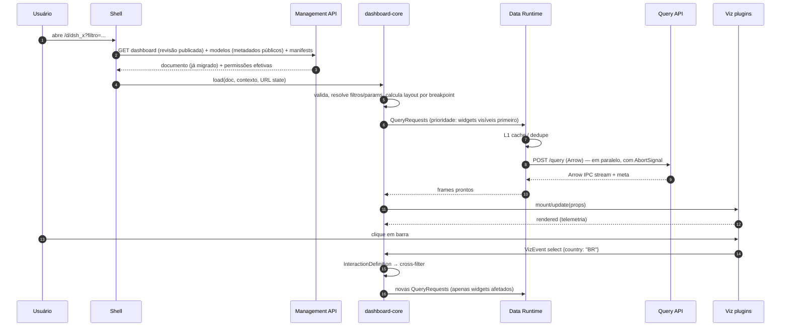

# 05 — Dashboard Engine

> Seções do pedido: **§8 Dashboard Engine**, §2 do pedido (princípio central: schema, validação, versionamento, migrations, compatibilidade, extensões, custom properties, plugins, serialização, persistência, diff, histórico, undo/redo, colaboração, templates).

Schemas completos: [`schemas/dashboard.ts`](schemas/dashboard.ts), [`schemas/widget.ts`](schemas/widget.ts), exemplo [`dashboard.sales.json`](schemas/examples/dashboard.sales.json).

---

## 8.1 O que é o Dashboard Engine

Um **interpretador headless** de documentos de dashboard. Recebe:
- o **documento** (DashboardDefinition, imutável por revisão),
- o **contexto de execução** (principal, tenant, locale, timezone, breakpoint, parâmetros externos de URL/embed),
- o **catálogo de plugins** (manifests: dataRequirements, capabilities),
- os **modelos semânticos** referenciados (metadados públicos: campos, tipos, formatos — não SQL),

e produz:
- o **estado de runtime** (filtros efetivos, parâmetros, seleções, drill path, página ativa),
- o conjunto de **QueryRequests** por widget (derivados de bindings + filtros + interações + dataRequirements),
- **props de visualização** por widget,
- reações a **eventos normalizados** (VizEvent → InteractionDefinition → novo estado → novas queries).

Por ser headless e isomórfico (`packages/dashboard-core`), o mesmo código roda em:
| Ambiente | Uso |
|---|---|
| Browser (runtime/builder/embed) | Experiência interativa |
| Control plane (Node) | Alertas, relatórios agendados (calcula as queries sem renderizar), cache warmup após publicação, extração de lineage, validação de dashboards quando um modelo muda |
| Render service | Exports com fidelidade total |

## 8.2 Modelo hierárquico (conceitual) vs. modelo persistido (normalizado)

Conceitualmente: `Dashboard → Pages → Containers/Widgets → Bindings (dataset/model, dimensions, metrics) → Filters/Parameters/Variables → Interactions → Calculations → Layout → Theme → Permissions → Runtime state`.

Persistido, o documento é **normalizado** (mapas por ID), porque:
- **Diff estrutural** e **merge** dependem de identidade estável, não de posição.
- **Operações** (`set nodes.nod_x.placement.lg.w = 6`) são endereçáveis e invertíveis.
- **CRDT/multiplayer** futuros mapeiam mapas por ID diretamente (Y.Map / Loro Map).
- Mover um widget entre containers é trocar `parentId` + `order` — não remover/inserir em arrays aninhados.

O que **não** está no documento:
| Item | Onde fica | Motivo |
|---|---|---|
| Permissões | Access Control (grants por objeto) | Permissão é relação entre principal e recurso, não conteúdo; mudar acesso não deve criar revisão de conteúdo |
| Runtime state | URL/bookmark/sessão | Estado do usuário, não do autor (bookmarks salvos são documentos separados que referenciam a revisão) |
| Dados | Query Engine | Documento descreve *o que* perguntar |
| SQL | Semantic Layer | Lógica de negócio centralizada |

## 8.3 Schema, validação e extensões

- **Autoria:** TypeBox (TS) → **JSON Schema 2020-12 canônico** publicado em `schemas/dashboard/v{N}.json`.
- **Validação em camadas:**
  1. *Estrutural* (JSON Schema, Ajv no TS, `jsonschema` no Rust) — no browser a cada comando (modo dev) e no servidor em todo save.
  2. *Referencial* — todos os IDs referenciados existem (nós ↔ widgets, interações → widgets, filtros → campos).
  3. *Semântica* — campos referenciados existem no modelo semântico na revisão alvo e são compatíveis com os papéis do plugin (dimension vs metric, tipo).
  4. *Plugin* — `viz.config` valida contra o `configSchema` da versão do plugin declarada.
- **Custom properties / extensões:** `extensions: { "vendor.feature": {...} }` em documento e widgets; o editor e as migrations **preservam** chaves desconhecidas (round-trip garantido por teste de propriedade).
- **Plugins:** config namespaced e versionada (`viz.plugin`, `viz.version`, `viz.config`); o core não interpreta `config`.

## 8.4 Versionamento do schema e migrations

| Mecanismo | Regra |
|---|---|
| `schemaVersion` (inteiro) no envelope | Incrementa a cada mudança incompatível do envelope |
| Migrations do envelope | Funções puras `migrate_vN_to_vN+1(doc) → doc` em `dashboard-core` (TS), executadas **no servidor** na leitura de revisões antigas e em importações; o cliente sempre recebe a versão corrente |
| Persistência pós-migração | Lazy: revisões antigas não são reescritas (imutáveis); a próxima revisão salva já nasce na versão nova |
| Config de plugin | `configVersion` no manifest + `migrateConfig(config, from)` no plugin; executada no runtime ao carregar |
| Compatibilidade retroativa | Leitura de **todas** as versões anteriores é garantida; escrita apenas na corrente |
| Compatibilidade futura | Cliente antigo que recebe `schemaVersion` maior entra em modo somente leitura e pede reload |
| Testes | **Corpus de documentos reais anonimizados por versão** → migrar → validar → snapshot; propriedade: migração preserva `extensions` e IDs |

## 8.5 Edição: comandos, operações, undo/redo

- **Comando** = intenção de alto nível com invariantes (ex.: `MoveNode` garante que o destino aceita o tipo e recalcula `order` por fractional indexing).
- **Operação** = mutação mínima em caminho (`["nodes","nod_x","placement","lg"]`) com valor anterior → **inversa trivial**.
- **Undo/redo** = pilhas de *transações* (grupos de ops de um comando; gestos contínuos como drag são coalescidos em uma transação).
- **Autosave** = op-log enviado em lote ao servidor (rascunho por usuário/dashboard); revisão nomeada criada em "Salvar versão"/"Publicar".
- **Copy/paste** = serialização de sub-árvore (nós + widgets + interações internas) com **remapeamento de IDs**; colar entre dashboards/tenants valida referências semânticas e oferece mapeamento de campos.

## 8.6 Diff, histórico e templates

- **Diff estrutural** por entidade: `widget added/removed`, `property changed (path, before, after)`, `node moved (parent/order)`; renderizado como lista e como overlay visual no canvas.
- **Histórico**: revisões imutáveis content-addressed (hash SHA-256 do documento canônico — JSON canonicalizado, RFC 8785) — ver [21](21-versioning-and-collaboration.md).
- **Templates**: documento de dashboard com **slots semânticos abstratos** (`{role: "metric", type: "currency"}`) em vez de IDs concretos; instanciar = mapear slots para campos de um modelo → novo documento com IDs novos.
- **Reusable blocks**: sub-árvore publicada como componente versionado; instâncias referenciam `blockId@version` com overrides de propriedades (modelo "componente/instância" do Figma), atualização opcional.
- **Widget presets**: `viz.config` + estilo pré-configurados por plugin, por tenant.

## 8.7 Dashboard lifecycle

### Ciclo de vida em runtime (carregamento de um dashboard)

## 8.8 Geração de queries a partir de widgets

1. Para cada widget visível: ler `data.encodings` + `dataRequirements` do plugin + `queryHints`.
2. Compor filtros efetivos: `dashboard ∪ página ∪ container ∪ widget ∪ cross-filters ativos − ignoreFilters`, com `fieldMappings` quando modelos diferem.
3. Resolver parâmetros (`{param}`) e variáveis.
4. Aplicar hints (densificação temporal, top-N com "outros", binning espacial por zoom, paginação).
5. Emitir `QueryRequest` (QDL). Um widget pode emitir mais de uma (ex.: KPI valor + sparkline; tabela + totais).
6. **Fingerprint** no cliente = hash do request canônico + revisão do modelo → dedupe entre widgets e cache L1.
7. **Otimização local:** se um request é *coarsening* de outro já em cache (mesmas measures aditivas, subconjunto de dimensões, mesmos filtros), o Data Runtime pode reagregar localmente.

## 8.9 ChangeSets, origem das mudanças e IA

Fundação adicionada ao `dashboard-core` nas **Fases 1–2** (antes da IA), útil por si só e pré-requisito da IA ([ADR-0035](adr/ADR-0035-ai-change-proposals.md)):

| Conceito | Definição | Usos sem IA | Uso pela IA |
|---|---|---|---|
| **ChangeOrigin** | Origem de toda transação de ops: `user`, `template`, `import`, `api`, `system`, `assistant` | Auditoria, histórico ("aplicado do template X") | Marca mudanças da IA (conversa, proposta, modelo) |
| **ChangeSet** | Conjunto de itens com ops, `base` (revisão/draftVersion + entidades tocadas), risco e validação | Aplicar template, colar sub-árvore de outro dashboard, importar, sugestões de "auto-layout" | Propostas da IA |
| **Camada de proposta** | Estado derivado `doc ⊕ changeSet` renderizado pelo runtime **sem gravar** | Preview de templates/auto-layout | Preview no canvas antes de aceitar |
| **Rebase** | Reaplicar ops sobre um draft que mudou, por entidade/propriedade; conflito → rejeitar | Colaboração futura, paste tardio | Propostas obsoletas |

Regras:
- Aplicar um ChangeSet = **uma transação** no undo stack, com rótulo do item ("IA: trocar visualização").
- Toda op passa pelos mesmos comandos e invariantes; o `dashboard-core` não sabe se a origem é humana ou IA (a origem é metadado, não caminho especial).
- No servidor, o **Proposal Service** (módulo `assistant`) usa o mesmo `dashboard-core` para simular e validar ChangeSets antes de enviá-los ao cliente.
- O **contexto que a IA recebe** sobre um dashboard é derivado do documento por funções do próprio `dashboard-core` (resumo estrutural, widget completo, QDL efetiva de um widget). Assim a "visão da IA" nunca diverge da semântica do engine.
