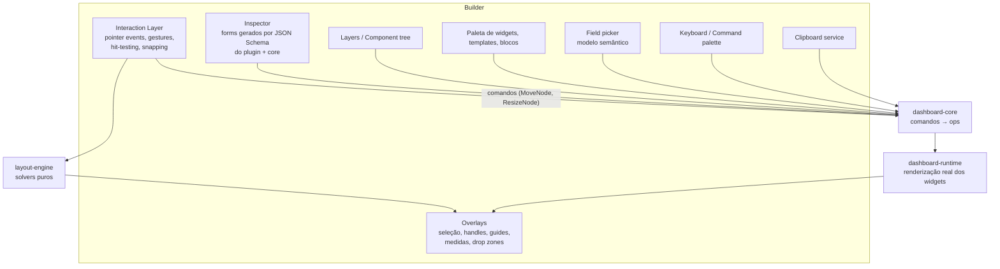

# 06 — Dashboard Builder Architecture

> Seção do pedido: **§9 Dashboard Builder architecture** (§5 do pedido).

---

## 9.1 Qual modelo de editor?

| Modelo | Exemplos | Prós | Contras |
|---|---|---|---|
| Grid tradicional | Grafana, Superset, Metabase | Simples, responsivo por natureza, rápido de montar | Pouco controle visual; layouts "relatório" impossíveis; aninhamento pobre |
| Canvas livre | Power BI (páginas fixas), Tableau dashboards flutuantes | Pixel-perfect, storytelling, sobreposição | Responsividade ruim (Power BI exige layout mobile separado); alinhamento manual trabalhoso |
| Figma-like (frames + auto-layout + constraints) | Figma, Framer | Muito expressivo, componentes/instâncias | Curva de aprendizado; motor de constraints complexo |
| Constraints puras (Cassowary) | Auto Layout iOS | Poderoso | Opaco para usuários de negócio; debugging difícil |
| Responsive layout engine | Webflow | Ótima responsividade | Mental model de CSS para analistas |

### Decisão: **híbrido baseado em containers com estratégias de layout**

A árvore de nós (ver [05](05-dashboard-engine.md)) contém **containers**, cada um com uma estratégia:

| Estratégia | Comportamento | Uso típico |
|---|---|---|
| `grid` (padrão da página) | Colunas (12/24) × linhas de altura fixa, compactação vertical opcional, colisão e reflow | Dashboards operacionais, 80% dos casos |
| `stack` | Auto-layout flex (direção, gap, alinhamento, wrap, grow/shrink) | Faixas de KPIs, barras de filtros, cards |
| `free` | Posição absoluta com z-index, rotação, snap | Relatórios pixel-perfect, infográficos, sobreposições (texto sobre imagem/mapa) |
| `tabs` | Filhos como abas | Agrupar visões alternativas |

Por que híbrido: o grid cobre o caso comum com responsividade gratuita; `stack` dá o melhor do auto-layout do Figma sem constraints arbitrárias; `free` existe **contido** (um container), então não contamina a responsividade da página toda. Constraints estilo Figma (pin left/right/center/scale) entram **somente dentro de `free`** e numa fase posterior.

## 9.2 Responsividade e breakpoints

- Breakpoints: `xl ≥1600`, `lg ≥1200` (fonte padrão), `md ≥992`, `sm ≥768`, `xs <768`.
- `placement` é **por breakpoint**; ausência ⇒ derivação automática:
  - `grid`: escala proporcional de colunas; abaixo de `sm`, **empilhamento em ordem de leitura** (y, depois x) com alturas mínimas por tipo de widget.
  - `stack`: wrap natural.
  - `free`: escala uniforme (fit-width) até `md`; abaixo, o container vira uma imagem rolável **ou** usa um layout alternativo definido pelo autor (aviso no builder).
- Editor permite "editar layout para breakpoint X" (overrides explícitos), ocultar nós por breakpoint e pré-visualizar dispositivos.

## 9.3 Arquitetura do builder

**Ponto-chave:** o canvas do builder renderiza **o runtime real** (mesmos plugins, mesmos dados), com overlays por cima. Não existe "preview" separado que pode divergir.

### Interaction layer próprio (não react-grid-layout)
- react-grid-layout cobre só grid plano; não suporta aninhamento, containers heterogêneos, `free`, guides nem multi-seleção robusta. **dnd-kit** é ótimo para listas/árvores (usado no painel de layers e paletas), mas o canvas precisa de hit-testing geométrico.
- Implementação: pointer events + máquina de estados de gestos (idle → pressing → dragging/resizing/marquee → dropping), cálculos em coordenadas do container, renderização dos overlays em uma camada absoluta (DOM/SVG), throttling por `requestAnimationFrame`.
- Os **solvers** (`layout-engine`) são funções puras: `solveGrid(nodes, columns, breakpoint) → rects`, `resolveCollision`, `snap(rect, guides, threshold)`, `deriveMobile(tree)`. Testáveis isoladamente e usados também pelo render service.

## 9.4 Funcionalidades × implementação

| Funcionalidade | Implementação |
|---|---|
| Canvas, grid, posicionamento, resize | Interaction layer + solvers; zoom/pan do canvas (CSS transform) |
| Drag-and-drop (da paleta, entre containers) | Drop zones calculadas por estratégia do container destino; comando `InsertNode`/`MoveNode` |
| Seleção múltipla | Shift/Cmd-click, marquee; seleção = conjunto de IDs (estado efêmero) |
| Alinhamento / distribuição | Comandos `AlignNodes(edge)`, `DistributeNodes(axis)` (em `free` e `grid`) |
| Agrupamento | `GroupNodes` cria container `stack`/`free` envolvendo a seleção; `Ungroup` |
| Copy/paste, duplicação | Clipboard serializa sub-árvore com remapeamento de IDs; colar entre dashboards valida referências |
| Layers, z-index | Árvore de nós; z apenas em `free` (`placement.z`); "trazer para frente/enviar para trás" |
| Locking, visibility | `locked`, `hidden[breakpoint]`, `visibleWhen` (condicional) |
| Inspector lateral | Formulário gerado de JSON Schema (core + `configSchema` do plugin) com `x-ui` hints (widget de cor, slider, field picker, seção, condição) — plugins não precisam escrever UI de configuração |
| Component tree | Painel de layers com dnd-kit (reordenar = novo `order`) |
| Undo/redo | Transações de ops (ver [05 §8.5](05-dashboard-engine.md)) |
| Keyboard shortcuts | Mapa central de comandos (command palette `⌘K`), atalhos remapeáveis, setas para mover (1 unidade / 10 com Shift) |
| Snapping, guidelines | Guides de bordas/centros de irmãos + grid; threshold em px de tela |
| Templates, reusable blocks, presets | Ver [05 §8.6](05-dashboard-engine.md) |
| Edição de dados do widget | Field picker com drag de campos semânticos para papéis (encodings) — o plugin declara os papéis |

## 9.5 Performance do builder
- Renderização de widgets fora da viewport do canvas é suspensa (IntersectionObserver) — mantém o retângulo.
- Durante drag/resize: widgets afetados recebem `resize` com debounce; queries não são refeitas (tamanho não muda dados, exceto plugins `viewportDriven`).
- Comandos aplicados de forma síncrona ao `DocumentStore`; derivação de queries é incremental (só widgets cujo binding ou filtro efetivo mudou).
- Meta: 60 fps em drag com 50 widgets na página (orçamento em [23](23-infrastructure-and-deployment.md#32-performance-budget)).

## 9.6 Integração com a IA (Fase 3+)

| Interação | Comportamento |
|---|---|
| **Seleção como contexto** | A seleção do builder (nós/widgets, multi-seleção, campo no field picker) entra no `UIContextSnapshot`; chips no painel mostram "Selecionado: 4 gráficos" |
| **Ações inline** | Barra flutuante da seleção: "Organizar" (multi), "Melhorar", "Trocar visualização", "Criar igual por…"; menu de contexto do widget: "Explicar", "Perguntar à IA" |
| **⌘K em linguagem natural** | "metade da largura", "adicionar filtro de período" → ChangeSet de baixo risco (autoaplicável se o usuário optou) |
| **Preview de propostas** | Overlay no canvas: widgets fantasmas (adições), destaque vermelho (remoções), handles de diff (alterações de layout/propriedades); aceitar/rejeitar por item no painel e no canvas |
| **Layout pela IA** | A IA propõe *placements* usando os mesmos solvers do `layout-engine` (ex.: `organize` gera grid via solver e não por coordenadas inventadas) |
| **Undo** | Aceitar um ChangeSet = 1 passo de undo com rótulo "IA: …" |
| **Estado vazio** | "Criar a partir de um objetivo" gera proposta de dashboard completo (páginas, widgets, filtros) para preview |

O builder **não muda de comportamento** com a IA desligada: as ações de IA simplesmente não aparecem.
