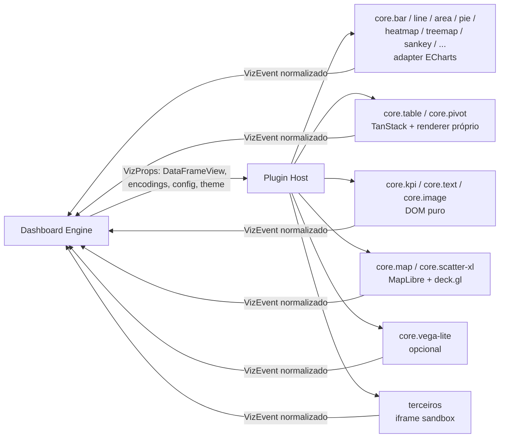

# 07 — Visualization Engine

> Seção do pedido: **§10 Visualization Engine** (§6 do pedido).

Contrato completo: [`schemas/visualization.ts`](schemas/visualization.ts).

---

## 10.1 Avaliação de bibliotecas

| Biblioteca | Forças | Fraquezas | Licença | Papel |
|---|---|---|---|---|
| **Apache ECharts** | Cobertura enorme (bar, line, area, scatter, bubble, pie, heatmap, treemap, sunburst, sankey, funnel, radar, gauge, boxplot, candlestick, graph, parallel, themeRiver, calendar); Canvas e SVG; *large mode*/progressive para centenas de milhares de pontos; temas; **SSR em Node** (SVG string); interações (brush, dataZoom, tooltip) ricas | API de opções enorme (precisa de adapter disciplinado); acessibilidade limitada; customização fina de layout às vezes difícil | Apache 2.0 | **Adapter primário** para gráficos padrão |
| **Vega-Lite** | Gramática declarativa elegante; ótima para exploração e especificação portátil | Performance com dados grandes; aparência "BI polida" exige trabalho; runtime pesado | BSD-3 | **Plugin opcional** "spec livre" para power users |
| **Vega** | Gramática completa (interações, transforms) | Complexidade, performance | BSD-3 | Base do plugin Vega-Lite apenas |
| **D3** | Primitivas para qualquer coisa (escalas, formas, layouts, geo) | Não é biblioteca de gráficos; custo de desenvolvimento por visual | ISC | **Utilitário** dentro de plugins custom (escalas, formatos, layouts) |
| **Plotly** | Científico, 3D, estatístico | Bundle grande, estética difícil de alinhar ao design system, customização limitada | MIT | Rejeitado como núcleo |
| **Highcharts** | Muito polida, acessível | **Licença comercial** por produto/OEM — custo e restrição para redistribuição (self-hosted/embedded) | Comercial | Rejeitado |
| **deck.gl** | WebGL2 (WebGPU em evolução via luma.gl), milhões de pontos, camadas geo e não-geo (scatter, hexagon, heatmap, line, arc, path), atributos binários | Não cobre gráficos de negócio comuns | MIT | **Adapter de alta escala** (mapas e scatter massivo) |
| **Custom WebGL/WebGPU** | Controle total | Alto custo, manutenção | — | **Adiado**; só para visuais específicos com gatilho de performance |
| **TanStack Table + Virtual** | Headless, virtualização | Não renderiza nada sozinho | MIT | **Base da tabela/pivot próprios** |
| **Glide Data Grid / canvas grid** | Grid em canvas para milhões de células | Customização de célula diferente do DOM | MIT | Avaliar para "tabela gigante" |

### Decisão: arquitetura híbrida atrás de um contrato

## 10.2 O contrato `VisualizationPlugin`

| Elemento | Conteúdo | Por que existe |
|---|---|---|
| `manifest` | id, versão, categoria, `engines.host`, trust | Registro, compatibilidade, sandbox |
| `configSchema` + `configVersion` | JSON Schema da config própria com hints `x-ui` | Inspector automático; validação no servidor; migrations |
| `dataRequirements` | Papéis (x, y, color, size, geo, rows, columns, values) com cardinalidade e tipos; `queryHints`; `maxRecommendedRows` | O **Dashboard Engine gera a query** — o plugin nunca busca dados |
| `capabilities` | renderers, interações, alvo de cross-filter, SSR, exports, responsive, realtimeAppend | Runtime decide fallback, export e interações disponíveis |
| Ciclo de vida | `mount(el, host) → instance`; `update(props)`, `resize`, `applyDelta`, `snapshot`, `destroy` | Framework-agnóstico (funciona em React, embed sem React, render service, iframe) |
| Eventos | `select`, `hover`, `brush`, `drill`, `context-menu`, `rendered`, `error` — em **coordenadas de dados** | Desacopla interações da biblioteca; permite trocar ECharts por outra sem quebrar interações salvas |
| Host API | `emit`, `requestViewport`, `requestPage`, `format`, `logger` | Superfície mínima, versionada por semver |
| `description` + `aiHints` | Descrição obrigatória; quando usar e quando evitar; formas de dados suportadas | Viz Recommender e IA conhecem as capacidades **reais** instaladas (inclusive de terceiros) |

### Regras anti-acoplamento
1. **Nenhum tipo de biblioteca no documento.** `viz.config` contém conceitos do plugin (`orientation`, `stacked`, `showLabels`), nunca `echartsOption`. (Escape hatch: `advanced.rawOptions` *apenas* em plugins first-party, marcado como não portátil e oculto por padrão.)
2. **Plugin não busca dados nem conhece o Query Engine.** Recebe `DataFrameView` (colunar, Arrow-backed).
3. **Formatação vem do modelo semântico** (`FieldMeta.format`) e é aplicada via `host.format` → números/datas consistentes em todos os plugins e no export.
4. **Tema vem de tokens de runtime** resolvidos; adapters traduzem tokens para o tema da biblioteca (ex.: gerador de tema ECharts a partir de tokens).
5. **Seleções são dados** (`DataSelection`), traduzidas pelo Dashboard Engine em filtros QDL.

## 10.3 Cobertura dos tipos pedidos

| Tipo | Plugin | Renderer |
|---|---|---|
| Bar, line, area, scatter, bubble, pie/donut, heatmap, treemap, sunburst, waterfall, funnel, radar, sankey, gauge, histogram, boxplot, candlestick | `core.*` via adapter ECharts (waterfall/histogram como transformações no adapter + query hints) | Canvas (SVG no export) |
| KPI cards | `core.kpi` (valor, comparação, sparkline mini ECharts/SVG) | DOM/SVG |
| Tables, matrices, pivot, conditional formatting | `core.table`, `core.pivot` — pivot calculado no **servidor** (QDL `pivot`), renderização virtualizada; regras condicionais do `WidgetDefinition` | DOM virtualizado (canvas grid para casos extremos) |
| Scatter massivo (> ~100k pontos) | `core.scatter-xl` (deck.gl ScatterplotLayer em coordenadas cartesianas) | WebGL2 → WebGPU |
| Geographic | `core.map` ([08](08-geospatial.md)) | MapLibre + deck.gl |
| Custom SVG | `core.svg-template` (SVG com bindings de dados, ex.: planta baixa) | SVG |
| Custom visualizations | Plugins de terceiros via SDK; Vega-Lite opcional | Qualquer |

## 10.4 Estratégia de renderização e fallback

Cada plugin escolhe o renderer por *capability detection* + volume:
`WebGPU → WebGL2 → Canvas 2D → SVG`
- Gráficos padrão: Canvas (interativo) / SVG (export, acessibilidade, poucos pontos).
- Volume acima de `maxRecommendedRows`: o Dashboard Engine pede agregação/binning ao servidor (query hints) **antes** de pensar em GPU.
- GPU apenas para casos onde o volume visível precisa ser alto (mapas, scatter de exploração).

## 10.5 Plugin host e isolamento
- **First-party e certificados:** módulos ESM carregados in-page (lazy por plugin).
- **Terceiros não certificados:** iframe `sandbox="allow-scripts"` (origem nula), CSP restrita, sem acesso a cookies/DOM do host; dados transferidos como `ArrayBuffer` Arrow via `postMessage` (transferable); eventos de volta pelo mesmo canal com validação de schema. Custo: um contexto por widget — aceitável para visuais custom.
- **Error boundary por widget**: falha de plugin não derruba o dashboard; telemetria de erro por plugin/versão; *kill switch* via feature flag.

## 10.6 SSR / export
Render service abre o **runtime real** em Chromium headless; plugins com `ssr: true` podem renderizar em modo `export` (SVG, sem animações). Para relatórios em lote sem browser (futuro), adapters ECharts suportam SSR direto em Node.

## 10.7 Viz Recommender (determinístico) e IA

- Pacote `packages/viz-recommender` (TS isomórfico, Fase 2/3): entrada = forma dos dados de uma consulta (tipos e cardinalidade das dimensões, número de métricas, temporalidade, papel geo, aditividade) + manifests instalados; saída = ranking explicável de plugins e configuração inicial de encodings.
- Usado pelo botão **"Sugerir visualização"** no builder (sem IA) e pela ferramenta `recommend_visualization` da IA ([ADR-0038](adr/ADR-0038-deterministic-insights-and-recommenders.md)).
- A IA pode justificar e ajustar a escolha ("barras horizontais porque há 27 estados"), mas **só pode usar plugins instalados** e configurações válidas pelo `configSchema`.
- Mini-visualizações de evidência nas respostas da IA são renderizadas **pelos mesmos plugins**, em modo somente leitura.
