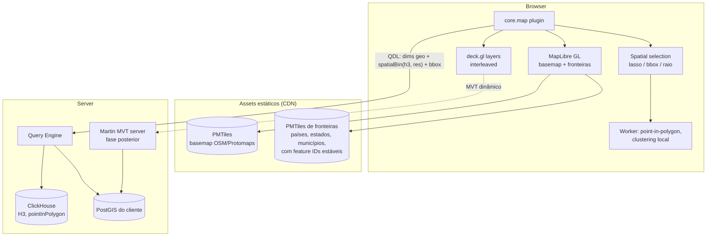

# 08 — Geospatial Architecture

> Seção do pedido: **§11 Geospatial architecture** (§7 do pedido).

---

## 11.1 Avaliação

| Tecnologia | Avaliação | Decisão |
|---|---|---|
| **MapLibre GL JS** | Fork open-source (BSD) do Mapbox GL v1; vector tiles, estilos, globe, terrain; comunidade ativa | **Basemap e camadas vetoriais** |
| Mapbox GL JS v2+ | Licença proprietária, cobrança por load | Rejeitado |
| Leaflet / OpenLayers | Ótimos para raster/2D; não escalam para milhões de features em WebGL como deck.gl | Rejeitados como núcleo |
| **deck.gl** | Camadas WebGL2 (WebGPU em evolução): Scatterplot, Hexagon, H3HexagonLayer, H3Cluster, Heatmap, GeoJson, MVT, Arc, Path/Trip, Column (3D), atributos binários | **Camadas de dados** (interleaved com MapLibre) |
| CesiumJS | 3D globe/terreno completo | Fora do escopo (fase futura se 3D geoespacial avançado virar requisito) |
| Kepler.gl | App sobre deck.gl | Inspiração de UX, não dependência |
| **PMTiles** | Arquivo único de tiles servido por HTTP range requests no object storage/CDN; sem tile server | **Basemaps e fronteiras** |
| Vector tiles dinâmicos (MVT) | Gerados do PostGIS (`ST_AsMVT`) via **Martin** (Rust) | Para fontes PostGIS live com geometrias grandes |
| GeoJSON | Simples; pesado para geometrias complexas | Apenas para geometrias pequenas/ad hoc (seleções, polígonos do usuário) |
| **H3** | Índice hexagonal hierárquico; agregação multi-resolução; funções nativas no ClickHouse e DuckDB | **Binning espacial padrão** |
| Geohash | Mais simples; células retangulares distorcidas | Suportado (compatibilidade com dados do cliente) |
| **PostGIS** | Referência em operações geométricas | Fonte live do cliente; geometrias pesadas |
| **ClickHouse GIS** | `pointInPolygon`, `greatCircleDistance`, funções H3, tipos Point/Polygon | Agregação espacial no serving |
| DuckDB spatial | Operações GEOS no worker/browser | Transformações geoespaciais em ingestão; datasets locais |

## 11.2 Arquitetura

### Padrões de camada

| Necessidade | Estratégia | Dados trafegados |
|---|---|---|
| **Choropleth** (país/estado/município) | Fronteiras vêm do PMTiles; a query retorna apenas `(feature_key, valor)`; join no cliente via `feature-state` do MapLibre | Kilobytes |
| **Pontos** (≤ orçamento, ex.: ~200k–1M) | Query retorna lat/lon como colunas Arrow `Float32/Float64` → atributos binários deck.gl (zero-copy) | Linear no número de pontos |
| **Milhões de pontos** | **Agregação H3 no servidor** com resolução dependente do zoom (`res = f(zoom)`) e filtro de viewport (bbox) → `H3HexagonLayer`; ao aproximar, re-query com resolução maior; abaixo de um limiar de contagem na viewport, pontos crus | Proporcional às células visíveis |
| **Clusters** | H3/grid no servidor (consistente com filtros/RLS); clustering local (Supercluster) apenas para datasets locais pequenos | Pequeno |
| **Heatmap** | deck.gl HeatmapLayer sobre agregados H3 ou pontos amostrados | Pequeno/médio |
| **Linhas, rotas, arcos** | PathLayer/TripsLayer/ArcLayer; rotas como LineString (WKB → binário) | Médio |
| **Polígonos custom do cliente** | Fonte PostGIS → MVT dinâmico (Martin); ou GeoParquet importado → PMTiles gerado no pipeline | Tiles |
| **3D** | ColumnLayer/H3 extrudado, terrain do MapLibre | — |
| **Camadas custom** | Plugins de terceiros que registram deck.gl layers via SDK geo | — |

### Viewport queries
- O plugin declara `queryHints.viewportDriven = true`; ao mover o mapa (debounce ~150–300 ms), chama `host.requestViewport(bbox, zoom)`.
- O Dashboard Engine gera QDL com filtro `spatial within bbox` + `spatialBin` adequado; o Data Runtime cancela requests obsoletos (AbortSignal) e usa cache por tile lógico (célula H3 de resolução grossa) para pan suave.

### Filtros e seleção espacial
- Lasso/bbox/raio geram `DataSelection { kind: "spatial", geometry }` → Interaction engine → filtro QDL `{ op: "spatial", relation: "within", geometry }` → compilado para `pointInPolygon` (ClickHouse), `ST_Within` (PostGIS/DuckDB), `ST_WITHIN` (BigQuery/Snowflake).
- Destaque imediato no cliente (point-in-polygon em worker sobre os dados já carregados), enquanto as queries dos outros widgets executam.

## 11.3 Modelagem semântica geo
- Dimensão `type: "geo"` com `role` (country, region, city, postal, lat, lon, point, h3) e `boundarySet` (catálogo de fronteiras com chaves estáveis — ISO-3166 para países/estados, códigos IBGE para municípios brasileiros, etc.).
- **Geocoding** (nome → código/coordenada) acontece no **pipeline** (enriquecimento), nunca em tempo de query.
- Transformações geo no Transformation Engine: parse WKT/WKB/GeoJSON, reprojeção (PROJ), cálculo de H3 em ingestão (coluna materializada para datasets grandes), simplificação de geometria.

## 11.4 Basemaps
- **SaaS**: Protomaps/OSM em PMTiles hospedado por nós (custo previsível; atribuição OSM) — ou provedor comercial (MapTiler/Stadia) como opção configurável.
- **Self-hosted/air-gapped**: PMTiles empacotado com a instalação.
- Estilos de basemap gerados a partir dos tokens de tema (light/dark).

## 11.5 IA e mapas

- A IA escolhe camadas a partir de `geo.role` e `boundarySet` das dimensões e dos `aiHints` do plugin `core.map` (ex.: choropleth para fronteiras conhecidas, H3 para pontos densos, pontos crus abaixo do orçamento).
- "Mapa com intensidade por município" → verifica a existência de `boundarySet` municipal para o país; se não houver, **informa a limitação** e oferece alternativas (H3 por coordenadas, ou importar fronteiras).
- Geocoding nunca é feito pelo modelo: é etapa do pipeline (proposta de transformação, se necessário).
