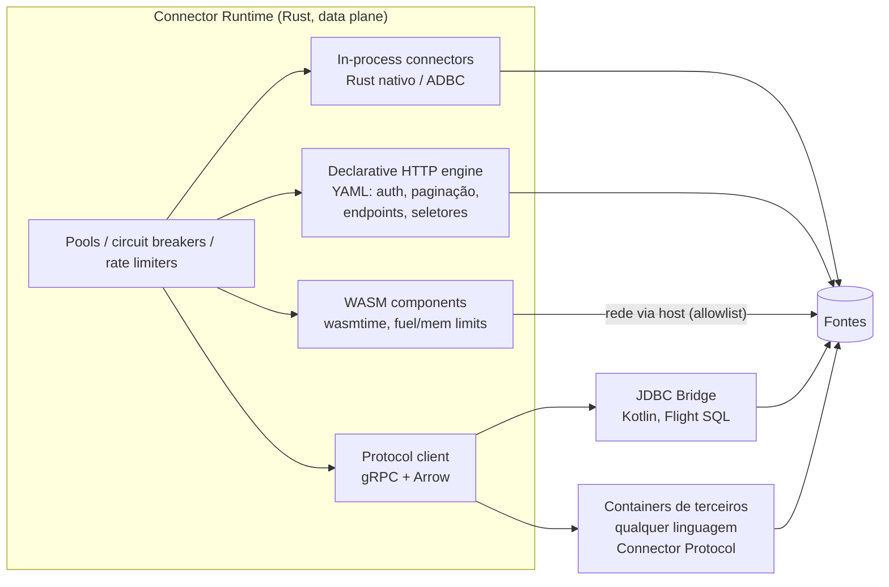
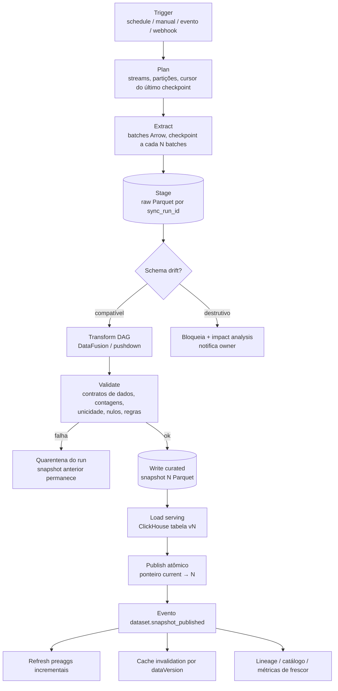

# 09 — Data Ingestion e Connector Architecture

> Seções do pedido: **§12 Data ingestion**, **§27 Connector architecture** (§8 e §9 do pedido).

Schemas: [`schemas/datasource.ts`](schemas/datasource.ts), [`schemas/dataset.ts`](schemas/dataset.ts).

---

## 27. Connector architecture

### 27.1 Duas famílias de conectores

| Família | Exemplos | Modos | Implementação |
|---|---|---|---|
| **Query connectors** (falam SQL, aceitam pushdown) | PostgreSQL, MySQL, SQL Server, Oracle, ClickHouse, Snowflake, BigQuery, Redshift, Databricks, Trino, DuckDB/MotherDuck | Live **e** Import | First-party em Rust: drivers nativos (`tokio-postgres`, `mysql_async`, `tiberius`, cliente ClickHouse HTTP/native) e **ADBC** (Snowflake, BigQuery, Flight SQL, PostgreSQL) — tudo produzindo Arrow; **JDBC bridge** para cauda longa |
| **Sync connectors** (APIs, arquivos, NoSQL) | REST/GraphQL, Google Sheets, Salesforce, HubSpot, ERPs, S3/arquivos, MongoDB, Elasticsearch/OpenSearch | Import / Incremental / Streaming | Rust first-party para os de alto volume; **conector declarativo YAML** para REST; **containers** (qualquer linguagem) via Connector Protocol |

> MongoDB e Elasticsearch/OpenSearch têm linguagens de consulta próprias; suportamos **import** primeiro e *live* com pushdown limitado (filtros/agregações traduzidos por um dialeto específico) numa fase posterior.

### 27.2 Connector SDK (contrato)

```text
Connector
├── spec()                → ConnectorDefinition (configSchema, auth, capabilities)
├── check(config, secret) → HealthResult (conectividade, permissões, versão do servidor)
├── discover(config)      → Catalog { namespaces, tables/streams, columns, tipos, PKs,
│                                     cursores candidatos, estatísticas, capabilities por stream }
├── read(streams, state)  → stream de mensagens:
│        RecordBatch(Arrow) | StateCheckpoint(cursor/LSN/offset) | SchemaChange | Log | Progress
├── query(sql | plan, params, opts) → Arrow stream          [apenas liveQuery]
├── estimate(sql)         → custo/linhas/bytes estimados     [opcional: EXPLAIN, BigQuery dry-run]
├── cancel(queryId)
└── subscribe(stream, from)  → stream contínuo (CDC/streaming) [opcional]
```

Responsabilidades **do host** (não do conector): retries com backoff exponencial + jitter, **throttling** conforme `rateLimits` declarados e quotas do tenant, circuit breaker por data source, timeouts, métricas/traces, decifração de credenciais (o conector recebe credenciais em memória, só durante a sessão), pooling de conexões, checkpoint persistence, paginação genérica (para o declarativo).

Credenciais: `configSchema` marca campos `x-secret: true`; eles vão para o cofre (envelope encryption, DEK por tenant) e nunca retornam pela API. OAuth2: tokens de refresh no cofre; renovação pelo host.

### 27.3 Runtimes de execução



| Runtime | Quando | Isolamento |
|---|---|---|
| In-process Rust/ADBC | Conectores first-party de alto volume e live query | Código confiável, revisado |
| Declarative HTTP (YAML) | 80% das APIs REST SaaS/proprietárias (auth, paginação, incremental por cursor, seletores JSONPath) | Sem código arbitrário |
| WASM component | Lógica custom leve (transformação de payload, auth exótica) de terceiros | Sandbox wasmtime; rede só via host com allowlist |
| Container (Connector Protocol) | Conectores complexos de terceiros, SDKs de fornecedor (Java/Python) | Container isolado, egress controlado, recursos limitados, executado em pool separado |
| JDBC bridge | Oracle, SAP HANA, DB2, Teradata, Informix, etc. | Serviço separado, Arrow Flight SQL |

**Compatibilidade Airbyte (avaliação):** um adaptador que executa imagens de conectores Airbyte e traduz o protocolo (JSON lines) para Arrow daria centenas de conectores SaaS. Viável tecnicamente; **verificar licença por conector** (parte é MIT, parte ELv2) antes de oferecer em SaaS. Decisão: avaliar na Fase 5.

### 27.4 Conectores de terceiros
- Publicados no Plugin Registry com manifest (`type: "connector"`), assinados (cosign), com **suíte de conformidade** obrigatória (kit de testes do SDK: spec/check/discover/read/state/idempotência/tipos Arrow).
- Permissões explícitas (egress para hosts declarados), aprovadas pelo admin do tenant.
- Versionamento semver do protocolo (`connector-v1`); o host suporta N e N-1.

---

## 12. Data ingestion

### 12.1 Estratégias e quando usar

| Estratégia | Descrição | Usar quando | Evitar quando |
|---|---|---|---|
| **Live Query** | Query vai à fonte a cada pedido (com cache) | Warehouse do cliente (Snowflake/BigQuery/Databricks/ClickHouse) dimensionado para analytics; dados que não podem sair da fonte; frescor imediato | OLTP de produção sem réplica; fontes lentas/caras por query |
| **Direct Query acelerado** | Live + pre-aggregations materializadas no nosso ClickHouse | Dashboards muito acessados sobre warehouse (reduz custo do cliente) | Dados que não podem ser copiados (compliance) |
| **Import (full)** | Snapshot completo periódico | Fontes pequenas/médias, APIs sem incremental, arquivos | Tabelas enormes com mudanças pequenas |
| **Incremental Import** | Cursor (`updated_at`, ID monotônico) + merge/dedupe por PK; `lookback` para dados atrasados | Tabelas grandes com coluna de mudança confiável | Fontes sem cursor confiável e com deletes (→ CDC) |
| **CDC** | Log de replicação (Postgres logical, MySQL binlog, SQL Server CDC) | Necessidade de deletes/updates fiéis com baixa latência | Sem permissão de replicação no cliente |
| **Streaming** | Eventos push (Kafka do cliente, webhooks, HTTP ingest API, MQTT) | Telemetria, IoT, eventos de produto | — |
| **Hybrid** | Histórico importado + janela recente live, unidos pelo planner por partição de tempo | Dados grandes que precisam de "hoje" fresco (padrão Power BI hybrid tables) | Fontes sem suporte a live |

Regra de decisão padrão (sugerida pelo produto ao criar o dataset): fonte é warehouse → **Live** (+ aceleração); fonte é OLTP → **Import incremental** (ou CDC no enterprise); fonte é API/arquivo → **Import**; fonte é stream → **Streaming**.

### 12.2 Pipeline de ingestão (workflow Temporal)



### 12.3 Garantias

| Tema | Mecanismo |
|---|---|
| **Idempotência** | `sync_run_id` determinístico por (dataset, janela/trigger); escrita em caminhos de staging únicos; publicação é troca de ponteiro → reexecutar um run nunca duplica dados |
| **Checkpointing** | Conector emite `StateCheckpoint` (cursor/LSN/offset/page token); o host persiste após o batch correspondente estar durável no staging → retomada exata após falha |
| **Retries** | Por atividade Temporal (backoff, máximo, não-retentáveis: credencial inválida, schema destrutivo) |
| **Exactly-once efetivo** | At-least-once na extração + dedupe por PK/cursor no merge + publicação atômica |
| **Schema changes** | `discover` antes de cada run; política por dataset: `auto-add-nullable` (padrão), `block-on-type-change`, `block-on-removal`; impacto calculado via lineage antes de aceitar |
| **Backpressure** | Batches limitados em memória; escrita Parquet streaming; concorrência por tenant e por fonte |
| **Isolamento** | Workers de ingestão em pool separado do Query Service; filas Temporal por classe de workload; limites por tenant |
| **Observabilidade** | Trace por run (extract/transform/load por stream), linhas/bytes, latência, frescor (`dataAsOf`), erros classificados |

### 12.4 Orquestração, polling e filas
- **Polling** (schedules) e **eventos** (webhooks de SaaS, notificações S3) disparam workflows.
- **Batch** é o padrão para import; **streaming** é caminho separado (bus → processor; [14](14-realtime.md)).
- **CDC**: Debezium (Server ou embedded via Kafka Connect) escrevendo no bus Kafka-API → consumidor Rust aplica merges no ClickHouse (ReplacingMergeTree com versão) e compacta para Parquet periodicamente. Fase 4/6.

### 27.5 Conectores e IA
- A IA **não** cria, edita nem testa conexões, e nunca vê configurações sensíveis ou `secretRef` (não existe ferramenta para isso; credenciais só existem decifradas no data plane).
- Pode **explicar** o catálogo descoberto (tabelas, colunas, PKs/FKs candidatas) e **sugerir** datasets e modelos semânticos auto-gerados como propostas.
- `ConnectorDefinition` e streams descobertos devem ter descrições legíveis (do conector ou da fonte), aproveitadas pelo catálogo e pela IA.
- **Classificação de campos** (PII/sensível) é sugerida na descoberta (heurísticas por nome/tipo/amostra no data plane) e confirmada pelo owner. Ela alimenta CLS, governança e o egress guard da IA ([ADR-0037](adr/ADR-0037-ai-data-access-policy.md)).
