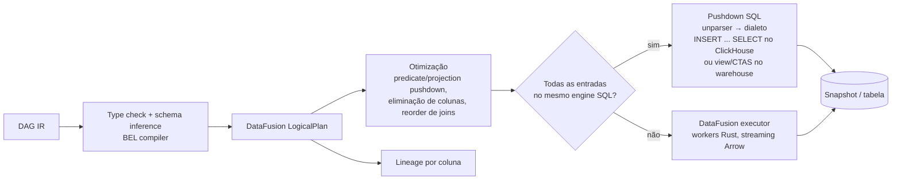

# 10 — Transformation Engine

> Seção do pedido: **§13 Transformation Engine** (§10 do pedido: normalização e transformação; Rust/Polars/Arrow/DataFusion/Parquet).

---

## 13.1 Avaliação da combinação proposta (Rust + Polars + Arrow + DataFusion + Parquet)

| Componente | Avaliação | Decisão |
|---|---|---|
| **Rust** | Performance, memória previsível, ecossistema Arrow maduro | **Sim** |
| **Apache Arrow** (arrow-rs) | Formato em memória comum a conectores, engine e wire | **Sim** |
| **Parquet** | Formato de staging/curated | **Sim** |
| **DataFusion** | Engine de consulta **como biblioteca**: SQL + DataFrame, otimizador extensível (regras próprias), `TableProvider` custom (nossos conectores/snapshots), UDF/UDAF/UDWF, planos lógicos inspecionáveis (lineage por coluna!), Substrait, unparser SQL. Projeto Apache top-level, usado por InfluxDB 3, Comet, GlareDB, etc. | **Motor de execução e planejamento** |
| **Polars** | Excelente performance de DataFrame, lazy engine com otimizações. Porém: API Rust é secundária ao Python e muda com frequência; extensibilidade de otimizador/fontes menor que DataFusion; ter dois engines duplicaria semântica de funções (casts, datas, nulos) | **Não como núcleo**; manter possível para operações pontuais |
| **DuckDB** (alternativa) | Performance excelente, melhor leitor de CSV do mercado (sniffer), Excel/JSON, spatial. C++ embarcado via `duckdb-rs`; menos controle sobre planejamento/lineage | **Usado no perfilamento/sniffing de arquivos** (detecção de delimitador, tipos, encoding) e no browser; não como engine de transformação principal |

**Conclusão:** a combinação é adequada com um ajuste — **DataFusion é o núcleo**, Polars sai do caminho crítico, DuckDB entra como ferramenta de parsing de arquivos. O fator decisivo é que o Transformation Engine e o Query Engine compartilham **o mesmo modelo de plano (DataFusion LogicalPlan)** e o mesmo sistema de tipos/funções, reduzindo divergências.

## 13.2 Transformation DAG IR

O usuário (UI estilo Power Query) ou um modelador (YAML/SQL) produz um **DAG declarativo** de passos, versionado como documento:

```json
{
  "pipeline": "ppl_orders_clean",
  "nodes": {
    "src":   { "op": "source", "dataset": "dts_raw_orders" },
    "cast":  { "op": "cast", "input": "src", "columns": { "amount": "decimal(18,2)", "created_at": "timestamp" } },
    "dedup": { "op": "deduplicate", "input": "cast", "keys": ["order_id"], "keep": "latest", "orderBy": "updated_at" },
    "cust":  { "op": "source", "dataset": "dts_customers" },
    "join":  { "op": "join", "left": "dedup", "right": "cust", "on": [["customer_id", "id"]], "type": "left" },
    "calc":  { "op": "add_column", "input": "join", "name": "net", "expression": "[amount] - [discount]" },
    "valid": { "op": "validate", "input": "calc", "rules": [{ "kind": "not_null", "column": "order_id" }, { "kind": "range", "column": "net", "min": 0 }] },
    "out":   { "op": "output", "input": "valid", "dataset": "dts_orders", "partitionBy": ["month(created_at)"] }
  }
}
```

### Catálogo de operações
| Categoria | Operações |
|---|---|
| Estrutura | select, rename, reorder, cast, drop, add_column (BEL), split_column, merge_columns |
| Linhas | filter (BEL), deduplicate, sort, sample, limit, fill_null, replace_values |
| Combinação | join (inner/left/right/full/semi/anti), union (by name / by position), lookup |
| Remodelagem | pivot, unpivot, group_by/aggregate, window, explode/flatten (JSON/arrays) |
| Tipos especializados | datas (parse, timezone, truncate, fiscal calendars), strings (trim, case, regex extract/replace, normalize unicode), números (round, bucket) |
| Geo | parse WKT/WKB/GeoJSON, lat/lon → point, H3 index, reprojeção, simplificação, geocoding (enriquecimento) |
| Qualidade | validate (not_null, unique, range, regex, referential, custom BEL), quarantine, assert row counts |
| Enriquecimento | lookup em dataset de referência, chamada a serviço de enriquecimento (assíncrono, cacheado) |
| Extensão | UDF via WASM component (plugin de transformação) |

## 13.3 Execução: dois backends



| Backend | Quando | Exemplo |
|---|---|---|
| **Pushdown SQL** | Entradas residem no mesmo engine (ClickHouse gerenciado ou warehouse do cliente) | Limpeza sobre dataset já importado; dataset virtual sobre Snowflake (vira view lógica, sem mover dados) |
| **DataFusion** | Fontes heterogêneas, arquivos, APIs, operações não expressáveis no dialeto | CSV + API REST + join com dataset gerenciado |

## 13.4 Propriedades exigidas

| Propriedade | Como |
|---|---|
| **Lazy execution** | DAG → plano lógico; nada executa até `output` ser materializado ou um preview ser pedido |
| **Preview interativo** | Execução do plano com `LIMIT` + amostragem estratificada sobre o último snapshot; cache de previews por (nó, hash do sub-DAG) |
| **Query optimization** | Otimizador DataFusion + regras próprias (ex.: empurrar filtros para dentro de `source` que é conector live) |
| **Predicate / projection pushdown** | `TableProvider` dos conectores e dos snapshots Parquet implementa `supports_filters_pushdown`; Parquet usa estatísticas de row group e page index |
| **Cache intermediário** | Nós marcados `materialize: true` ou detectados como caros e reutilizados por múltiplos outputs são materializados em Parquet com chave = hash(sub-DAG + versões de entrada) |
| **Lineage** | Extraído do plano lógico (coluna de saída → expressões → colunas de entrada) e publicado no grafo de lineage |
| **Observability** | Métricas por operador (linhas in/out, tempo, memória) via métricas do plano físico DataFusion; trace por run |
| **Reproducibility** | Run = (hash do DAG, versões/snapshots de entrada, versão do engine); snapshots imutáveis → reexecução determinística; funções não determinísticas (`now()`) recebem o timestamp do run |
| **Memória** | Execução streaming com spill-to-disk (memory pool do DataFusion com limite por job) |

## 13.5 Normalização de fontes heterogêneas
- **Tipos canônicos** da plataforma (mapeados para Arrow): string, int64, decimal(p,s), float64, boolean, date, timestamp(tz), duration, json, geometry, array, struct.
- Cada conector declara mapeamento de tipos nativos → canônicos (tabela testada na suíte de conformidade).
- Strings: normalização Unicode NFC, trimming opcional, detecção de encoding na ingestão de arquivos.
- Datas: armazenadas em UTC com timezone de origem registrado no metadado do campo; conversão para o timezone do modelo semântico em query.
- Moedas: valores + coluna/dimensão de moeda; conversão como metric derivada usando dataset de câmbio (não no pipeline, para preservar o valor original).

## 13.6 Transformação assistida por IA (AI v2, Fase 4)

- O **catálogo de operações** (§13.2) é publicado como schemas (JSON Schema por operação, com `description` em cada parâmetro) em `packages/schema`. É o mesmo contrato usado pela UI estilo Power Query e pela IA.
- A IA gera **ops do catálogo** (nunca código): "converta para data" → `cast`/parse de data; "separe nome e sobrenome" → `split_column`; "coluna de margem" → `add_column` com BEL tipado; "una datasets" → `join` com chaves sugeridas a partir de relacionamentos/perfis.
- Fluxo: proposta → **preview em amostra** (infra de preview existente, com o principal do usuário) → confirmação → revisão draft do pipeline → execução normal (Temporal, idempotência, validação, quarentena).
- `RAW_SQL`, UDFs e chamadas externas de enriquecimento **não** ficam disponíveis para a IA (UDFs de plugins apenas se expostas como ferramenta e permitidas).
- Lineage e impact analysis aparecem na proposta antes da confirmação.
