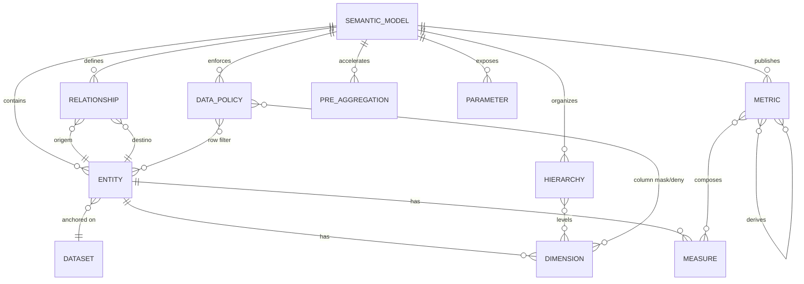

# 11 — Semantic Layer

> Seção do pedido: **§14 Semantic Layer** (§11 do pedido).

Schema: [`schemas/semantic-model.ts`](schemas/semantic-model.ts) · Exemplo: [`semantic-model.sales.json`](schemas/examples/semantic-model.sales.json).

---

## 14.1 O que aprendemos com cada referência

| Referência | O que adotamos | O que evitamos |
|---|---|---|
| **Power BI semantic models** | Relacionamentos com cardinalidade e direção; measures como objetos de primeira classe; *calculation groups* (time intelligence reutilizável); RLS por papel com expressões | DAX e o *filter context* implícito — poderoso, mas opaco e difícil de compilar para SQL portátil |
| **LookML (Looker)** | Modelo como código versionável; *explores* com join graph explícito; **symmetric aggregates** contra fan-out; `sql_always_where` / access filters | Acoplamento a SQL bruto em toda definição (portabilidade entre dialetos ruim) |
| **Cube** | Pre-aggregations declaradas e aggregate awareness; *refresh keys*; multitenancy por contexto de segurança; API semântica | Cubos como unidade (modelamos entidades + metrics globais) |
| **dbt Semantic Layer / MetricFlow** | **Entities** com chaves e join automático pelo grafo de entidades; tipos de metric (simple, ratio, derived, cumulative, conversion); measures com `agg` e `non_additive_dimension`; definição desacoplada do warehouse | Dependência do ecossistema dbt |
| **Tableau** | **LOD expressions** (FIXED/INCLUDE/EXCLUDE) — modelo mental excelente para analistas; relationships "noodles" com agregação no nível nativo de cada tabela | Extracts proprietários (.hyper) |

### Decisão: semantic layer própria, combinando
**Entidades e grafo de joins do MetricFlow** + **symmetric aggregation/fan-out safety do Looker** + **pre-aggregations do Cube** + **LOD do Tableau** + **calculation groups/RLS do Power BI**, com uma **linguagem de expressões própria (BEL)** compilada para múltiplos dialetos.

## 14.2 Modelo conceitual

| Conceito | Definição | Exemplo |
|---|---|---|
| **Dataset** | Tabela lógica (física, virtual ou gerenciada) | `orders` |
| **Entity** | Objeto de negócio ancorado num dataset com **chave primária** | `Order(order_id)` |
| **Dimension** | Atributo para agrupar/filtrar; tipos categorical, time (grains), geo, boolean, bucket | `country`, `order_date.month` |
| **Measure** | Agregação sobre uma entidade com **semântica de aditividade** | `sum(amount - discount) where status = 'paid'` |
| **Metric** | Conceito de negócio publicado, composto de measures/metrics | `revenue`, `aov = revenue / orders`, `revenue_yoy` |
| **Relationship** | Join entre entidades com cardinalidade, tipo e estado (ativo/inativo) | `Order N:1 Customer` |
| **Hierarchy** | Caminho de drill | `país → estado → cidade` |
| **Time intelligence** | Modificadores reutilizáveis (YTD, QTD, MTD, PoP, running total, % do total) | `revenue` + `ytd` |
| **Parameter** | Valor escolhido pelo usuário usado em expressões | moeda de exibição, cenário what-if |
| **Calculated field** | Dimensão/measure/metric definida por BEL | `margin_pct = ([revenue] - [cost]) / [revenue]` |
| **Data policy** | RLS (predicado por entidade) e CLS (deny/mask por campo), com sujeito por papel/grupo/condição ABAC | `[region] IN @user.attributes.regions` |
| **Metadata de negócio** | Label, descrição obrigatória para certificadas, owners, formato, unidade, moeda, timezone, sinônimos (para busca/NLQ) | — |

### "Revenue" não é `SUM(amount)`
`met_revenue` carrega: fórmula (via measure com filtro), **unidade/moeda** (BRL, ou de uma dimensão de moeda com conversão), **formato**, **timezone** da dimensão temporal default, **aditividade** (determina se pode ser re-agregada em rollups e totais), **políticas de acesso**, **descrição de negócio**, **owner** e **status de certificação**. Qualquer widget, export, alerta ou API que use "Receita" obtém exatamente a mesma definição.

## 14.3 BEL — BI Expression Language

- **Sintaxe**: estilo fórmula de planilha/SQL-like familiar: `[campo]`, funções (`SUM`, `IF`, `CASE`, `DATE_TRUNC`, `COALESCE`, `REGEXP_EXTRACT`, `H3`...), operadores, literais tipados, referências `@user.attributes.x`, `@param.x`.
- **Tipada e verificada**: typechecker produz erros com posição; tipos canônicos da plataforma.
- **LOD**: `{FIXED [customer] : MIN([order_date])}`, `{INCLUDE [product] : SUM([amount])}`, `{EXCLUDE [region] : SUM([amount])}` → compiladas para subqueries/janelas.
- **Implementação única em Rust** (crate `semantic`): parser (ex.: `chumsky`/`winnow`/pest), AST, typechecker, normalizador, compilador para expressão DataFusion (que segue para o dialeto).
- **Compartilhada via WASM** com o browser: editor de expressões (CodeMirror 6) recebe diagnósticos, autocomplete de campos/funções e tipo do resultado sem round-trip.
- **Segurança**: sem SQL bruto do usuário final; funções permitidas por allowlist; modeladores com permissão podem usar `RAW_SQL("...")` marcado como não portátil (auditado).

## 14.4 Corretude de agregação (o problema mais difícil)

| Armadilha | Proteção |
|---|---|
| **Fan-out** (join 1:N infla somas da entidade "1") | Measures são agregadas **no nível da sua entidade antes do join** (estratégia MetricFlow) ou com **symmetric aggregates** (`SUM(DISTINCT pk_hash + valor)` estilo Looker) quando o dialeto exige join único; escolha feita pelo planner |
| **Chasm trap** (duas tabelas fato ligadas por dimensão comum) | Cada fato agregado separadamente por dimensões comuns e depois juntado ("multi-fact query") |
| **Caminhos de join ambíguos** | Apenas relacionamentos ativos; inativos exigem seleção explícita (role-playing: data do pedido vs data de entrega); erro de modelagem detectado na publicação |
| **Semi-aditivas** (saldo, estoque) | `additivity.semi-additive` com dimensão não aditiva (tempo) e janela (`last`) → planner gera "último valor por período" e não soma no tempo |
| **Não aditivas** (count distinct, mediana) | Não são reagregadas de rollups (exceto HLL aproximado se permitido); totais recalculados na fonte |
| **Totais e subtotais** | Calculados com a semântica da metric (ex.: ratio total = soma numerador / soma denominador), nunca somando linhas exibidas |

## 14.5 Ciclo de vida do modelo
- Autoria na UI (editor visual + editor de expressões) **e** como código (YAML exportável/importável; Git sync numa fase posterior).
- **Publicação = compilação**: o control plane chama o compilador (data plane, gRPC — ou o build WASM no Node) que valida tipos, grafo de joins, ciclos, ambiguidade, políticas e pre-aggs; gera um **snapshot compilado** imutável (`rev_*`, hash).
- **Impact analysis** antes de publicar: diff com a revisão anterior + lineage → dashboards/alertas afetados; mudanças destrutivas (remover/renomear campo usado, mudar tipo) exigem confirmação ou deprecação gradual (`deprecated` com substituto).
- O Query Service carrega snapshots por `(tenant, model, revision)` em cache local (LRU) — sem consultar o Postgres no caminho quente.

## 14.6 Exposição externa (futuro)
- **API semântica** (QDL via REST) desde o início.
- **SQL API** (Postgres wire / Arrow Flight SQL) expondo metrics/dimensions como tabelas virtuais para ferramentas externas (Excel, Tableau, notebooks) — fase Scale.
- **NLQ/assistentes**: a camada semântica (com descrições, sinônimos e tipos) é a base da tradução linguagem natural → QDL (nunca → SQL direto). Ver §14.7 e [31](31-ai-assistant.md).

## 14.7 Semantic layer como base de grounding da IA

| Extensão (aditiva) | Uso | Sem IA |
|---|---|---|
| `synonyms` em dimensões e metrics | Resolver "faturamento" → `met_revenue` | Busca do catálogo |
| `classification` (herdada do campo do dataset, pode endurecer) | Mascaramento no egress guard; CLS automática | Governança/CLS |
| `ai.instructions` (por modelo, versionadas com a revisão) | Glossário e regras de negócio ("receita = líquida por padrão") | Documentação do modelo |
| `ai.verifiedQuestions` (pergunta → QDL aprovada por steward) | Exemplos confiáveis e respostas "verificadas" | Perguntas frequentes / atalhos de exploração |
| `ai.exclude` | Campos que a IA não deve usar (técnicos, obsoletos) | — |

- **Propostas de modelagem pela IA** (AI v2): "crie uma métrica de ticket médio" → proposta de `MetricDefinition` (ratio) num **draft** do modelo → compilação (tipos, grafo, aditividade) → impact analysis → confirmação → publicação pelo fluxo humano normal.
- A IA **sugere** descrições e sinônimos (acelera a curadoria), sempre aceitos por humanos.
- Snapshot compilado expõe uma **visão compacta para contexto** (campos, tipos, descrições, relacionamentos, hierarquias), cacheada por hash de revisão e reaproveitada como prefixo estável de prompt.
