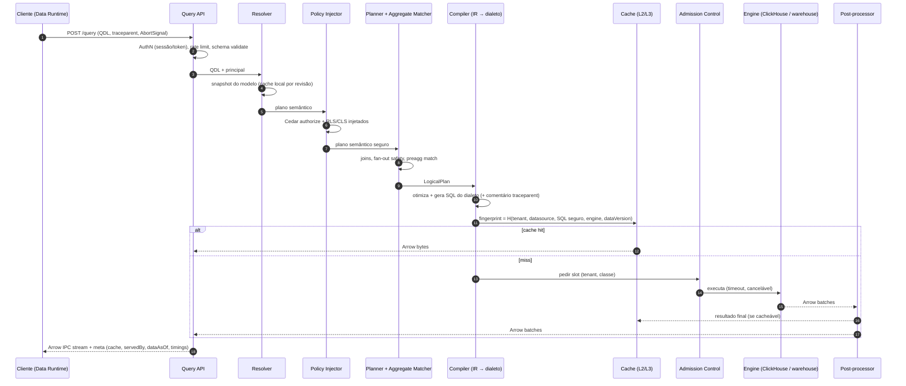
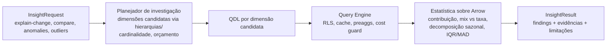

# 12 — Query Engine, Cache Strategy e Pre-aggregation

> Seções do pedido: **§15 Query Engine**, **§20 Cache strategy**, **§21 Preaggregation strategy** (§12, §19, §20 do pedido).

Contrato: [`schemas/query.ts`](schemas/query.ts) · Exemplo: [`query-request.json`](schemas/examples/query-request.json).

---

## 15.1 Componentes

| Componente | Responsabilidade |
|---|---|
| **QDL (Query Definition Language)** | Contrato semântico declarativo (dimensions, metrics, filters, order, limit, totals, pivot, calculations, parameters, options, context). Versionado (`qdl: 1`). |
| **Resolver** | Carrega snapshot do modelo; resolve refs para expressões; valida papéis e tipos; expande metrics derivadas/PoP/LOD |
| **Policy Injector** | Avalia autorização (Cedar) do principal sobre modelo/campos; injeta RLS (predicados por entidade) e aplica CLS (remove/mascara campos ou rejeita) **no plano semântico** |
| **Semantic Planner** | Escolhe entidades e caminho de joins; estratégia anti fan-out/chasm; multi-fact; time spine para densificação; totals |
| **Aggregate Matcher** | Verifica se pre-aggregations atendem (total ou parcialmente — lambda: rollup + dados recentes) |
| **Relational IR** | **DataFusion LogicalPlan** + otimizações (pushdown, simplificação, eliminação de colunas, regras próprias) |
| **Dialect Compiler** | Unparser DataFusion com customizações por dialeto + emissores próprios para lacunas (funções de data, H3, LOD, symmetric aggregates) |
| **Cost guard** | Estimativa (EXPLAIN ESTIMATE no ClickHouse, dry-run no BigQuery, heurísticas de cardinalidade das estatísticas do catálogo) → rejeita/alerta acima do orçamento do tenant |
| **Executor** | Pools por data source; **admission control** (slots por tenant e por classe: interactive > export > warmup); timeouts; cancelamento propagado (abort do browser → `KILL QUERY`/cancel API) |
| **Post-processor** | DataFusion: totals/subtotais, pivot, metrics que combinam fontes, federação leve (join de resultados agregados), formatação de tipos, truncamento |
| **Result cache** | L2 (processo) / L3 (Valkey) por fingerprint seguro |
| **Serializer** | Arrow IPC stream (chunks) ou JSON; metadados de campos (formato, unidade, papel) no schema metadata |

## 15.2 Query lifecycle



## 15.3 Decisões de design

### Por que a política entra antes da otimização
Se RLS fosse aplicado como `WHERE` sobre o SQL final, otimizações (pre-agg matching, reuso de cache, pushdown) poderiam produzir resultados sem o filtro. Injetando no plano semântico:
- o aggregate matcher só usa rollups que contêm as dimensões do predicado de política;
- o fingerprint de cache é calculado sobre o SQL **já** seguro;
- teste de propriedade (proptest) garante: *para todo plano físico gerado para principal com política P aplicável, o predicado de P está presente*.

### Por que DataFusion como IR (e o risco)
- **A favor:** otimizador maduro e extensível, tipos Arrow, unparser SQL para dialetos (Postgres, MySQL, SQLite, DuckDB, BigQuery... e extensível), o mesmo plano serve para execução local (pós-processamento/federação) e para geração de SQL; reutilizado pelo Transformation Engine.
- **Risco:** cobertura do unparser varia por dialeto e a API evolui rápido.
- **Mitigação:** **spike obrigatório na Fase 1** (gerar SQL de 50 queries representativas para ClickHouse, Postgres, Snowflake, BigQuery e comparar resultados com DuckDB como oráculo); camada `sql-dialects` própria encapsula o unparser — se necessário, troca-se por emissores próprios sem afetar planner/semântica. Alternativa avaliada: **Apache Calcite** (mais maduro em dialetos, mas JVM e sem WASM) — rejeitado pelo custo de um terceiro runtime no caminho quente.

### Federação
- **Leve (suportada):** metrics de fontes diferentes agregadas separadamente e combinadas por dimensões conformadas no post-processor (DataFusion), com limite de cardinalidade.
- **Pesada (não suportada no caminho interativo):** joins linha-a-linha entre fontes grandes → produto sugere **importar** ou materializar; Trino como conector opcional no futuro.

### SQL generation por dialeto — testes
- Golden tests (QDL → SQL) por dialeto.
- **Testes diferenciais**: mesma QDL executada em ClickHouse/Postgres/DuckDB (Testcontainers) com o mesmo dataset → resultados comparados; DuckDB é o oráculo.
- Fuzzing de QDL/BEL (geração aleatória válida por tipo).

---

## 15.4 Consumidores de IA (Assistant e Insights)

| Aspecto | Regra |
|---|---|
| Entrada | Apenas QDL (text-to-SQL não existe) com `context.purpose = "assistant"` ou `"insight"` + `conversationId`/`toolCallId` |
| Principal | **Token delegado** de vida curta (claims do usuário + `via: assistant` + escopo); mesmas RLS/CLS ([ADR-0034](adr/ADR-0034-ai-delegated-principal.md)) |
| Egress | `options.egress` (linhas/colunas máximas, classificações mascaradas) aplicado **no servidor** ao payload destinado ao modelo; o usuário pode ver o resultado completo renderizado |
| Admission control | Classe própria (`assistant`), com prioridade abaixo de `interactive` e orçamento por turno (queries/bytes) |
| Cache | Mesmo fingerprint pós-política: perguntas repetidas da IA são servidas pelo L2/L3/preaggs |
| Telemetria | Spans ligados ao turno da IA; `query.executed` com `purpose` para metering e auditoria |

## 15.5 Insights Engine (Fase 4)

Módulo `insights` usado pelo `query-service` ([ADR-0038](adr/ADR-0038-deterministic-insights-and-recommenders.md)):



- Exposto em `POST /insights/v1` para a UI sem IA ("Explicar variação", selos de anomalia) e como ferramenta da IA.
- Resultados são **reprodutíveis** (mesmas QDLs, mesmas revisões) e testados com datasets sintéticos com efeitos conhecidos.

---

## 20. Cache strategy

### Camadas

| Camada | Onde | Conteúdo | Chave | TTL / invalidação | Isolamento |
|---|---|---|---|---|---|
| **L1 — Browser** | Memória do Data Runtime (por aba) | Frames Arrow por fingerprint de request | `H(QDL canônica, modelRevision, tenant, principalScope)` | Sessão; invalidado por eventos (`dataset.snapshot_published` via WebSocket) ou TTL curto | Por usuário/aba; **não persistido** por padrão |
| **L2 — Processo** | LRU no Query Service | Resultados pequenos e quentes; snapshots de modelos; decisões de política | Fingerprint seguro | Segundos–minutos; limite de memória | Chave inclui tenant |
| **L3 — Valkey** | Cluster por cell | Arrow IPC comprimido (ZSTD) | `qc:{tenant}:{fingerprint}` | Por `dataVersion` (import) ou TTL/refresh key (live); tamanho máximo por entrada | Prefixo por tenant; quotas de memória por tenant (contabilidade) |
| **L4 — Engine** | Query cache do ClickHouse / result cache do Snowflake/BigQuery | — | Do engine | Do engine | Do engine |
| **L5 — Pre-aggregations** | ClickHouse | Rollups materializados | Definição + partição | Refresh incremental | Database por tenant |

### Fingerprint seguro (o ponto mais importante)
```
fingerprint = SHA-256(
  tenant_id,
  datasource_id,
  engine + dialect version,
  compiled_sql_after_policy_injection,   // RLS do principal já embutida
  bound_parameters,
  data_version | refresh_key_value,      // invalidação natural
  result_shape_options (limit, format)
)
```
- Dois usuários com a **mesma RLS efetiva** compartilham entradas (eficiência); usuários com RLS diferentes geram SQL diferente → chaves diferentes (segurança). **Nunca** cachear por QDL "crua".
- CLS mascarado é parte do SQL → também protegido.

### Invalidação
| Tipo de dataset | Estratégia |
|---|---|
| Importado | `dataVersion` (snapshot) na chave → publicação de novo snapshot torna entradas antigas inalcançáveis (expiram por LRU/TTL) |
| Live | **Refresh key** (estilo Cube): query barata (`SELECT max(updated_at)`) executada no máximo a cada N segundos por data source/tabela; valor entra na chave. Fallback: TTL configurável por dataset |
| Streaming | Não cacheado no L3 (ou TTL de segundos); gateway envia deltas |
| Mudança de política/grant | Política entra no SQL → automático; cache de *decisões* de autorização invalidado por evento `policy.changed` |

### Proteções
- **Stampede**: *single-flight* por fingerprint (lock leve no Valkey) — N widgets/usuários iguais = 1 execução.
- **Stale-while-revalidate** opcional por dataset (dashboards de alta audiência).
- Tamanho máximo por entrada; resultados acima não vão ao L3.

---

## 21. Preaggregation strategy

### Tipos
| Tipo | Descrição | Onde |
|---|---|---|
| **Rollup declarado** | Definido no modelo semântico (measures re-agregáveis × dimensões × grain temporal) | ClickHouse (`AggregatingMergeTree`/`SummingMergeTree` ou tabela agregada simples) |
| **Rollup de fonte live** | Mesmo conceito, materializado a partir do warehouse do cliente para o **nosso** ClickHouse | Reduz latência e custo do warehouse |
| **MV incremental** | Materialized view do ClickHouse alimentada no insert (dados importados/stream) | Realtime e datasets append-only |
| **Recomendado** | Gerado a partir do query log (formas de query frequentes e caras) e sugerido ao modelador | Fase 6 |
| **Automático** | Criado/removido pela plataforma com orçamento por tenant | Fase 7 |

### Aggregate awareness (matching)
Uma QDL pode ser servida por um rollup R se:
1. `dims(Q) ∪ dims(filtros(Q)) ∪ dims(políticas aplicáveis) ⊆ dims(R)`;
2. todas as measures de Q são deriváveis de R: `sum`, `count`, `min`, `max` diretamente; `avg = sum/count`; `count_distinct` só via estado HLL (`uniqState`) **se** a metric permitir aproximação;
3. grain temporal de Q ≥ grain de R (dia → mês ok);
4. metrics derivadas/ratio/PoP decompostas em measures base e recompostas;
5. R está fresco o suficiente (`allowStale` ou lambda: R para partições fechadas + fonte para a janela recente não materializada).

Escolha entre vários rollups candidatos: menor custo estimado (linhas da partição).

### Refresh
- Particionado por tempo (`partitionGrain`); apenas partições afetadas recalculadas (`updateWindow` para dados atrasados).
- Disparado por: schedule, `dataset.snapshot_published`, refresh key de fonte live.
- Executado como workflow Temporal (pre-agg builder no data plane), com idempotência por (rollup, partição, versão de entrada).
- Build em tabela nova + troca atômica de partição.

### Governança de custo
- Orçamento de armazenamento/compute de pre-aggs por tenant (entitlements).
- Métricas: taxa de acerto por rollup, custo de build, economia estimada (bytes evitados) → rollups sem uso são sugeridos para remoção.

