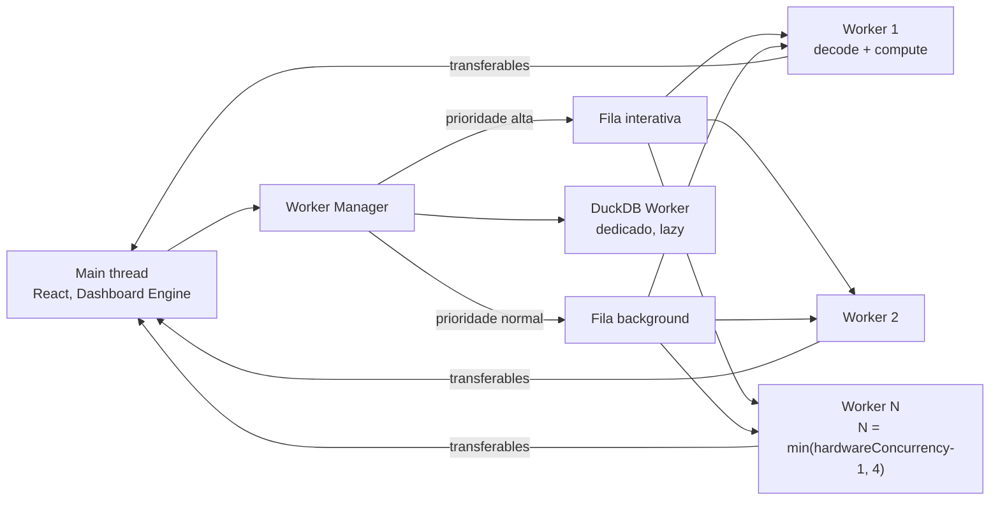
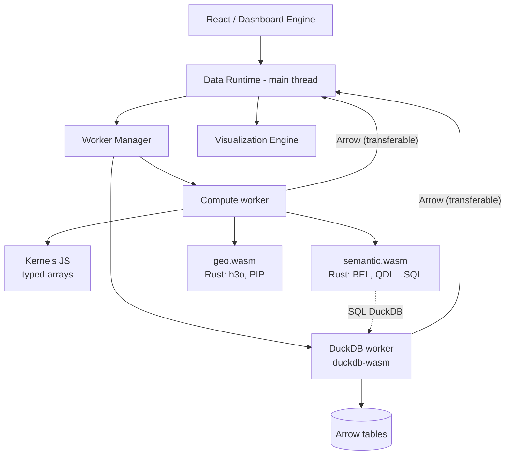

# 13 — Browser Data Runtime, Rust/WASM, Web Workers e GPU

> Seções do pedido: **§17 Browser Data Runtime**, **§18 Rust/WASM architecture** (§14, §15, §16, §17 do pedido: Arrow, WASM, Workers, WebGPU/WebGL).

---

## 17.1 Responsabilidades do Data Runtime

| Responsabilidade | Detalhe |
|---|---|
| **Query manager** | Recebe `QueryRequest`s do Dashboard Engine; dedupe por fingerprint; prioridade (visível > abaixo da dobra > prefetch); cancelamento (AbortSignal) quando filtros mudam ou widget sai de vista; limite de concorrência HTTP por origem |
| **Transporte** | `fetch` com streaming (Arrow IPC chunks), HTTP/2/3; WebSocket para realtime |
| **Decodificação** | Arrow IPC → tabelas Arrow em worker; entrega `DataFrameView` ao main thread via transferables |
| **Cache L1** | Memória, por aba, com orçamento (ex.: 128–256 MB) e LRU; invalidação por eventos |
| **Computação local** | Reagregação ("coarsening"), filtros locais, ordenação, top-N, LTTB, point-in-polygon — em workers |
| **Datasets locais** | DuckDB-WASM (lazy) para arquivos do usuário/offline |
| **Compilador semântico WASM** | Validação de BEL, autocomplete, compilação QDL → SQL DuckDB para datasets locais |
| **Telemetria** | Tempos por query (fila, rede, decodificação, render), cache hit L1, memória |

<a id="arrow"></a>
## 17.2 Apache Arrow no browser (§14 do pedido)

```text
Backend (Arrow RecordBatches) → Arrow IPC stream (+ Content-Encoding br/zstd/gzip) → fetch streaming
  → Worker: decode IPC (buffers alinhados, sem parse por valor) → Arrow Table em memória do worker
  → transfer ArrayBuffers (zero-copy entre threads) → main thread: DataFrameView (typed arrays)
  → plugin: ECharts (converte para arrays/dataset — custo O(n), aceitável para n agregado pequeno)
           deck.gl (atributos binários direto — zero-copy real até a GPU)
```

| Aspecto | Avaliação |
|---|---|
| **Zero-copy** | Real dentro de uma thread e entre threads via *transferables* (posse transferida, não cópia). Não existe zero-copy JS↔WASM sem copiar para a memória linear do WASM (ou ler dela) — por isso evitamos idas e vindas JS/WASM com dados grandes. Para deck.gl, colunas numéricas viram atributos de GPU sem conversão |
| **Columnar processing** | Filtros/agregações locais sobre typed arrays são vetorizáveis e cache-friendly; JS puro já é rápido para ≤ ~1M valores |
| **Serialização** | Arrow IPC evita JSON.parse (que é o gargalo dominante acima de ~50k linhas) e preserva tipos (int64, decimal, timestamp com tz) |
| **Compatibilidade** | `apache-arrow` (JS oficial) ou **Flechette** (decoder JS menor e mais rápido, focado em leitura) — escolher por benchmark na Fase 1; Int64/Decimal exigem tratamento (BigInt) → servidor envia `float64` para measures quando seguro e `int64` só onde necessário |
| **Streaming** | IPC *stream format* permite renderização progressiva (tabelas grandes) e cancelamento no meio |
| **Compressão** | Compressão de buffers IPC (LZ4/ZSTD) tem suporte irregular nos decoders JS → usar **compressão HTTP** (brotli/gzip universalmente; zstd onde o browser suportar) |
| **Memory pressure** | Orçamento por aba; frames liberados quando widgets são destruídos; resultados acima de `maxRows` truncados no servidor (com flag `truncated`) |

**JSON** permanece como formato alternativo para: respostas pequenas (< ~1k linhas, onde a diferença é irrelevante), consumidores de API de terceiros, debugging.

---

## 16 (pedido). Web Workers — Worker Pool



| Tema | Design |
|---|---|
| **Scheduling** | Duas filas (interativa / background) + prioridade por visibilidade do widget; work-stealing simples; tarefas pequenas agrupadas |
| **Cancellation** | Cada tarefa tem `taskId` + AbortSignal; workers checam cancelamento entre chunks; tarefas obsoletas descartadas antes de iniciar |
| **Priority** | Interação do usuário (cross-filter) preempta prefetch; tarefas de decode de widgets visíveis primeiro |
| **Memory** | Contabilidade de bytes por worker; se excede orçamento → evict L1, recusar computação local (fallback servidor) |
| **Backpressure** | Limite de tarefas em voo por worker; stream de Arrow pausa leitura (`ReadableStream` backpressure) quando worker está saturado |
| **Worker reuse** | Pool persistente (custo de spawn e de carregar WASM pago uma vez); DuckDB em worker dedicado (estado + memória próprios) |
| **Protocolo** | Mensagens tipadas (`{type, taskId, payload}`), Comlink-like RPC, schema validado em dev |

---

## 18. Rust/WASM architecture

### Onde WASM gera valor (e onde não)

| Responsabilidade | WASM? | Justificativa |
|---|---|---|
| **Compilador semântico / BEL** (parser, typechecker, autocomplete, QDL → SQL DuckDB) | **Sim — Fase 2/3** | Mesmo código do servidor: zero divergência de gramática/tipos; feedback instantâneo no editor |
| **Engine SQL local para datasets do usuário** | **Sim — DuckDB-WASM** (não Rust próprio) | Maduro, lê CSV/Parquet/JSON, Arrow in/out; construir isso em Rust/DataFusion-WASM seria duplicar trabalho |
| **Filtering / sorting / grouping de resultados agregados (≤ ~100k linhas)** | **Não** | JS com typed arrays é suficiente; custo de copiar para memória WASM anula o ganho |
| **Reagregação de resultados grandes (≥ ~1M linhas)** | **Talvez** | Só se profiling mostrar ganho real; alternativa é DuckDB-WASM sobre o Arrow já carregado |
| **Pivot** | **Não** (servidor) | Pivot correto depende da semântica de metrics; feito no post-processor |
| **Funções estatísticas** (percentis, regressão, histogramas) | **Talvez** | Para datasets locais; preferir DuckDB-WASM |
| **Geoespacial** (H3 via `h3o`, point-in-polygon em massa, simplificação) | **Sim, sob demanda** | Rust tem implementações excelentes; usado em datasets locais e seleção espacial grande |
| **LTTB / binning para render** | **Talvez** | Implementar em JS primeiro; portar se gargalo |
| **Cálculo de layout** | **Não** | Pequeno, JS |

### Arquitetura



A arquitetura proposta no pedido (`React → Data Runtime → Worker → Rust/WASM → Arrow → Result → Visualization`) está **correta na forma**, com duas correções: (1) o caminho padrão é **servidor → Arrow → worker (JS decode) → viz**, sem WASM; (2) o "Rust/WASM" no browser é principalmente o **compilador**, e o motor de dados local é **DuckDB-WASM**.

### Detalhes técnicos

| Tema | Decisão |
|---|---|
| **wasm-bindgen** | Sim, para a crate `wasm-bindings` (API pequena: `validate`, `complete`, `compile`, `typeOf`); `wasm-pack`/`wasm-bindgen-cli` no build; tamanho alvo do `semantic.wasm` < ~1–1,5 MB comprimido (feature flags para remover dialetos não usados no browser) |
| **SharedArrayBuffer / threads** | Exige **cross-origin isolation** (COOP/COEP) — conflita com embeds em sites de terceiros e com recursos cross-origin sem CORP. Decisão: **não depender** de SAB; DuckDB-WASM funciona em modo single-thread; habilitar threads apenas na app principal quando isolada (feature detection) |
| **Transferable objects** | Padrão para mover buffers Arrow entre workers e main thread |
| **SIMD** | WASM SIMD128 amplamente suportado; habilitar no build Rust (`target-feature=+simd128`) para kernels geo |
| **Memory management** | Memória linear do WASM só cresce (não devolve ao SO) → kernels WASM em workers recicláveis (terminar worker após picos); DuckDB com `memory_limit` |
| **Serialization overhead** | Interface WASM recebe/retorna strings pequenas (QDL/SQL/diagnósticos) ou ponteiros para buffers Arrow via Arrow C Data Interface quando necessário |
| **Limites do browser** | wasm32 limita a 4 GB de endereçamento (prática: 1–2 GB estáveis); Safari/iOS mais restritivo → orçamento de dataset local menor em mobile |

---

## 17 (pedido). WebGPU / WebGL

| Caso | Tecnologia | Fallback |
|---|---|---|
| Mapas (basemap, vetores) | MapLibre (WebGL2) | WebGL1 (degradado) / imagem estática |
| Milhões de pontos, heatmaps, hexbins, arcos, 3D | deck.gl (WebGL2; WebGPU quando estável em luma.gl) | Agregação mais grossa no servidor + Canvas |
| Scatter massivo cartesiano | deck.gl `OrthographicView` | ECharts large mode (Canvas) com amostragem |
| Gráficos de negócio | ECharts Canvas | SVG |
| Custom visualizations de alta escala | Plugin com deck.gl/luma.gl | Canvas |

Cadeia: **WebGPU → WebGL2 → Canvas 2D → SVG**, decidida por plugin via capability detection (`navigator.gpu`, contexto WebGL2) e por volume. Princípio: **antes de usar GPU, reduzir dados** (agregação no servidor); GPU é para quando o volume visível precisa ser grande.

---

## Nota: IA e o Data Runtime
O assistente não roda computação de dados no browser. Mini-visualizações de evidência e propostas usam o Data Runtime normal (QDL → Arrow → plugins). O compilador semântico em WASM também valida expressões BEL geradas pela IA no editor antes do envio. No Flow E (dataset local), a IA só recebe **metadados** do dataset local por padrão (o dado permanece no dispositivo, coerente com a promessa do modo local).
