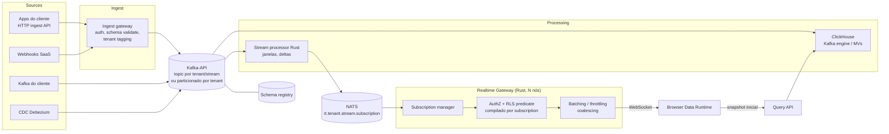

# 14 — Realtime Architecture

> Seção do pedido: **§19 Realtime architecture** (§18 do pedido).

---

## 19.1 Estágios (realtime não nasce no dia 1)

| Estágio | Capacidade | Infra |
|---|---|---|
| **Fases 0–3: near-real-time** | Refresh por intervalo + **notificações de mudança** ("dataset atualizado") empurradas ao browser, que re-consulta (com cache) | Outbox → Valkey pub/sub → canal WebSocket/SSE de notificações do control plane |
| **Fase 4: realtime** | Streams de eventos, janelas de agregação, deltas incrementais ao browser, CDC | Kafka-API bus, stream processor, ClickHouse MVs, NATS fan-out, Realtime Gateway |
| **Fase 7: escala** | Milhões de conexões, multi-região | Gateways por região, NATS supercluster/leaf nodes |

## 19.2 Avaliação de tecnologias

| Tecnologia | Forças | Fraquezas | Papel |
|---|---|---|---|
| **WebSocket** | Bidirecional, multiplexação de subscriptions numa conexão, binário (Arrow deltas) | Reconexão/resume por nossa conta; proxies corporativos às vezes problemáticos | **Transporte principal** browser ↔ gateway |
| **Server-Sent Events** | Simples, HTTP, reconexão nativa com `Last-Event-ID` | Unidirecional, texto (base64 para binário), limite de conexões em HTTP/1.1 | **Fallback** para ambientes restritivos e para notificações simples |
| **Kafka** | Padrão de mercado, durabilidade, replay, ecossistema (Connect, Debezium, Schema Registry) | JVM, operação pesada self-hosted (KRaft simplificou) | Protocolo-alvo (Kafka API) |
| **Redpanda** | Kafka API compatível, binário único C++, sem JVM/ZooKeeper, schema registry embutido, menor latência de cauda | Licença BSL em partes (verificar para self-hosted); ecossistema menor que Kafka | **Implementação preferida self-hosted**; no SaaS, Kafka-API gerenciado (MSK/Confluent/Redpanda Cloud) |
| **NATS (JetStream)** | Leve, subjects hierárquicos com wildcards (ótimo para tenant/tópico), fan-out eficiente, multi-tenancy por *accounts*, request/reply | Ecossistema de stream processing/conectores menor; retenção/replay menos maduros que Kafka para grandes volumes | **Fan-out interno** processor → nós do gateway |
| **Pulsar** | Multi-tenancy nativo, tiered storage | Operação complexa (brokers + BookKeeper + ZK/metadata) | Rejeitado |

Decisão: **Kafka API** como contrato de ingestão durável (não um produto específico) + **NATS core** para fan-out efêmero + **WebSocket** ao browser. Dois sistemas de mensageria só na Fase 4, cada um com papel distinto: Kafka = log durável e replay; NATS = roteamento de baixa latência para milhares de assinaturas dinâmicas.

### Stream processing
| Opção | Avaliação |
|---|---|
| **ClickHouse MVs incrementais** (Kafka engine ou consumidor próprio) | Janelas tumbling/agregações no insert; zero infra extra; consultáveis pelo Query Engine. **Padrão** |
| **Processor Rust próprio** (leve, sobre `rdkafka`) | Janelas curtas por subscription, cálculo de deltas, enriquecimento; estado em memória com checkpoint em offsets |
| **RisingWave** (streaming DB Postgres-compatível, Rust) | Avaliar se surgirem streaming joins/MVs complexas |
| **Flink** | Poderoso, operação pesada (JVM) — só com gatilho de complexidade |
| **Arroyo** | Rust/SQL streaming — acompanhar maturidade |

## 19.3 Arquitetura

## 19.4 Protocolo e semântica

| Tema | Design |
|---|---|
| **Subscriptions** | Cliente envia `subscribe {subId, qdl, mode: "append"|"window"|"snapshot-refresh", maxRate}`; gateway compila a QDL (com RLS) em um **predicado/agregação incremental**; registra interesse em `rt.<tenant>.<stream>` no NATS |
| **Topics** | Kafka: `t.<tenant>.<stream>` para tenants grandes; tópico compartilhado particionado por `tenant_id` para pequenos (evita explosão de tópicos). NATS subjects: `rt.<tenant>.<stream>.<partition>` |
| **Tenant isolation** | Ingest gateway carimba `tenant_id` a partir da credencial (nunca do payload); NATS accounts por cell e permissões por subject; gateway só assina subjects do tenant da sessão; RLS aplicada por subscription antes do envio |
| **Snapshot + delta** | Ao assinar: snapshot via Query API (estado atual agregado, com `watermark`/offset) → deltas a partir do watermark; cliente aplica deltas (`applyDelta` no plugin) |
| **Incremental updates** | Deltas como Arrow record batches pequenos (append/upsert por chave/janela) ou JSON para baixas taxas |
| **Aggregation windows** | Tumbling/hopping definidas na subscription (ex.: 1s/10s/1min); computadas no processor ou lidas de MVs |
| **Batching / throttling** | Coalescing por subscription (`maxRate`, ex.: 4 Hz para gráficos, 1 Hz para KPIs); prioriza o último estado ("latest wins") para métricas; nunca envia mais rápido do que o browser renderiza |
| **Backpressure** | Buffer por conexão com limite; se o cliente não drena → descarta deltas intermediários e envia **resync** (novo snapshot) |
| **Reconnection / resume** | Mensagens com `seq` por subscription; cliente reconecta com `resumeToken {subId, lastSeq}`; gateway retoma do buffer recente ou manda snapshot novo; backoff exponencial com jitter |
| **Heartbeats** | Ping/pong 15–30 s; detecção de conexões zumbis |
| **Escala** | Gateways stateless (estado de subscriptions reconstruível pelo cliente); sticky não obrigatório; limite de conexões por nó e por tenant (entitlement) |
| **Segurança** | Token de sessão curto validado no upgrade; reautenticação periódica; revogação via evento derruba conexões |

---

## Nota: IA e realtime
A IA não participa do caminho realtime. Evoluções previstas (Fase 5+): alertas de anomalia em streams com explicação (Insights + modelo `fast` via Delivery) e widgets realtime criados por proposta da IA, que usam o protocolo normal de subscriptions.
