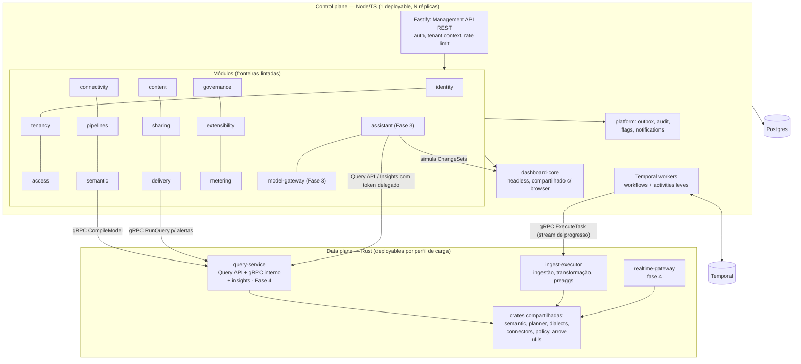

# 15 — Backend Architecture, Job Orchestration e Filas

> Seções do pedido: **§22 Backend architecture**, **§32 Job orchestration** (§21, §40, §41 do pedido).

---

## 22.1 Avaliação de linguagens

| Linguagem | Forças para este produto | Fraquezas | Veredito |
|---|---|---|---|
| **Rust** | Arrow-rs, DataFusion, Parquet, ADBC; performance e memória previsíveis; sem GC (latência de cauda estável em query/streaming); **compila para WASM** (compilador semântico compartilhado com o browser); segurança de memória | Curva de aprendizado; produtividade menor em CRUD/integrações (SAML, SDKs SaaS); compilação lenta | **Data plane** |
| **Go** | Simples, ótimo para serviços de rede, binários pequenos, bom ecossistema cloud/SAML/OIDC; fácil para time misto | Não compartilha código com o browser; ecossistema Arrow/DataFusion inferior ao Rust; GC | Bom candidato para control plane, **perde para TS pelo isomorfismo** |
| **Java/Kotlin** | Ecossistema enterprise imbatível (JDBC para tudo, Calcite, SAML), JVM madura | Footprint de memória, cold start, sem WASM prático, terceiro runtime | **Apenas JDBC bridge** |
| **.NET** | Performance boa, produtivo | Ecossistema de dados (Arrow/engines) menor, menos comum em times de dados | Rejeitado |
| **Node.js / TypeScript** | **Mesmo código do browser** (schemas, migrations, dashboard-core headless, Cedar WASM), Temporal TS SDK maduro, time misto produtivo, ecossistema enorme | Single-thread (CPU-bound ruim — mas CPU pesada vai para o Rust), tipos só em compile-time (mitigado com validação TypeBox/Ajv) | **Control plane** |
| **Elixir** | Excelente para conexões massivas/realtime (BEAM) | Mais um ecossistema; time menor de contratação; Rust cobre o gateway | Rejeitado |

### Decisão: **dois planos, dois monolitos modulares** ([ADR-0001](adr/ADR-0001-two-plane-architecture.md))

- **Control plane — TypeScript (Node LTS + Fastify)**. Por quê: o *Dashboard Engine headless* (`dashboard-core`) precisa rodar no servidor para alertas, relatórios agendados, cache warmup após publicação, validação de dashboards quando modelos mudam e extração de lineage. Com o control plane em TS, é **o mesmo pacote** do browser — sem reimplementar regras do documento em outra linguagem. Somam-se: schemas TypeBox (validação idêntica nos dois lados), migrations de documentos num só lugar, Temporal TS SDK, e o time misto produtivo. Precedente: **Cube** (Node para API/orquestração + Rust para planner/store).
- **Data plane — Rust (Axum + Tonic + Tokio)**. Por quê: tudo que toca dados em volume ou latência (query, conectores, ingestão, pre-aggs, realtime) se beneficia de Arrow nativo e latência estável; e o compilador semântico gera WASM.
- **Por que não "tudo em Rust"**: produtividade em CRUD/integrações e, principalmente, reimplementar `dashboard-core` em Rust ou executar Node como sidecar para isso.
- **Por que não "tudo em TS"**: Arrow/DataFusion/engine de query/streaming em Node seriam inferiores em performance e memória, e perderíamos o WASM compartilhado.

### Axum vs alternativas (Rust)
| Framework | Avaliação |
|---|---|
| **Axum** | Do time Tokio, baseado em Tower (middlewares reutilizáveis com Tonic/gRPC), ergonomia boa, amplamente adotado | **Escolhido** |
| Actix Web | Muito rápido, ecossistema próprio (menos integração Tower) | Alternativa válida |
| Poem / Rocket / Salvo | Menor adoção/manutenção | Rejeitados |

### Fastify vs alternativas (Node)
**Fastify** (schema-first com TypeBox, performance, plugins encapsulados) > NestJS (DI pesada, decorators) > Express (sem schemas, lento). Acesso a dados: **Kysely** (query builder tipado, SQL explícito, bom com RLS/`SET LOCAL`) — ORMs pesados evitados.

## 22.2 Arquitetura do backend

**Data plane: um código, vários deployables.** As crates formam um *workspace* único; os binários (`query-service`, `ingest-executor`, `realtime-gateway`) existem porque têm perfis de carga opostos (latência interativa vs throughput em lote vs conexões longas) — isso não é microservices por modismo, é isolamento de recursos. Inicialmente `ingest-executor` pode rodar no mesmo processo do `query-service` com pools separados; a separação de deploy é configuração.

## 22.3 Modular monolith → extração de serviços

| Candidato a extração | Gatilho objetivo |
|---|---|
| `delivery` (exports pesados, render service já separado) | Picos de exports afetam latência p95 da Management API |
| `governance/catalog search` | Necessidade de engine de busca dedicado (OpenSearch/Meilisearch) |
| `collaboration` (WebSocket de presença/edição) | Fase 7: conexões longas não devem coabitar com API REST |
| `identity` | Raramente — broker externo já absorve a complexidade |
| `model-gateway` | Consumidores fora do control plane; rede dedicada para endpoints privados de clientes (BYO); escala independente |
| `assistant` | Latência/CPU dos turnos de IA afetando a Management API, ou conexões longas de streaming em volume alto |
| `ingest-executor` como serviço separado | Desde que syncs concorrentes impactem queries interativas (provável já na Fase 1–2) |

Regras: módulos já se comunicam por interfaces e eventos (outbox), então extrair = trocar chamada local por gRPC e consumir eventos de um bus — sem redesenho.

## 22.4 Módulos de IA no control plane (Fase 3+)

| Módulo | Responsabilidade | Depende de |
|---|---|---|
| `assistant/orchestrator` | Loop do agente, budgets (passos, tokens, tempo, custo de query), cancelamento, streaming SSE | `model-gateway`, `assistant/tools` |
| `assistant/context` | Resolve `UIContextSnapshot` com authz; compacta usando funções do `dashboard-core` e visão compacta do snapshot semântico | content, semantic, access |
| `assistant/tools` | Tool Registry: definições versionadas + implementações que chamam **interfaces públicas** de módulos e gRPC do data plane | todos os módulos (somente interfaces públicas) |
| `assistant/proposals` | Proposal Service: gera, simula e valida ChangeSets; rebase; aplicação para objetos governados (drafts) | `dashboard-core`, semantic (CompileModel), pipelines |
| `assistant/conversations` | Persistência, retenção, resumos | Postgres, Temporal (expiração) |
| `model-gateway` | Adapters, roteamento por tarefa, egress guard, quotas, metering, cache de prefixo, telemetria GenAI | entitlements, metering, AIPolicy |

Regra de dependência (lint): **nenhum módulo core importa `assistant` ou `model-gateway`**. Somente `assistant` importa `model-gateway`.

---

## 32. Job orchestration

### Workloads
(Turnos interativos de IA **não** são jobs: rodam in-process com budgets e cancelamento. Jobs de IA: expiração de conversas, narrativas em relatórios agendados e alertas explicados, evals agendados.)

imports/syncs, transformações, refresh de datasets, exports, pre-aggregations, relatórios agendados, alertas, syncs de conectores, compaction de Parquet, manutenção (expiração de snapshots, limpeza de staging), emails/webhooks.

### Avaliação

| Opção | Forças | Fraquezas | Veredito |
|---|---|---|---|
| **Temporal** | Durable execution (workflows de longa duração com estado), retries/timeouts/heartbeats por atividade, signals (cancelar/pausar), schedules nativos, visibilidade, versionamento de workflows, multi-linguagem; Temporal Cloud elimina operação | Curva conceitual (determinismo); self-hosting exige Postgres/Cassandra + serviços; mais um componente no self-hosted | **Escolhido** para workflows duráveis |
| Airflow | Padrão para data teams | DAGs estáticos em Python, multi-tenancy de produto ruim, latência de agendamento, não é infra de produto | Rejeitado |
| Dagster | Excelente para *assets* de dados internos | Mesmo problema: orientado a time de dados, não a milhares de tenants dinâmicos | Rejeitado |
| Prefect | Pythonic, dinâmico | Mesmo problema; Python | Rejeitado |
| BullMQ | Simples (Node + Redis) | Durabilidade depende do Redis; sem workflows longos com estado; observabilidade limitada | Rejeitado |
| Celery | Maduro (Python) | Python, durabilidade/visibilidade fracas | Rejeitado |
| Custom workers | Controle total | Reimplementar retries, timers, estado, visibilidade = Temporal mal feito | Rejeitado |
| Kafka-driven workflows | Escala, desacoplamento | Coreografia difícil de observar; sem timers/estado de workflow | Para eventos, não orquestração |
| Restate / Hatchet / Inngest | Alternativas modernas de durable execution | Menos maduras/adotadas que Temporal | Acompanhar |

### Desenho
- **Workflows em TypeScript** (control plane), um por tipo: `DatasetSyncWorkflow`, `PreAggRefreshWorkflow`, `ExportWorkflow`, `ScheduledReportWorkflow`, `AlertEvaluationWorkflow`, `MaintenanceWorkflow`.
- **Atividades pesadas delegadas ao data plane**: a atividade TS chama `ingest-executor` via gRPC streaming (`ExecuteTask`), repassando heartbeats e progresso; cancelamento do workflow → cancelamento gRPC. Assim o Rust **não depende** do SDK Temporal (cujo SDK Rust não tem a mesma maturidade dos SDKs TS/Go/Java — reavaliar quando estabilizar).
- **Task queues por classe**: `interactive-exports`, `syncs`, `preaggs`, `reports`, `maintenance` → workers dimensionados separadamente.
- **Fairness por tenant**: semáforos de concorrência por tenant (Valkey) checados pelas atividades + limites por plano; avaliar recursos nativos de prioridade/fairness do Temporal quando GA.
- **Schedules** do Temporal para agendamentos de usuários (cron com timezone do tenant).
- **Self-hosted**: Temporal server com Postgres (mesma instância ou separada) empacotado no Helm/Compose.

---

## 41 (pedido). Filas e tarefas assíncronas

| Requisito | Mecanismo |
|---|---|
| **Eventos de domínio** | **Outbox transacional** no Postgres (mesma transação da mudança) → dispatcher (poll com `FOR UPDATE SKIP LOCKED` ou logical replication) → handlers internos / webhooks / Temporal signals |
| **Tarefas leves e transacionais** (email, webhook, thumbnail, audit fan-out) | Fila no Postgres (tabela de jobs com `SKIP LOCKED`, biblioteca estilo graphile-worker/pg-boss) — enfileirar na mesma transação garante consistência |
| **Workflows duráveis** | Temporal |
| **Prioridades** | Task queues/filas separadas por prioridade; Query Service tem admission control próprio (classes interactive/export/warmup) |
| **Retries** | Backoff exponencial + jitter; classificação de erros retentáveis vs permanentes |
| **Dead-letter** | Jobs que esgotam retries vão para `dead_letter` com payload, erro e trace; UI administrativa para reprocessar; alerta por taxa |
| **Idempotência** | Chave de idempotência por job (`idempotency_key` única); handlers idempotentes; publicação atômica |
| **Scheduling** | Temporal Schedules (usuário); cron interno para manutenção |
| **Concurrency** | Por worker (pool), por tenant (semáforos), por data source (limite de conexões) |
| **Rate limits** | Token bucket (Valkey) por tenant/data source/API externa; respeito a `Retry-After` de APIs SaaS |

