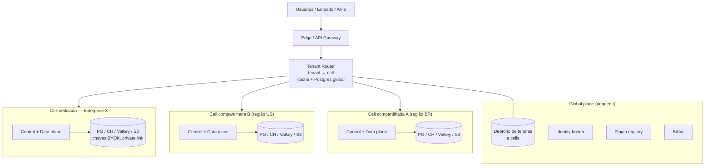

# 16 — Multi-tenancy

> Seção do pedido: **§23 Multi-tenancy** (§23 do pedido).

---

## 23.1 Modelo de tenancy

```
Tenant (unidade de isolamento, contrato e cobrança)
 └── Organization (opcional: holdings com várias orgs)
      └── Workspace (fronteira de conteúdo e permissões: "Financeiro", "Vendas")
           └── Folders → Dashboards, Modelos, Datasets, Conexões
```
- **Tenant** é a fronteira de isolamento técnico (dados, chaves, quotas, cell).
- **Workspace** é fronteira de colaboração/autorização dentro do tenant.
- Embedded: o cliente ISV é um tenant; seus clientes finais são **contextos externos** (claims no token de embed → atributos de RLS), não tenants — evita milhões de tenants. Opcional enterprise: *sub-tenants* gerenciados via API para ISVs que precisam de isolamento físico por cliente final.

## 23.2 Cells — a decisão estrutural

Uma **cell** é uma instância completa da stack (control plane, data plane, Postgres, ClickHouse, Valkey, object storage prefix/bucket, Temporal namespace) servindo um subconjunto de tenants.



| Benefício | Explicação |
|---|---|
| **Blast radius** | Incidente/deploy ruim afeta uma cell, não todos os clientes |
| **Escala horizontal previsível** | Nova cell quando métricas da atual atingem limites — não re-arquitetura |
| **Residência de dados** | Cell por região (ex.: Brasil/LGPD, UE/GDPR) |
| **Enterprise dedicado** | Cell dedicada = mesmo artefato, outra configuração |
| **Self-hosted** | Uma cell instalada pelo cliente (sem global plane, ou com licença offline) |
| **Deploy progressivo** | Canário por cell |

**O que nasce no primeiro commit:** o Tenant Router (mesmo que mapeie tudo para `cell-1`), `cell_id` no diretório de tenants, URLs/config sem hardcode de cell, e **ferramenta de migração de tenant entre cells** prevista (possível porque serving é reconstruível do Parquet).

## 23.3 Isolamento por recurso

| Recurso | Padrão (SaaS compartilhado) | Enterprise | Mecanismo de enforcement |
|---|---|---|---|
| **Metadados (Postgres)** | Tabelas compartilhadas com `tenant_id` | Cell dedicada (DB dedicado) | PK composta `(tenant_id, id)`, **Postgres RLS** com `SET LOCAL app.tenant_id`, testes automáticos de isolamento em toda rota |
| **Dados analíticos (ClickHouse)** | Database por tenant + usuário/quotas por tenant | Cluster dedicado | Grants por database; settings profiles; quotas; Query Service usa credencial do tenant |
| **Object storage** | Prefixo `tenants/<id>/` com políticas IAM por serviço | Bucket dedicado + chave KMS do cliente (BYOK) | SSE-KMS; o data plane assume papel com escopo de prefixo (session policy por tenant) quando viável |
| **Cache** | Chaves `qc:{tenant}:...` | Valkey dedicado | Fingerprint inclui tenant; contabilidade de memória por tenant |
| **Query execution** | Slots por tenant + classes de workload | Pools dedicados | Admission control; timeouts; cost guard; limites do engine |
| **Credenciais** | DEK por tenant (envelope encryption) | KEK do cliente (BYOK / HYOK) | Decifração só no data plane, em memória, por sessão |
| **Filas / jobs** | Task queues compartilhadas + semáforos por tenant | Task queues/workers dedicados | Fairness; quotas de jobs concorrentes |
| **Realtime** | Subjects/topics com tenant; limites de conexões | Gateway dedicado | NATS accounts/permissões; carimbo de tenant na ingestão |
| **Rede** | Egress compartilhado com IPs fixos publicados (allowlist do cliente) | **Private networking** (PrivateLink/PSC/VPC peering), egress dedicado | Configuração de cell |
| **Plugins** | Instalação por tenant | Registry privado | Permissões por instalação |
| **IA — conversas e propostas** | Tabelas `assistant.*` com `tenant_id` + RLS | Cell dedicada | RLS; retenção por política |
| **IA — modelos** | Provedor da plataforma (região da cell) | **BYO model** (endpoint/conta do cliente), allowlist de provedores, IA desabilitada | `AIPolicy` aplicada no Model Gateway; cache de prompt sem mistura entre tenants |
| **IA — custo** | Quotas/créditos por tenant e rate limit por usuário | Limites contratuais | Entitlements + metering |
| **Logs/telemetria** | Tabelas com `tenant_id` | Exportação dedicada | Filtro obrigatório por tenant nas consultas de suporte (auditadas) |

## 23.4 Noisy neighbors e fairness
- Limites por edição (entitlements): queries concorrentes, linhas por resultado, bytes escaneados/dia, syncs concorrentes, armazenamento, conexões realtime.
- Admission control no Query Service com filas por tenant (weighted fair queuing).
- Workers de ingestão separados do serving interativo.
- Detecção: métricas por tenant (CPU-seconds no ClickHouse via `system.query_log` por usuário, bytes lidos) → alertas e throttling automático.

## 23.5 Opções enterprise

| Requisito | Atendido por |
|---|---|
| Dedicated database | Cell dedicada (ou Postgres/ClickHouse dedicados dentro de cell compartilhada — modo híbrido, se o custo de cell inteira não se justificar) |
| Dedicated cluster | Cell dedicada |
| Private networking | PrivateLink/PSC para o cliente acessar a cell; e da cell para as fontes do cliente |
| Self-hosted | Helm chart (Kubernetes) e Docker Compose (avaliação/pequeno); licença offline assinada; dependências substituíveis (MinIO, Keycloak/Zitadel, Temporal self-hosted, ClickHouse operator) |
| Residência de dados | Cell regional |
| BYOK | KEK em KMS do cliente (grants cross-account) |
