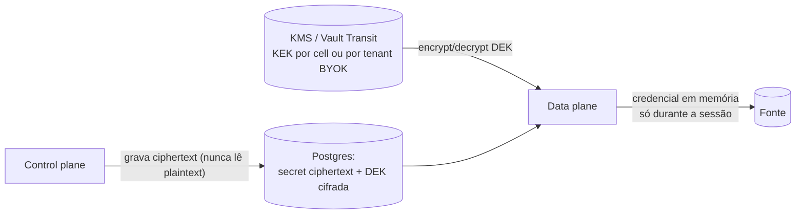
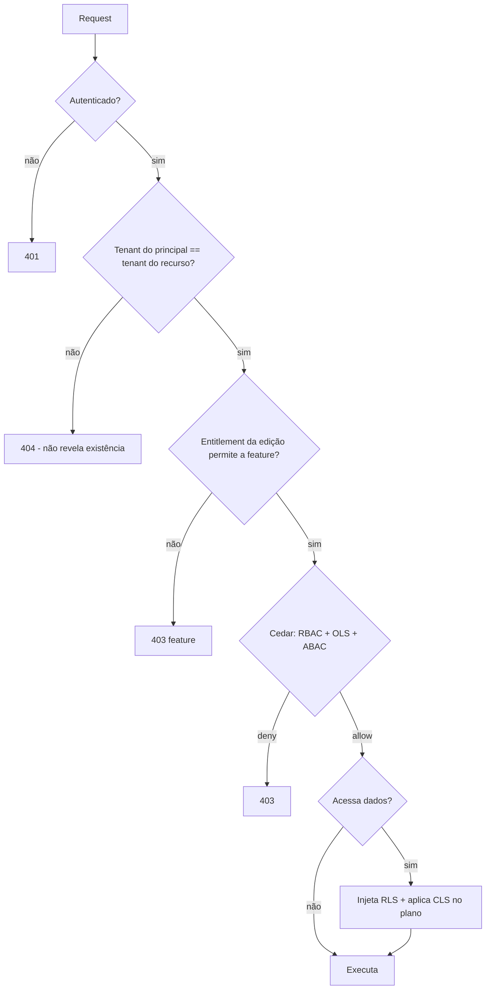

# 17 — Security Architecture e Permissions Architecture

> Seções do pedido: **§24 Security architecture**, **§25 Permissions architecture** (§24 do pedido).

---

## 24.1 Autenticação

| Mecanismo | Design |
|---|---|
| **OIDC / OAuth 2.0 / SAML / SSO / MFA** | **Identity broker** externo — **Zitadel** (Go, multi-tenant nativo com organizations) ou **Keycloak** (JVM, mais maduro) para self-hostable; **WorkOS** como opção gerenciada no SaaS. A plataforma consome **OIDC** do broker; o broker federa SAML/OIDC do cliente, aplica MFA (TOTP, WebAuthn/passkeys) e políticas de senha. Decisão entre Zitadel/Keycloak/WorkOS é uma das "decisões agora" ([30](30-roadmap.md)) |
| **SCIM** | Provisionamento de usuários/grupos (Fase 6), via broker ou endpoint próprio |
| **Sessões web** | Cookie `HttpOnly; Secure; SameSite=Lax`, sessão server-side (Valkey) com rotação; CSRF token para mutações; sem JWT de longa duração no browser |
| **Access tokens internos** | JWT curto (5–15 min) emitido pelo control plane para o data plane (Query API/Realtime) com claims mínimos: `tenant`, `sub`, `roles`, `attrs` hash, `cell`, `exp`; assinado com chave rotacionada (JWKS) |
| **API keys** | Prefixo identificável + segredo; armazenadas como hash (Argon2id/SHA-256 com pepper); escopos (`dashboards:read`, `query:execute`...), expiração, último uso, rotação |
| **Service accounts** | Principais não humanos com papéis próprios; credenciais por API key ou OAuth client credentials |
| **Embed** | Tokens assinados trocados por sessão curta ([19](19-embedded-analytics.md)) |

## 24.2 Segredos e criptografia


- **Envelope encryption**: segredo cifrado com **DEK por tenant** (AES-256-GCM); DEK cifrada pela **KEK** no KMS (AWS KMS/GCP KMS/Azure Key Vault; **Vault Transit** no self-hosted).
- O control plane recebe o segredo do usuário via API e o cifra com a chave pública/DEK sem retê-lo; **somente o data plane** decifra, em memória, no momento da conexão.
- Segredos nunca retornam pela API, nunca aparecem em logs (redaction obrigatória no logger), nunca em mensagens de erro.
- **BYOK**: KEK no KMS do cliente; revogação pelo cliente torna dados/credenciais inacessíveis (crypto-shredding).
- TLS 1.2+ em todo tráfego; mTLS interno entre planos (ou service mesh quando houver Kubernetes).
- Dados em repouso: criptografia nativa dos serviços gerenciados + SSE-KMS no object storage.

## 24.3 Auditoria
- **Audit log imutável** de eventos de segurança e governança: login, mudança de papéis/grants/políticas, acesso a dados sensíveis, exports, criação de embeds/API keys, alterações de conexões, publicação de modelos/dashboards, acessos de suporte.
- Formato estruturado (actor, tenant, ação, recurso, contexto, resultado, IP, user agent, trace id), gravado via outbox; retenção configurável por edição; exportável (SIEM via webhook/S3); hash encadeado para evidência de adulteração (enterprise).

## 24.4 Segurança da IA

Detalhes em [31 §14](31-ai-assistant.md#14-segurança-privacidade-e-multi-tenancy). Resumo:

| Ameaça | Controle |
|---|---|
| IA acessando mais que o usuário | Principal delegado (`via: assistant`) em toda ferramenta; token delegado com escopo no data plane ([ADR-0034](adr/ADR-0034-ai-delegated-principal.md)) |
| Contexto da UI forjado | Snapshot é dica; todo ID é reconsultado com authz |
| Vazamento para provedores | Egress guard com rótulos de classe de dado, `AIPolicy` (`metadata-only`/`aggregates`/`row-level`), mascaramento por classificação, detecção de padrões, BYO model ([ADR-0037](adr/ADR-0037-ai-data-access-policy.md)) |
| Segredos no contexto | Impossível por desenho: o assistente roda no control plane, que nunca tem credenciais decifradas |
| Injeção de prompt (títulos, descrições, valores de dados) | Conteúdo rotulado como não confiável; mutações sempre via ChangeSet com confirmação; nenhuma ferramenta de exfiltração (HTTP arbitrário, compartilhamento, e-mail); red-team contínuo |
| Exfiltração pela saída | Markdown seguro sem HTML, sem imagens/links remotos auto-carregados; links internos validados |
| Ações destrutivas | Ferramentas de publicar, apagar publicados, compartilhar, conceder acesso e gerenciar credenciais **não existem** |
| Abuso de custo | Quotas, budgets por turno, rate limit, kill switch |

## 24.5 Segurança de aplicação
- CSP estrita na app (sem `unsafe-inline`), `frame-ancestors` controlado por configuração de embed; Trusted Types onde possível.
- Sanitização de conteúdo rico (widgets de texto/HTML) com DOMPurify; plugins de terceiros em iframe sandbox.
- SSRF: conectores HTTP/declarativos passam por *egress proxy* com allowlist e bloqueio de redes internas/metadados de nuvem.
- Rate limiting por IP/usuário/tenant/API key.
- Dependências: SCA contínuo, SBOM, assinatura de imagens ([24](24-testing-and-cicd.md)).
- Pentest anual + bug bounty (Fase 6); threat modeling por ADR que mexa em fronteiras de confiança.

---

## 25. Permissions architecture

### 25.1 Camadas de autorização

| Camada | Pergunta | Onde é aplicada | Tecnologia |
|---|---|---|---|
| **RBAC** | Que ações este papel permite? (`viewer`, `editor`, `modeler`, `admin`, custom) | Control + data plane | Cedar |
| **Object-Level Security** | Este principal pode ver/editar *este* dashboard/modelo/conexão? (grants herdados de workspace → folder → objeto) | Control plane (e data plane para modelos) | Cedar + grants no Postgres |
| **ABAC** | Atributos do principal/recurso/contexto permitem? (departamento, região, horário, IP, classificação do dado) | Ambos | Cedar (condições) |
| **Row-Level Security** | Quais linhas? | **Query compiler** (predicados injetados) | DataPolicy `kind: row` (BEL) |
| **Column-Level Security** | Quais campos? Mascarar? | **Query compiler** + metadados expostos ao builder | DataPolicy `kind: column` |
| **Canal (`via`)** | A ação é permitida por este canal (UI, API, assistente, embed)? | Ambos | Cedar `context.via`: políticas podem restringir ações via assistente, nunca ampliar |

### 25.2 Por que Cedar
| Opção | Avaliação |
|---|---|
| **Cedar** (AWS, open source) | Linguagem de políticas legível, **analisável formalmente** (verificar que uma mudança não amplia acesso), RBAC+ABAC com hierarquia de entidades (`parent`), avaliação embarcada rápida; implementações **Rust** (data plane) e **WASM/JS** (control plane) e Go. **Escolhido** |
| OPA / Rego | Muito flexível, popular em infra; Rego é mais difícil para regras de produto; menos foco em autorização de aplicação | Alternativa |
| OpenFGA / SpiceDB (Zanzibar) | Ótimos para relações massivas (compartilhamentos granulares em escala Google Drive); exigem serviço/datastore próprio e sincronização de tuplas | **Adiar** — adotar se o grafo de compartilhamento crescer além do que consultas no Postgres + cache resolvem |
| Código ad hoc | Espalha regras, inauditável | Rejeitado |

### 25.3 Modelo de entidades Cedar (esboço)

```cedar
// Hierarquia: Tenant → Workspace → Folder → Dashboard | SemanticModel | DataSource
permit (
  principal in Role::"editor",
  action in [Action::"dashboard:edit", Action::"dashboard:view"],
  resource in Workspace::"wsp_sales"
);

// ABAC: dados classificados como "restricted" só para o departamento dono, em rede corporativa
forbid (
  principal,
  action == Action::"model:query",
  resource
) when {
  resource.classification == "restricted" &&
  (principal.department != resource.ownerDepartment || !context.corporateNetwork)
};
```
- **Entidades** carregadas do Postgres (principal + grupos + papéis + atributos; recurso + ancestrais) e cacheadas por request/curto prazo.
- **Grants** (compartilhar dashboard com usuário/grupo/link) são dados → viram relações de entidade (`principal in Group`, `resource.sharedWith`), não políticas novas.
- Mudança de política: *policy analysis* compara versões e indica se o acesso foi ampliado (revisão obrigatória em enterprise).

### 25.4 Políticas de dados (RLS/CLS) — compiladas na query
```text
DataPolicy(row): entidade Customer, predicate "[sales_region] IN @user.attributes.regions",
                 appliesTo {roles: [viewer, analyst], except: [admin]}
→ Policy Injector resolve @user.attributes.regions = ["South", "Southeast"] (do IdP/SCIM, perfil ou claims de embed)
→ adiciona filtro na entidade Customer no plano semântico; qualquer query que toque Customer
  (direta ou via join) recebe o predicado antes do planejamento de joins e do matching de preaggs.
```
- **Fail closed**: atributo ausente → predicado avalia falso (zero linhas), nunca "sem filtro".
- **CLS**: `deny` remove o campo do catálogo visível do usuário e rejeita QDL que o referencie; `mask` substitui a expressão (ex.: `CONCAT('***', RIGHT([cpf], 2))`).
- **Fontes live com segurança nativa** (Snowflake row access policies, BigQuery authorized views): opcionalmente usar **credenciais por usuário** (OAuth pass-through) para que a fonte aplique sua própria segurança — combinável com nossas políticas.
- **Exports e alertas** executam com o principal do destinatário (ou do dono, configurável e auditado) — nunca com permissões elevadas implícitas.

### 25.5 Diagrama de decisão


