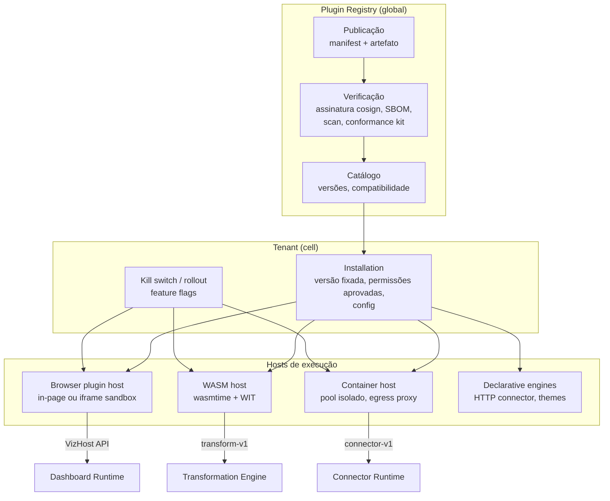

# 18 — Plugin Architecture

> Seção do pedido: **§26 Plugin architecture** (§27 do pedido).

Schema: [`schemas/plugin-manifest.ts`](schemas/plugin-manifest.ts) · Exemplo: [`plugin-manifest.gantt.json`](schemas/examples/plugin-manifest.gantt.json).

---

## 26.1 Tipos de plugin e onde executam

| Tipo | Executa em | Entrypoint | Isolamento | Host API |
|---|---|---|---|---|
| **Visualization** | Browser (+ render service) | ESM | First-party/certificado: in-page; terceiro: **iframe sandbox** | `VizHost` ([07](07-visualization-engine.md)) |
| **Connector** | Data plane | Rust in-process (first-party), YAML declarativo, WASM component, container | Container/WASM para terceiros | Connector Protocol ([09](09-ingestion-and-connectors.md)) |
| **Transformation** (UDF/operadores) | Data plane | WASM component (WIT) | wasmtime: fuel, memória, sem rede/FS | `transform-v1` WIT world (Arrow batches in/out) |
| **Action** (botões, ações de contexto, write-back) | Browser e/ou webhook | ESM / webhook | iframe / chamada HTTP assinada | `ActionHost` (contexto da seleção, filtros) |
| **Exporter** (novos formatos/destinos) | Workers | Container / WASM | Isolado | `exporter-v1` |
| **Theme** | Browser | Declarativo (tokens JSON) | Sem código | — |
| **Integration** (Slack, Teams, Jira, webhooks) | Control plane | Declarativo + webhook | Chamadas HTTP pela plataforma | Eventos assinados |
| **Assistant tool** (Fase 5+) | No sandbox do tipo do plugin (WASM/container/webhook) | `assistantTools` no manifest | Mesmo do tipo; apenas `read`/`propose`; permissões aprovadas pelo admin | Tool Registry (JSON Schema) |

**Princípio:** *first-party usa o mesmo SDK que terceiros.* Os gráficos core são plugins; os conectores core implementam o mesmo trait do Connector SDK. Isso garante que o SDK seja suficiente e testado desde a Fase 2.

## 26.2 Arquitetura

## 26.3 Segurança e sandboxing

| Ameaça | Mitigação |
|---|---|
| Plugin de viz exfiltra dados/cookies | Terceiros em iframe com origem nula (`sandbox="allow-scripts"`), CSP `connect-src` restrita às permissões aprovadas (via proxy da plataforma), sem acesso a cookies/DOM/tokens do host; dados recebidos apenas do widget |
| Plugin trava o browser | Iframe isolado (crash contido); watchdog de `rendered`; error boundary; desativação automática após falhas repetidas |
| UDF maliciosa/infinita no backend | WASM com **fuel** (limite de instruções), limite de memória, sem WASI de rede/FS, timeout por batch |
| Conector exfiltra credenciais | Container sem acesso a outros segredos; credencial injetada só daquele data source; **egress proxy** com allowlist declarada no manifest e aprovada pelo admin |
| Supply chain | Assinatura obrigatória (Sigstore/cosign), digest fixado na instalação, SBOM, scan de vulnerabilidades no registry, publishers verificados |
| Ferramenta de IA de plugin induzindo ações | Apenas `read`/`propose`; propostas passam pelo Proposal Service e confirmação humana; saídas tratadas como não confiáveis; desativável por tenant |
| Escalada de permissão via update | Atualização que pede novas permissões exige reaprovação; versões fixadas por tenant (update explícito ou auto-update minor opt-in) |

## 26.4 Compatibilidade e versionamento
- Host APIs com **semver** (`hostApi: "^1.4.0"`); host suporta a major atual e a anterior por período de depreciação documentado.
- Manifest declara `engines`; instalação recusa incompatíveis.
- **Plugin compatibility tests** no CI da plataforma: todos os plugins certificados rodam o conformance kit contra cada release candidate do host.
- Config de plugin com `configVersion` + `migrateConfig`.

## 26.5 Plugin SDK (DX)
- `create-plugin` CLI (templates: viz ECharts, viz D3, viz deck.gl, conector declarativo, conector container, UDF WASM em Rust/AssemblyScript/TinyGo).
- Dev server com **playground** (dashboard local com dados fixture e hot reload), validação de manifest, conformance kit local.
- Documentação gerada dos schemas das Host APIs.

## 26.6 Plugins e IA
- Viz plugins declaram `description` e `aiHints` → o Viz Recommender e a IA passam a conhecer visualizações de terceiros instaladas.
- Conectores e operações de transformação de plugins precisam de descrições em seus schemas para serem utilizáveis pela IA.
- Plugins podem contribuir **ferramentas do assistente** (Fase 5+), sob as regras do Tool Registry ([ADR-0030](adr/ADR-0030-plugin-sandboxing.md), emenda).
