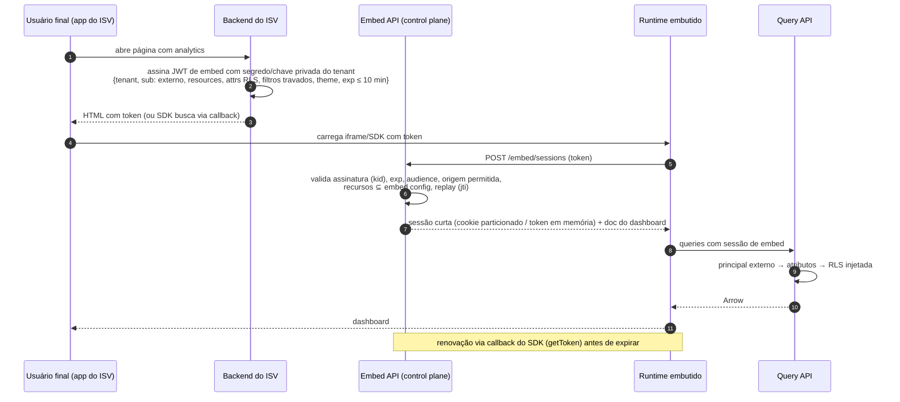

# 19 — Embedded Analytics Architecture

> Seção do pedido: **§28 Embedded analytics architecture** (§25 do pedido).

---

## 28.1 Modos de embedding

| Modo | Como | Isolamento | Integração visual | Quando usar |
|---|---|---|---|---|
| **iframe** | `<iframe src="https://embed.<plataforma>/d/<id>#session=...">` | Forte (origem separada) | Tema via tokens; sem herdar CSS do host | Padrão; mais seguro; qualquer stack |
| **JS SDK / Web Component** | `<bi-dashboard dashboard-id="..." token="...">` renderiza o runtime **no DOM do host** (Shadow DOM) | Médio (mesma origem do host; Shadow DOM isola CSS) | Integração total (fontes, tamanhos, eventos síncronos) | ISVs que querem aparência nativa |
| **React SDK** | `<Dashboard id=... token=... onEvent=... />` — wrapper do Web Component | Igual ao JS SDK | Idem | Hosts React |
| **Componentes individuais** | Embutir **um widget** ou uma "query → visual" sem dashboard | Idem | Idem | Analytics contextual dentro de telas do produto do ISV |
| **Headless (Query API)** | ISV usa só a API semântica e renderiza com sua própria UI | — | Total | ISVs com design system próprio |

Todos os modos usam **o mesmo `dashboard-runtime`** — não existe "versão embed" divergente.

## 28.2 Autenticação: signed embeds

### Claims do token de embed
| Claim | Uso |
|---|---|
| `iss`/`kid` | Identifica a chave do tenant (rotação suportada: múltiplas chaves ativas) |
| `tenant` | Tenant do ISV |
| `sub` | ID do usuário externo (para auditoria, cache por escopo, rate limit) |
| `resources` | Dashboards/widgets/modelos permitidos (subconjunto da *embed config*) |
| `attrs` | Atributos para RLS (`customer_id`, `regions`) — **a fonte da verdade de segurança do usuário externo** |
| `filters` / `params` | Valores iniciais e **travados** (não alteráveis pelo usuário) |
| `permissions` | Capacidades de UI (exportar, drill, ver dados, editar — "self-service embedded") |
| `theme` | Tema/tokens |
| `exp`, `iat`, `jti`, `aud` | Validade curta, anti-replay, audiência |

Chaves: o tenant registra **chave pública** (recomendado, Ed25519/ES256) ou usa segredo HMAC gerado pela plataforma. Sem chamadas server-to-server obrigatórias — o ISV assina localmente. Alternativa: endpoint server-to-server `POST /embed/tokens` (para ISVs que preferem não gerenciar chaves).

### Cookies e iframes
Browsers bloqueiam cookies de terceiros → a sessão de embed usa **token em memória** (enviado em header) ou **cookies particionados (CHIPS)**; nunca depende de cookie de terceiros clássico.

## 28.3 Tenant context, theming e filtros via API
- **Tenant context**: derivado do token; cell resolvida pelo Tenant Router; o runtime não confia em parâmetros de URL para tenant/segurança.
- **Theming**: tema do tenant + `theme` do token + `setTheme(tokens)` via SDK (apenas tokens de runtime).
- **Filtros via API**: `setFilters`, `setParameters` (respeitando travados), inicial via token ou atributos do componente.

## 28.4 Comunicação bidirecional (eventos)

| Direção | Mensagens |
|---|---|
| Host → Embed (comandos) | `setFilters`, `setParameters`, `navigate(page/dashboard)`, `refresh`, `export(format)`, `setTheme`, `setLocale`, `resize` |
| Embed → Host (eventos) | `ready`, `loaded`, `error`, `filtersChanged`, `parametersChanged`, `dataPointClicked {tuple}`, `selectionChanged`, `drill`, `pageChanged`, `exportCompleted`, `heightChanged` (auto-resize), `tokenExpiring` |

- iframe: `postMessage` com **allowlist de origens** (configurada na embed config) verificada nos dois lados; mensagens versionadas e validadas por schema.
- JS SDK: EventTarget/callbacks diretos.
- **Actions customizadas**: o ISV registra ações de contexto ("Abrir pedido no meu sistema") que disparam eventos com a tupla de dados.

## 28.5 Segurança específica de embed
- CSP `frame-ancestors` dinâmica por embed config (domínios do ISV).
- Rate limit por `sub` externo e por tenant.
- Cache: escopo inclui atributos de RLS (via SQL seguro) → usuários externos com mesmos atributos compartilham cache, com atributos diferentes não.
- Auditoria por usuário externo (`sub`).
- Embeds públicos (sem login, ex.: dashboard em site) = embed config "public" com dados restritos por política fixa, rate limit agressivo e cache obrigatório.

## 28.6 Assistente de IA em embeds (Fase 5–6)
- Habilitado pelo ISV por embed config + claim `assistant: { enabled, tools, dataAccess }`, sempre **restringido** pela `AIPolicy` do tenant ISV.
- Ferramentas padrão para usuários finais: análise e descoberta; edição só em visões pessoais (bookmarks/cópias), nunca no dashboard do ISV.
- Usa o principal externo (atributos de RLS do token) → mesmas garantias de isolamento.
- Custo e metering atribuídos ao tenant ISV, com quotas por `sub` externo.
- Eventos para o host: `assistantOpened`, `assistantAnswered` (sem conteúdo, salvo opt-in).
