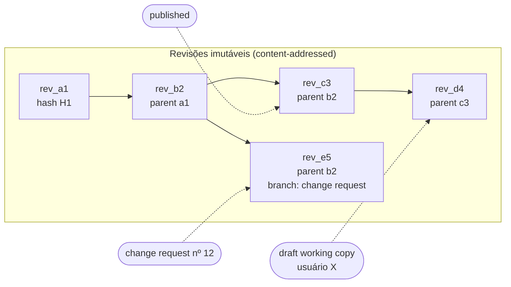

# 21 — Versionamento e Collaboration Architecture

> Seções do pedido: **§30 Collaboration architecture**, §29 do pedido (versionamento: draft, published, history, rollback, diff, audit).

---

## 29 (pedido). Versionamento — "Git-like sem Git"

### Modelo

| Conceito | Implementação |
|---|---|
| **Revisão** | Linha imutável `(tenant_id, id, object_id, parent_id, hash, schema_version, body jsonb, author_id, message, created_at)`; `hash` = SHA-256 do JSON canonicalizado (RFC 8785) → deduplicação e verificação de integridade |
| **Draft** | Working copy mutável por (objeto, usuário) alimentada pelo op-log de autosave; vira revisão em "salvar versão"/"publicar" |
| **Published** | Ponteiro `published_revision_id` no objeto; viewers sempre veem a publicada |
| **Version history** | Cadeia de `parent_id`; lista com autor, mensagem, data, diff resumido |
| **Rollback** | Cria **nova** revisão cujo body = revisão antiga (história nunca é reescrita) e move o ponteiro |
| **Diff** | Estrutural por entidade (IDs estáveis): adicionado/removido/alterado/movido; para modelos semânticos, diff semântico (metric X mudou fórmula; campo Y removido) + impact analysis via lineage |
| **Audit** | Eventos `revision.created`, `object.published`, `object.rolled_back` no audit log |
| **Origem** | Transações de ops e revisões carregam `ChangeOrigin` (`user`, `assistant`, `template`, `import`, `api`, `system`); o histórico mostra "alterado com IA (conversa X)". Publicação é sempre humana |
| **Branches / change requests** (Fase 7) | Revisão com `parent` antigo + merge de três vias por entidade (base, ours, theirs); conflitos só quando a mesma propriedade da mesma entidade mudou nos dois lados |
| **Reprodutibilidade** | Dashboard pode fixar `pinnedRevision` do modelo semântico; export/alerta registram as revisões usadas |

### Por que não Git internamente
Git é ótimo para arquivos de texto e fluxos de desenvolvedor, mas: multi-tenancy em milhões de repositórios, permissões por objeto, consultas (quem usa a metric X?), merges semânticos de JSON e latência transacional seriam problemas. Adotamos os **conceitos** (DAG de revisões, content addressing, merge de três vias) com armazenamento relacional.

**Git sync opcional** (Fase 6/7): exportar/importar modelos semânticos e dashboards como YAML/JSON para repositórios do cliente (CI de analytics engineering), com o Git como *espelho*, não como fonte da verdade.

---

## 30. Collaboration architecture

### O que a arquitetura precisa garantir desde já
1. **IDs estáveis + mapas** (não arrays) no documento → mapeável para CRDT/OT.
2. **Edição por operações** pequenas e invertíveis → podem ser transmitidas, transformadas e aplicadas remotamente.
3. **Validação pós-merge** → qualquer estratégia de merge é seguida de validação de schema/referências (um merge pode gerar estado inválido: widget apontando para nó removido).
4. **Separação documento vs estado efêmero** (seleção, cursor) → presença não polui o documento.
5. **Comentários ancorados por ID de entidade**, não por posição.

Com isso, multiplayer é **aditivo**, não uma reescrita.

### CRDT agora? Análise

| Opção | Prós | Contras |
|---|---|---|
| **Yjs** | Maduro, rápido, ecossistema (providers, awareness/presença, Hocuspocus), excelente para rich text | Documento vira Y.Doc (tipos próprios) → validação de schema e migrations ficam mais difíceis; servidor precisa materializar JSON; tombstones crescem |
| **Automerge** | Modelo JSON natural, histórico completo, Rust core | Performance/memória historicamente piores (melhorou na v2/v3); menos ecossistema de presença |
| **Loro** | CRDT moderno em Rust (WASM), suporta árvores móveis (movable tree) e listas com bom desempenho | Mais jovem |
| **Servidor autoritativo + ops com LWW por propriedade** (modelo Figma) | Simples de raciocinar; validação centralizada; conflitos raros em documentos estruturados (dois usuários raramente editam a mesma propriedade ao mesmo tempo); integra com revisões | Requer conexão para colaborar (offline limitado); reordenação concorrente exige fractional indexing (já temos) |

**Decisão:** **não adotar CRDT na fundação.** Quando o multiplayer for priorizado (Fase 7):
- **Documento estruturado** (dashboards, modelos): **servidor autoritativo** com o op-log existente, LWW por propriedade, fractional indexing para ordem, reparenting com detecção de ciclos no servidor, validação após cada op aplicada. Mesma abordagem que o Figma documentou publicamente para seu editor.
- **Rich text** (widgets de texto, descrições, comentários longos): **Yjs** (ou Loro) embutido como valor de propriedade — CRDT onde ele brilha.
- **Presença e cursores**: canal efêmero (awareness) sobre o mesmo WebSocket; nada persistido.

Custo de preparar agora: ~zero (as escolhas de documento já são boas práticas para undo/diff). Custo de adotar CRDT agora: alto (validação, migrations, persistência, debugging) sem benefício até haver colaboração simultânea.

### Roadmap de colaboração

| Capacidade | Fase | Base técnica |
|---|---|---|
| Comentários e menções (ancorados em dashboard/widget/ponto de dados) | 5 | Contexto Collaboration; âncora = (objeto, entityId, tupla de dados opcional) |
| Presença ("quem está vendo/editando") | 6 | Canal efêmero WebSocket |
| Locks suaves de edição (um editor por vez com aviso) | 3 | Lease no draft |
| Approvals / review / change requests | 6–7 | Revisões + branches + merge de três vias |
| Multiplayer editing com cursores | 7 | Servidor autoritativo de ops + awareness |
| IA como participante (presença "IA editando", ChangeSets passando pelo merge autoritativo) | 7 | Mesmo modelo de ops; ChangeSets = ops com origem `assistant` |
| Resumo de threads de comentários e de mudanças entre revisões pela IA | 6 | Diff estrutural + modelo `fast` |
