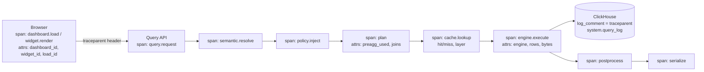
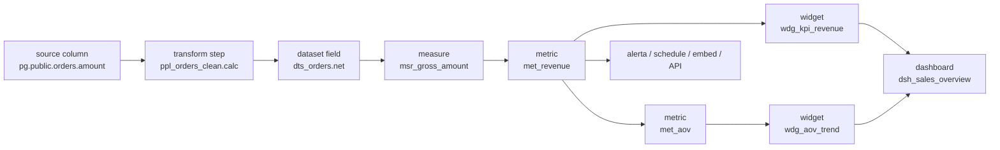

# 22 — Observability, Data Lineage, Governance e Data Catalog

> Seções do pedido: **§33 Observability**, **§34 Data lineage**, **§35 Governance** (§33–§36 do pedido).

---

## 33. Observability

### Pilares
| Sinal | Tecnologia | Destino (SaaS) | Destino (self-hosted) |
|---|---|---|---|
| Traces | **OpenTelemetry** SDKs (Node, Rust `tracing` + `opentelemetry`, browser) | Backend OTLP (Grafana Tempo / Honeycomb / Datadog — decisão de fornecedor adiável graças ao OTLP) | Tempo/Jaeger |
| Métricas | OTel metrics → Prometheus-compatível | Mimir/Grafana Cloud/Datadog | Prometheus |
| Logs | JSON estruturado com `trace_id`, `tenant_id`, `request_id`; redaction de segredos | Loki/Datadog | Loki |
| Erros frontend | Sentry (ou compatível) | — | Opcional |
| **Query logs e uso** | ClickHouse (tabelas próprias) | Dashboards internos **construídos no próprio produto** (dogfooding) | Idem |

### Rastreamento ponta a ponta de uma query

- `traceparent` (W3C) propagado do browser até o SQL: comentário `/* traceparent=... tenant=... widget=... */` ou `log_comment`/query tag (ClickHouse, Snowflake `QUERY_TAG`, BigQuery labels) → correlaciona o trace com o query log **do engine**.
- Turnos de IA geram spans seguindo as **convenções semânticas GenAI** do OpenTelemetry (modelo, tokens, latência) com filhos por ferramenta. `run_query` encadeia até o SQL: **turno → ferramenta → query.request → engine**.
- Cada widget carrega `load_id` → é possível responder "por que o dashboard X demorou 6 s para o usuário Y?" decompondo por widget → fila → plano → cache → engine → rede → decode → render.

### Sinais por componente
| Componente | Métricas-chave |
|---|---|
| Query Service | QPS, latência p50/p95/p99 por classe e engine, cache hit por camada, preagg hit, fila de admission, cancelamentos, erros por tipo, bytes escaneados por tenant |
| Conectores | Health por data source, latência, erros de auth, throttling, circuit breaker aberto |
| Pipelines | Duração por etapa, linhas/bytes, falhas, frescor (`now - dataAsOf`) por dataset, drift detectado |
| Workers/Temporal | Backlog por task queue, idade da tarefa mais antiga, retries, dead letters |
| Realtime | Conexões, subscriptions, msgs/s, lag do consumidor, resyncs |
| Frontend | TTFV (time to first visualization), tempo até todos os widgets, long tasks, memória JS, erros de plugin, web-vitals (LCP, INP, CLS) |
| Plataforma | Custo estimado por tenant (compute, storage, egress) |
| Assistente de IA | Tempo até o primeiro token, latência do turno, erros por provedor/modelo, erros de ferramenta, taxa de falha de compilação de QDL/BEL/ops gerados, aceitação/rejeição/undo de propostas, custo e tokens por turno/tenant, bloqueios do egress guard, quotas atingidas, feedback 👍/👎 |
| Insights Engine | Duração, queries e bytes por investigação, findings por tipo |

### SLOs (definir valores na Fase 0 com base em medições)
Disponibilidade da Query API, latência p95 de queries interativas cacheadas e não cacheadas por classe de workload, frescor de datasets dentro do agendamento, sucesso de jobs agendados, TTFV p75.

---

## 34. Data lineage

### Grafo

| Aspecto | Design |
|---|---|
| **Armazenamento** | Postgres: `lineage_nodes(tenant_id, id, kind, ref, revision)` + `lineage_edges(tenant_id, from, to, kind)`; consultas de impacto por **CTE recursiva**. Graph DB não é necessário (volumes por tenant são moderados) |
| **Extração** | Em tempo de compilação/salvamento, nunca por parsing de logs: Transformation Engine (plano lógico → lineage por coluna); Semantic compiler (dimensões/measures/metrics → campos de dataset); `dashboard-core` (widgets → campos semânticos, filtros, interações); Delivery (alertas/schedules → widgets/metrics) |
| **Versionado** | Arestas associadas a revisões publicadas (o grafo "atual" usa as publicadas; histórico disponível) |
| **Impact analysis** | "Se eu remover/renomear `orders.amount` / mudar `met_revenue`: quais datasets, metrics, widgets, dashboards, alertas e embeds são afetados?" — exibido no momento da mudança (drift de schema, edição de modelo) |
| **Uso** | Arestas enriquecidas com contagem de uso (query logs) → priorizar impacto real |
| **Exportação** | Eventos **OpenLineage** para catálogos externos (DataHub, OpenMetadata, Marquez) — Fase 6 |

---

## 35. Governance e Data Catalog

### Catálogo (sobre os mesmos metadados — sem sistema separado no início)
| Capacidade | Implementação |
|---|---|
| Dataset/metric/dashboard discovery e search | Postgres full-text + `pg_trgm` (Fase 3); engine dedicado (OpenSearch/Meilisearch/Typesense) quando volume/relevância exigir |
| Metadata, tags, descriptions | Campos nos documentos + tabela de tags |
| Ownership | `owners` por objeto (usuários/grupos); obrigatório para certificação |
| Certifications | Estados `draft → certified → deprecated` para datasets, metrics e dashboards; selo visível no builder/runtime; somente papéis "data steward" certificam |
| Lineage | [34](#34-data-lineage) |
| Usage | Query logs (ClickHouse) → popularidade, últimos acessos, usuários ativos, objetos órfãos |
| Glossário de negócio | Termos ligados a metrics (descrição obrigatória para certificadas); sinônimos usados por busca/NLQ |

### Governança
| Tema | Mecanismo |
|---|---|
| **Data owners / stewards** | Papéis com permissão de certificar, aprovar acesso, depreciar |
| **Certified datasets/metrics** | Builder prioriza certificados; política opcional: "dashboards publicados só podem usar metrics certificadas" |
| **Deprecated fields** | `deprecated {since, replacement}` → aviso no builder, lista de dependentes, data de remoção; remoção bloqueada enquanto houver dependentes publicados (ou forçada com aprovação) |
| **Access requests** | Usuário sem acesso solicita → owner aprova/nega → grant temporário/permanente; auditado |
| **Policies** | Classificação de dados (pública, interna, confidencial, restrita, PII) em campos → políticas Cedar/CLS automáticas (ex.: PII mascarado por padrão) |
| **Compliance** | Audit log imutável, retenção configurável, export de evidências, residência por cell, direito ao esquecimento (exclusão por titular em datasets gerenciados via job de reescrita de snapshots — Fase 6), LGPD/GDPR |
| **Audit logs** | Ver [17 §24.3](17-security-and-permissions.md); eventos da IA (`assistant.turn`, `assistant.query.executed`, `assistant.proposal.*`, `assistant.policy.blocked`) em [31 §19](31-ai-assistant.md#19-auditoria) |
| **Conhecimento curado para IA** | Stewards mantêm `ai.instructions`, `ai.verifiedQuestions` e sinônimos no modelo semântico; certificação prioriza objetos confiáveis nas respostas |
| **Política de IA** | `AIPolicy` por tenant/workspace é um objeto governado (auditado, com owner); mudanças geram `ai_policy.changed` |
