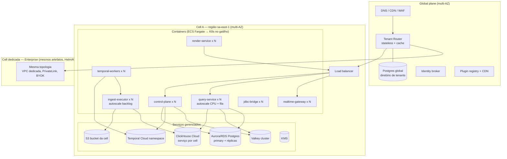

# 23 — Infrastructure, Deployment, Scalability, Performance Budget, Escala e Custo

> Seções do pedido: **§36 Infrastructure**, **§37 Deployment architecture**, **§41 Scalability strategy**, §32 do pedido (**Performance budget**), **§55 Escala**, **§56 Custo**.

---

## 36. Infrastructure

### Avaliação de plataformas de execução

| Opção | Prós | Contras | Quando |
|---|---|---|---|
| **Docker (imagens OCI)** | Base de tudo; reprodutível | — | **Sempre** |
| **Docker Compose** | Dev local, demos, self-hosted pequeno | Sem HA/autoscaling | Dev e "self-hosted avaliação" |
| **ECS Fargate / Cloud Run** | Sem gerenciar nós; autoscaling simples; baixa carga operacional | Lock-in moderado (definições de serviço); menos controle de rede/recursos; não é alvo de self-hosted | **SaaS Fases 0–5** |
| **Kubernetes (EKS/GKE/AKS)** | Padrão para self-hosted enterprise (Helm), operadores (ClickHouse, Temporal, Redpanda), KEDA (autoscaling por fila), multi-cell homogêneo | Complexidade operacional real (upgrades, rede, segurança, custo de time) | **Gatilho** (abaixo) |
| **Nomad** | Mais simples que K8s | Ecossistema/operadores menores; clientes enterprise pedem K8s | Rejeitado |
| **Serverless (Lambda/Functions)** | Ótimo para tarefas esporádicas | Cold start, limites de tempo/memória, conexões a bancos; ruim para query service e realtime | Apenas utilidades pontuais (ex.: processamento de webhooks) |
| **Serviços gerenciados** | Postgres (RDS/Aurora/Cloud SQL), **ClickHouse Cloud**, **Temporal Cloud**, Valkey gerenciado, S3, KMS | Custo unitário maior; lock-in contornável (protocolos padrão) | **SaaS inicial** — operar stateful é o maior custo escondido |

### Gatilhos para adotar Kubernetes (qualquer um)
1. Primeira **cell dedicada ou self-hosted** contratada (Helm chart passa a ser produto).
2. Operar componentes stateful OSS por custo (ClickHouse self-managed, Redpanda, Temporal) com operadores.
3. > ~8–10 serviços com necessidades de autoscaling heterogêneas (KEDA por backlog de filas, HPA por métricas custom).
4. Necessidade de isolamento de rede granular/service mesh (mTLS automático) exigida por compliance.

Até lá: **imagens e configuração 12-factor** (config via env, sem dependência de APIs da plataforma de execução no código, health/readiness endpoints, graceful shutdown) tornam a migração ECS → K8s uma mudança de IaC, não de código.

### IaC e ambientes
- **OpenTofu/Terraform** com módulos por cell (`module "cell"`) — criar cell = aplicar módulo com variáveis.
- Ambientes: `dev` (efêmeros por PR quando possível), `staging` (cell de pré-produção com dados sintéticos), `prod-cell-*`.
- Segredos de infraestrutura em AWS Secrets Manager/Vault; nada em variáveis de CI.

---

## 37. Deployment architecture

| Tema | Decisão |
|---|---|
| Alta disponibilidade | Multi-AZ por cell; serviços stateless com ≥ 2 réplicas; Postgres com failover gerenciado; ClickHouse com réplicas |
| Disaster recovery | Postgres: PITR + snapshots cross-region; object storage: versionamento + replicação cross-region (curated); ClickHouse: **reconstruível** do curated + pre-aggs recalculáveis (backup nativo opcional para reduzir RTO); RPO/RTO definidos por edição |
| Deploy | Imagens imutáveis assinadas; rollout **canário por cell** (staging → cell canário → demais cells em ondas) |
| Migrations | Expand/contract executadas como job antes do rollout; código compatível com schema N e N+1 |
| IA | Model Gateway faz egress para provedores pela região da cell (ou endpoint privado/BYO do tenant via PrivateLink quando disponível); self-hosted: IA desabilitada até configurar um endpoint |
| Self-hosted | Helm chart + Compose; dependências substituíveis (MinIO, Keycloak/Zitadel, Temporal self-hosted com Postgres, ClickHouse operator/single node, Valkey) |

---

## 32 (pedido). Performance budget

> Valores abaixo são **metas iniciais (hipóteses)** para orientar arquitetura e testes. Devem ser recalibrados na Fase 0/1 com medições reais e transformados em SLOs.

### Frontend
| Métrica | Meta inicial | Notas |
|---|---|---|
| JS inicial do shell (gzip) | ≤ 250 KB | Builder, plugins, DuckDB lazy |
| Dashboard: shell interativo (desktop, rede boa) | ≤ 1,5 s p75 | Inclui documento + manifests |
| TTFV — primeira visualização (dados em cache) | ≤ 1,0 s após shell | Widgets visíveis priorizados |
| Todos os widgets visíveis renderizados (cache quente) | ≤ 2,5 s p75 | Dashboard de ~20 widgets |
| Interação de filtro → visuais atualizados (cache/preagg) | ≤ 300 ms p50 / ≤ 800 ms p95 | |
| Interação de filtro (sem cache, dataset importado médio) | ≤ 1,5 s p95 | Depende da classe de workload |
| Cross-filter local (dados já carregados) | ≤ 100 ms | Worker |
| Long tasks no main thread | nenhuma > 50 ms durante interação | INP ≤ 200 ms |
| Drag/resize no builder | 60 fps com 50 widgets na página | |
| Widgets por página (recomendado / limite suave) | 25 / 60 | Acima: sugerir páginas/tabs |
| Linhas por widget entregues ao browser (padrão / máximo) | 5k / 100k | Tabelas paginadas; mapas usam agregação |
| Pontos renderizados via GPU | até ~1–5 M (desktop) | Acima: agregação obrigatória |
| Memória JS por aba (dashboard típico) | ≤ 300–500 MB | Cache L1 com orçamento |
| Dataset local (DuckDB-WASM) recomendado | ≤ ~500 MB Parquet / ~10–50 M linhas desktop; menor em mobile | Limites do wasm32/Safari |

### Backend
| Métrica | Meta inicial |
|---|---|
| Overhead do Query Service (resolve + policy + plan + compile), sem execução | ≤ 20 ms p95 |
| Cache hit L3 ponta a ponta (servidor) | ≤ 30 ms p95 |
| Query interativa sobre preagg | ≤ 200 ms p95 |
| Query interativa sobre dataset importado (classe Medium) | ≤ 1 s p95 |
| Management API (leituras) | ≤ 100 ms p95 |
| Publicação de snapshot após load | ≤ 5 s |
| Realtime: evento → browser | ≤ 1–2 s p95 (com janelas de 1 s) |
| IA: tempo até o primeiro evento do turno (`context.resolved`) | ≤ 500 ms p95 |
| IA: tempo até o primeiro token | ≤ 2 s p75 (depende do provedor) |
| IA: proposta de edição simples (widget/layout) | ≤ 8 s p75 |
| IA: investigação analítica (Insights + narrativa) | ≤ 30 s p75, com progresso visível |

### Classes de workload

| Classe | Caracterização (métricas que definem) | Estratégia padrão |
|---|---|---|
| **Small** | Datasets até ~10⁶ linhas; poucos viewers concorrentes; refresh diário | Import em ClickHouse compartilhado (ou tier DuckDB futuro); cache; sem preaggs |
| **Medium** | ~10⁶–10⁸ linhas; dezenas de viewers concorrentes; refresh horário | Import + ORDER BY otimizado + preaggs declaradas para dashboards principais |
| **Large** | ~10⁸–10¹⁰ linhas; centenas de viewers; frescor de minutos | Live em warehouse do cliente **ou** ClickHouse com recursos dedicados; preaggs obrigatórias; quotas |
| **Enterprise** | Requisitos de isolamento, SLA, residência, rede privada, volumes Large+ | Cell dedicada; capacidade reservada; SLOs contratuais |

---

## 41. Scalability strategy

| Componente | Eixo de escala | Limite/gatilho a observar |
|---|---|---|
| Control plane | Réplicas stateless | CPU/latência p95; conexões Postgres (usar pooler — PgBouncer/RDS Proxy) |
| Query Service | Réplicas + admission control | Fila de admissão, p95, CPU; cache hit |
| ClickHouse | Vertical → réplicas → shards → mais clusters/cells | Parts/tabelas por cluster, memória, concorrência, custo |
| Ingestão | Workers por backlog | Idade da tarefa mais antiga, throughput por fonte |
| Postgres | Vertical → réplicas de leitura → particionamento → nova cell | Tamanho de revisões/audit, conexões |
| Valkey | Cluster mode | Memória, ops/s |
| Realtime | Gateways horizontais + NATS cluster | Conexões/nó, msgs/s, lag |
| Plataforma toda | **Mais cells** | Qualquer recurso compartilhado da cell no limite |

---

## 55. Escala — cenários progressivos

> Não fixamos números como requisitos. Definimos **as métricas a coletar** e **as decisões que mudam** por faixa.

### Métricas a definir e acompanhar desde a Fase 0
Tenants ativos · usuários ativos diários/concorrentes por tenant (p50/p99) · dashboards visualizados/dia · widgets por dashboard · queries/s (média e pico) por classe · % cache/preagg hit · bytes escaneados/dia por tenant · linhas e GB importados por tenant · número de datasets/tabelas por cluster ClickHouse · syncs/hora e duração · conexões realtime concorrentes e msgs/s · exports/dia · custo por tenant/mês.

| Faixa | O que tipicamente pressiona | Decisões que mudam |
|---|---|---|
| **~10 clientes** | Nada estrutural; foco em corretude | 1 cell; ClickHouse Cloud pequeno; Temporal Cloud; sem preaggs automáticas; observabilidade de base; medir tudo |
| **~100 clientes** | Noisy neighbors; dashboards populares repetindo queries; syncs simultâneos às horas cheias | Quotas por edição; admission control por tenant; preaggs declaradas nos dashboards top; jitter em agendamentos; ingest-executor separado; Valkey cluster |
| **~1.000 clientes** | Nº de tabelas no ClickHouse; custo de datasets pequenos; volume de jobs; suporte multi-região | **Segunda cell** (por região/capacidade); tier DuckDB para datasets pequenos/frios; pools de workers por classe; recomendação de preaggs; Kubernetes se houver cells dedicadas; catálogo/busca dedicados |
| **IA em qualquer faixa** | Custo de tokens; latência do provedor; limites de rate do provedor | ~10: 1 provedor, quotas simples. ~100: créditos por edição, roteamento `fast`. ~1.000: contratos de capacidade/rate com provedores, fallback entre adapters, regiões. ~10.000: Model Gateway extraído, multi-provedor, BYO generalizado |
| **~10.000 clientes** | Operação de muitas cells; custo; residência; realtime em escala | Automação de provisionamento de cells; roteamento global maduro; migração de tenants entre cells automatizada; preaggs automáticas com orçamento; FinOps por tenant; NATS supercluster; equipes por plano/contexto |

---

## 56. Custo

### Principais centros de custo
| Centro | Drivers | Alavancas de controle |
|---|---|---|
| **Analytical DB (ClickHouse)** | Compute de queries, storage quente, nº de tabelas | Preaggs; cache; ORDER BY/projeções corretas; tiering (dados frios em S3 via storage policies/ClickHouse Cloud); evicção de datasets inativos do serving (mantém Parquet, reidrata sob demanda); tier DuckDB |
| **Query execution em warehouses do cliente** | Custo do **cliente** (risco de churn se a conta dele explode) | Cache, preaggs (materializadas no nosso lado), cost guard (dry-run/estimate), limites por dashboard, relatórios de custo para o cliente |
| **Compute de aplicação** | Réplicas de control/data plane, render service | Autoscaling; render service com pool de browsers e fila |
| **Ingestão** | Workers, transferências | Incremental/CDC em vez de full; compressão; agendamentos inteligentes (não reprocessar o que não mudou) |
| **Storage (S3)** | Raw, curated, exports | Lifecycle (raw expira), compaction, N snapshots retidos, ZSTD |
| **Egress** | Respostas ao browser, exports baixados, réplicas cross-region | Arrow + compressão; agregação no servidor; CDN/R2 para downloads; manter dados e compute na mesma região |
| **Realtime** | Conexões longas, bus, processadores | Coalescing/throttling; limites por edição; desligar subscriptions de abas ocultas |
| **Cache** | Memória Valkey | Limite por entrada; TTL; contabilidade por tenant |
| **IA (modelos)** | Tokens de entrada/saída por turno, tamanho de contexto, modelo usado, investigações com muitas queries | Roteamento `fast`/`standard`; contexto mínimo + ferramentas sob demanda; cache de prefixo do provedor (prefixo estável com metadados por revisão); cache L2/L3 das queries; budgets por turno; créditos por tenant; kill switch |
| **Observabilidade** | Volume de traces/logs | Amostragem de traces (tail-based para erros/lentos), retenção diferenciada |
| **Serviços gerenciados** | Prêmio sobre infra crua | Reavaliar self-managed com operadores quando escala justificar (gatilho K8s) |

### Controle de custo por tenant
1. **Metering** de: tokens de IA (entrada, saída, cache) e custo estimado por modelo/feature/usuário, compute-seconds de query (do `system.query_log` por usuário do tenant), bytes escaneados, linhas/GB importados, GB armazenados (curated + serving + preaggs), minutos de jobs, exports, conexões-minuto realtime, egress estimado.
2. Agregação diária em ClickHouse → **custo estimado por tenant** e margem por edição (dashboard interno).
3. **Quotas e limites** (entitlements) aplicados em runtime; alertas ao cliente e a nós antes de estourar.
4. Políticas automáticas: tenants inativos → serving evictado; dashboards sem acesso → preaggs suspensas.
