# 24 — Testing Strategy, CI/CD, Feature Flags e Edições

> Seções do pedido: **§38 Testing strategy**, **§40 CI/CD** (§44, §45 do pedido), §42 (Feature flags), §43 (Licenciamento e edições).

---

## 38. Testing strategy

| Tipo | Escopo | Ferramentas | Onde roda |
|---|---|---|---|
| **Unit** | Funções puras: solvers de layout, comandos/ops, migrations, BEL parser/typechecker, planner rules, formatação | Vitest (TS), `cargo test` + `proptest` (Rust) | Todo PR |
| **Integration** | Módulo + Postgres real; Query Service + ClickHouse real; conectores contra bancos reais | Testcontainers (Postgres, ClickHouse, MySQL, SQL Server, MinIO, Valkey, Temporal dev server) | Todo PR (afetados) |
| **Contract** | Schemas JSON/Protobuf/OpenAPI; compatibilidade N/N-1; consumidores vs produtores | `buf breaking` (proto), oasdiff (OpenAPI), testes de fixtures QDL/VizProps | Todo PR |
| **E2E** | Fluxos A–F no browser | Playwright (cell efêmera ou Compose) | PR (smoke) + nightly (completo) |
| **Query correctness** | QDL → SQL por dialeto (golden) **e** resultados equivalentes entre engines (**testes diferenciais**, DuckDB como oráculo); casos de fan-out, chasm trap, semi-aditivas, totais, time intelligence, LOD, fusos | Harness Rust + datasets sintéticos determinísticos (TPC-H/TPC-DS em escala pequena + casos patológicos) | Todo PR que toca semantic/planner/dialects |
| **Security** | Isolamento multi-tenant (toda rota com principal de outro tenant → 404); RLS (propriedade: predicado sempre presente); CLS; embed tokens adulterados/expirados/replay; SSRF; authz matrix por papel; fuzzing de parsers (BEL, QDL, manifests) | Suíte dedicada, `cargo-fuzz`, ZAP/Burp (DAST periódico), Semgrep regras próprias | PR + nightly |
| **Schema migration tests** | Postgres: migrations aplicadas em snapshot anonimizado de produção (expand/contract); documentos: **corpus por versão** → migrar → validar → snapshot; idempotência e preservação de `extensions` | Jobs dedicados | PR que toca migrations |
| **Connector tests** | **Conformance kit** do SDK (spec/check/discover/read/state/tipos/idempotência/retomada) + testes contra fontes reais (containers) ou sandboxes SaaS gravadas (VCR) | Harness Rust + containers | PR do conector + nightly |
| **Plugin compatibility** | Plugins certificados vs release candidate do host (VizHost/Connector Protocol/WIT) | Conformance kits | RC |
| **Visual regression** | Galeria de todos os plugins × temas × estados com dados fixos; builder | Playwright screenshots (+ serviço tipo Chromatic/Argos opcional) | PR que toca UI/plugins |
| **Performance** | Benchmarks: planner (criterion), decode Arrow no browser, render de dashboard de 50 widgets, drag no builder, ingestão de CSV grande | criterion, Playwright + tracing, Lighthouse CI | Nightly + PR com label |
| **Load** | Query API (QPS, mistura de classes), Management API, Realtime (conexões, msgs/s), ingestão concorrente | k6 (HTTP/WebSocket), cenários por classe de workload | Semanal/antes de releases maiores, em staging |
| **Chaos / resilience** | Falha de ClickHouse/Valkey/Temporal/fonte; latência injetada; perda de nó do gateway | Toxiproxy, fault injection | Periódico em staging |
| **Accessibility** | axe em componentes e páginas; navegação por teclado | axe-core, Playwright | PR |
| **AI evals** | Tarefas golden por modo (criar, editar, analisar, descobrir, modelar, transformar) sobre tenants fixture; validade de ferramentas, compilação de QDL/BEL/ops, correção numérica, aceitação simulada de propostas | Harness em `testing/ai-evals` (determinístico onde possível; LLM-as-judge só como complemento) | Suíte rápida no PR que toca IA; completa no nightly; obrigatória para troca de modelo |
| **AI red-team** | Injeção via títulos/descrições/valores; cross-tenant; RLS/CLS via IA; ações proibidas; exfiltração por links; respeito às políticas `metadata-only`/`aggregates` | Suíte adversarial automatizada | Nightly + antes de releases |
| **Core sem IA** | Suíte E2E completa com o módulo `assistant` desabilitado | Playwright | PR (smoke) + nightly |

Pirâmide: muitos unit/property tests no núcleo (semantic, planner, layout, documento), integração com dependências **reais** (sem mocks de banco), E2E focado nos fluxos críticos.

---

## 40. CI/CD

```mermaid
flowchart LR
  PR[Pull request] --> AFF[Detecção de afetados<br/>Turborepo + cargo metadata]
  AFF --> LINT[Lint, format, typecheck,<br/>clippy, regras de fronteira]
  LINT --> TEST[Unit + integration + contract<br/>dos afetados]
  TEST --> SEC[SAST Semgrep/CodeQL,<br/>cargo-deny/audit, osv-scanner,<br/>secret scan, licenças]
  SEC --> BUILD[Build imagens + WASM + bundles<br/>SBOM Syft, assinatura cosign]
  BUILD --> E2E[E2E smoke em ambiente efêmero]
  E2E --> EVAL[AI evals se assistant/model-gateway/ferramentas mudaram]
  EVAL --> MERGE[Merge em main]
  MERGE --> STG[Deploy staging<br/>migrations expand]
  STG --> CAN[Canário: cell canária<br/>métricas/SLO gates]
  CAN --> WAVES[Ondas por cell]
  WAVES --> CONTRACT[Migrations contract<br/>na release seguinte]
  CAN -->|SLO violado| RB[Rollback automático<br/>pin da imagem anterior]
```

| Tema | Decisão |
|---|---|
| Plataforma | GitHub Actions (runners maiores para Rust; cache de `sccache`/Turborepo remoto) |
| Branching | Trunk-based, PRs pequenos, feature flags para trabalho incompleto |
| Builds | Apenas afetados; imagens multi-stage; WASM com `wasm-opt`; bundles com análise de tamanho (orçamento falha o PR) |
| Security scanning | SAST, SCA, licenças (bloquear GPL/AGPL/BSL em dependências redistribuídas conforme política de licença), containers (Trivy/Grype), IaC (Checkov/tfsec), secrets (gitleaks) |
| Migrations | Expand/contract; verificação automática de que a migration é compatível com a versão anterior do código; jobs pré-deploy |
| Deploy | Imagens imutáveis por digest; promoção da mesma imagem entre ambientes |
| Canary | Cell canária (tenants internos + opt-in) → gates de SLO (erro, p95) → ondas |
| Rollback | Re-deploy do digest anterior; migrations expand garantem compatibilidade; feature flags desligam funcionalidade sem deploy |
| Versioning | SaaS: deploy contínuo (versão = data+sha); **semver** para artefatos públicos: SDKs, Embed SDK, Plugin Host APIs, Connector Protocol, schemas (QDL, documentos), Helm chart; self-hosted: releases mensais com LTS trimestral (enterprise) |
| Release notes | Conventional commits → changelog por artefato público |

---

## 42 (pedido). Feature flags

- **OpenFeature** como API nos dois lados (TS/Rust) + provider **Unleash** (self-hostável) ou **flagd**; LaunchDarkly opcional no SaaS — o código não depende do fornecedor.
- Tipos: *release* (temporários, com dono e data de remoção — lint/alerta para flags velhas), *ops/kill switch* (desligar plugin, conector, funcionalidade cara), *experiment*, *permission-like* (**proibido** — isso é entitlement).
- Avaliação com contexto: tenant, cell, edição, usuário, % rollout.
- IA: **kill switch** global, por provedor e por ferramenta; troca de modelo por rota via flag com canário e comparação de métricas online.

### Feature flags ≠ entitlements
| | Feature flag | Entitlement |
|---|---|---|
| Propósito | Rollout/risco operacional | Licenciamento/plano |
| Vida | Temporária | Permanente |
| Fonte | Serviço de flags | Contexto Tenancy & Entitlements (contrato/licença) |
| Exemplo | "novo builder para 10% dos tenants" | "embedding disponível na edição Embedded/Enterprise" |

---

## 43 (pedido). Licenciamento e edições

| Edição | Natureza |
|---|---|
| **Community** | Self-hosted, conjunto core (se houver estratégia open-core) |
| **Cloud** | SaaS multi-tenant (planos) |
| **Enterprise** | SaaS dedicado ou self-hosted com SSO avançado, SCIM, ABAC, auditoria longa, BYOK, private networking, SLA |
| **Embedded** | Foco em ISVs: embed SDK, multi-tenancy de clientes finais, white-label (+ assistente para usuários finais, Fase 5–6) |
| **Self-hosted** | Modalidade de deployment (Community ou Enterprise) |

Separação arquitetural:
1. **Entitlements como capabilities** (`embedding.sdk`, `ai.assistant`, `ai.analysis`, `ai.modeling`, `ai.transform`, `ai.byo_model`, `ai.credits`, `security.abac`, `governance.certification`, limites numéricos) avaliados por um único serviço (`entitlements.check(tenant, capability)`), cacheados; UI e APIs consultam a mesma fonte.
2. **Código enterprise isolado** em diretórios `ee/` (TS) e crates/features Cargo `ee-*`, com licença distinta; o build Community os exclui (build flags) — o core nunca importa `ee/` diretamente (pontos de extensão/registros).
3. **Licença self-hosted**: arquivo assinado offline (Ed25519) com tenant, edição, capabilities, limites, validade; verificação local, sem phone-home obrigatório (air-gapped).
4. **Decisão pendente (agora)**: modelo de licença do core (Apache-2.0 vs AGPL vs source-available como BSL/ELv2) — afeta escolhas de dependências (ex.: Valkey vs Redis, Redpanda BSL) e a estratégia de comunidade.
