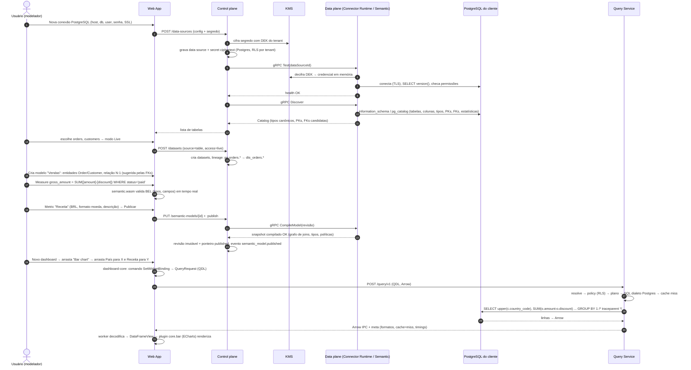
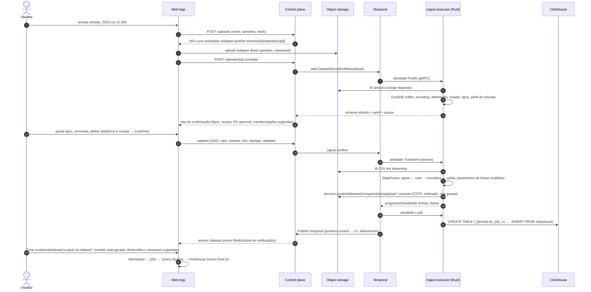
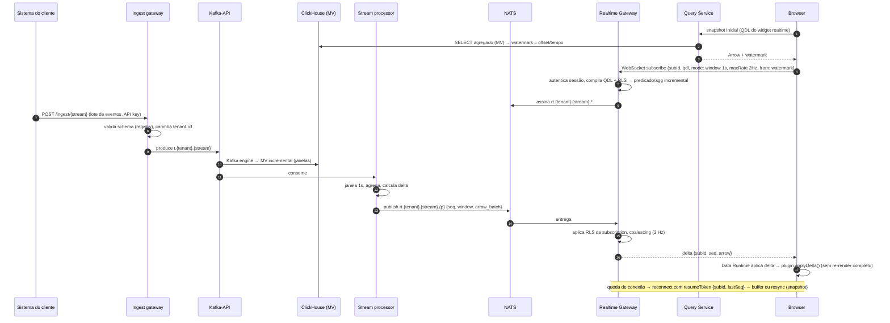
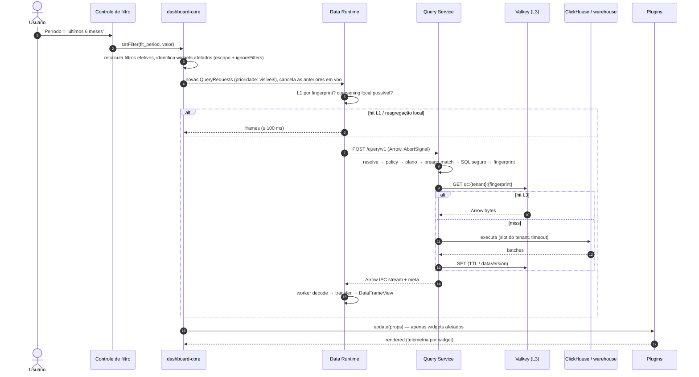
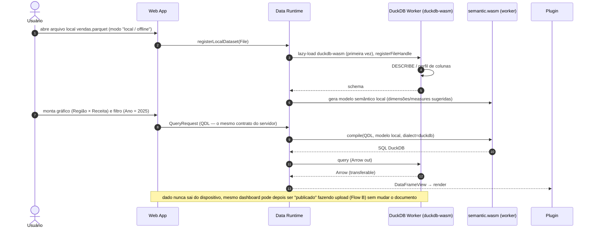
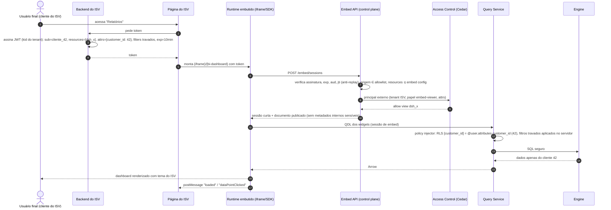
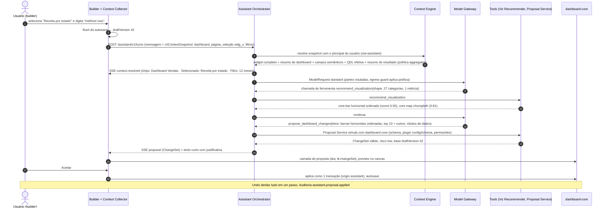
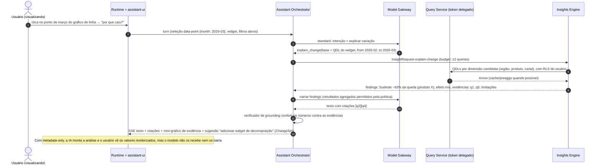
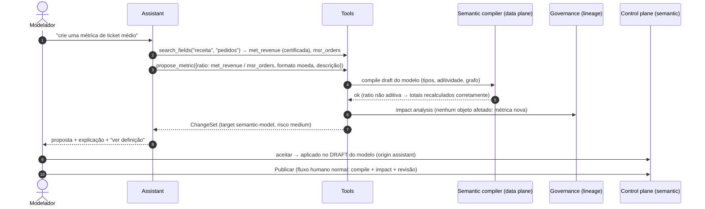
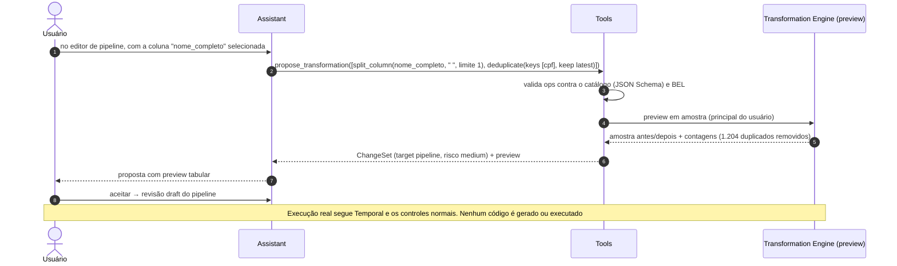

# 28 — Fluxos Completos (A–F)

> Seção do pedido: **§53 Fluxos completos**.

---

## FLOW A — Conectar PostgreSQL → schema discovery → dataset → semantic model → metric → gráfico → query → render

**Notas:** o modelador nunca escreve SQL; o PostgreSQL de produção deve ser réplica (o produto recomenda e limita concorrência por data source). Se a tabela for grande e o banco OLTP, o produto sugere **Import incremental** em vez de Live.

---

## FLOW B — CSV com milhões de linhas → upload → object storage → parsing → normalização → Parquet → engine analítico → dashboard

**Notas:** o upload nunca passa pelo control plane (URLs pré-assinadas). Linhas inválidas vão para uma tabela de quarentena consultável. O Parquet é a verdade; a tabela ClickHouse pode ser recriada.

---

## FLOW C — Fonte envia dados em tempo real → streaming bus → processor → realtime gateway → browser → atualização

---

## FLOW D — Usuário muda filtro → dashboard engine → query engine → cache → database → Arrow → runtime → visualização

---

## FLOW E — Dataset local no browser → Web Worker → WASM → filter → aggregation → visualização

**Notas:** o documento do dashboard é o mesmo; apenas a *fonte* do modelo é local. Limites de memória do dispositivo aplicados ([13](13-browser-data-runtime.md)).

---

## FLOW F — Dashboard compartilhado externamente → embed token → permissões → definição → segurança de query → render

**Notas:** filtros "travados" são aplicados **no servidor** (claims do token), não confiados ao cliente; o usuário final não consegue removê-los via devtools.

---

## FLOW G — Usuário seleciona um widget → "melhore isso" → proposta → preview → aceitar → undo disponível

---

## FLOW H — "Por que o faturamento caiu neste período?" → Insights Engine → resposta com evidências

---

## FLOW I — "Crie uma métrica de ticket médio" → proposta no draft do modelo → impact analysis → publicação humana

---

## FLOW J — "Separe nome e sobrenome e remova duplicados" → ops do catálogo → preview → pipeline draft

