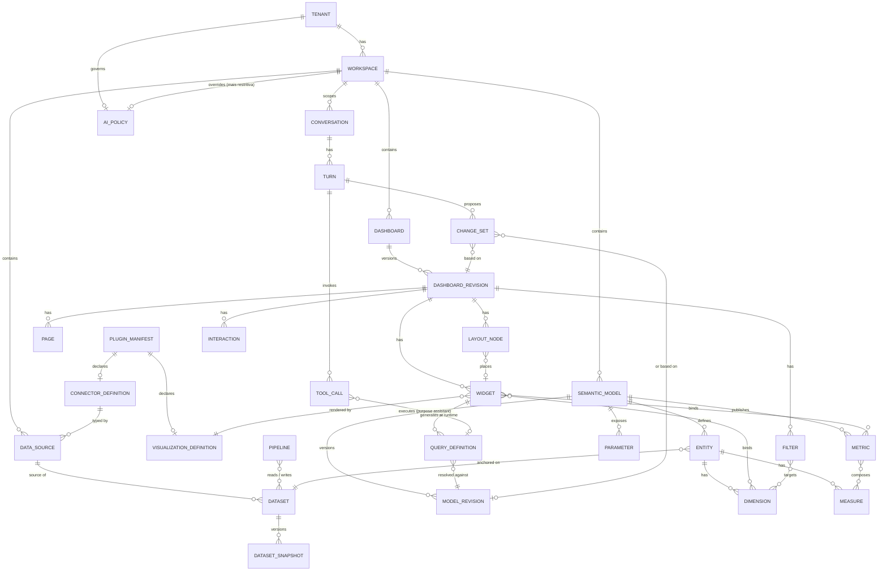

# 29 — Schemas Centrais

> Seção do pedido: **§59 Schemas centrais**.

Os sketches TypeScript ficam em [`schemas/`](schemas/) e são a referência para o pacote `packages/schema` (TypeBox → JSON Schema 2020-12 canônico → codegen Rust/validadores). Exemplos completos em [`schemas/examples/`](schemas/examples/).

| Entidade | Arquivo | Dono (contexto) | Persistência |
|---|---|---|---|
| `DashboardDefinition` | [dashboard.ts](schemas/dashboard.ts) | Content | `content.dashboard_revisions.body` (jsonb, imutável) |
| `WidgetDefinition` | [widget.ts](schemas/widget.ts) | Content (dentro do dashboard) | Embutido no dashboard (mapa por ID) |
| `DatasetDefinition` | [dataset.ts](schemas/dataset.ts) | Data Pipelines | `pipelines.datasets` + `dataset_snapshots` |
| `MetricDefinition` / `DimensionDefinition` / `MeasureDefinition` | [semantic-model.ts](schemas/semantic-model.ts) | Semantic Modeling | Embutidos no modelo (mapas por ID) |
| `SemanticModel` | [semantic-model.ts](schemas/semantic-model.ts) | Semantic Modeling | `semantic.model_revisions.body` (jsonb, imutável) + snapshot compilado |
| `QueryDefinition` (QDL) | [query.ts](schemas/query.ts) | Query & Acceleration | Efêmero (logado em ClickHouse para telemetria) |
| `FilterDefinition` / `FilterExpression` | [filter.ts](schemas/filter.ts) | Content / Query | Embutido |
| `ParameterDefinition` | [filter.ts](schemas/filter.ts) | Content / Semantic | Embutido |
| `DataSourceDefinition` | [datasource.ts](schemas/datasource.ts) | Connectivity | `connectivity.data_sources` (+ `secrets`) |
| `ConnectorDefinition` | [datasource.ts](schemas/datasource.ts) | Connectivity / Extensibility | Registry (manifest do plugin conector) |
| `VisualizationDefinition` (manifest + contrato) | [visualization.ts](schemas/visualization.ts) | Extensibility (frontend) | Registry |
| `PluginManifest` | [plugin-manifest.ts](schemas/plugin-manifest.ts) | Extensibility | Registry + `installations` por tenant |
| `ChangeOrigin` / `DataClassification` | [common.ts](schemas/common.ts) | Plataforma (transversal) | Em ops, revisões, eventos; campos de datasets/modelos |
| `UIContextSnapshot` | [assistant.ts](schemas/assistant.ts) | Assistant | Efêmero (registrado por turno como referência) |
| `ChangeSet` | [assistant.ts](schemas/assistant.ts) | Content/Assistant (`dashboard-core`) | `assistant.proposals` (com expiração); aplicado vira ops/revisões |
| `ToolDefinition` | [assistant.ts](schemas/assistant.ts) | Assistant | Código (registry versionado) |
| `AIPolicy` | [assistant.ts](schemas/assistant.ts) | Assistant / Tenancy | `assistant.policies` (governado, auditado) |
| `ModelRequest` / `LabeledPart` | [assistant.ts](schemas/assistant.ts) | Assistant (Model Gateway) | Efêmero |
| `InsightRequest` / `InsightResult` | [assistant.ts](schemas/assistant.ts) | Query & Acceleration | Efêmero (evidências por queryId) |
| `Conversation` / turnos | [assistant.ts](schemas/assistant.ts) | Assistant | `assistant.conversations/turns/tool_calls` (RLS, retenção) |

## Relacionamentos

## Regras de modelagem comuns
1. **IDs estáveis com prefixo de tipo** (`dsh_`, `wdg_`, `met_`...) — ULID; nunca reutilizados.
2. **Referências por ID**, nunca por nome; nomes são exibição.
3. **Mapas por ID** para coleções editáveis; ordem por `OrderKey` (fractional indexing).
4. **`schemaVersion` no envelope**; plugins com `configVersion` próprio.
5. **`extensions` namespaced** preservadas em todo round-trip.
6. **Sem segredos** em documentos (só `secretRef`).
7. **Sem SQL** em documentos de viewers (exceto datasets `kind: "sql"` criados por modeladores com permissão, auditados).
8. **Tenant** no envelope de todo documento persistido; validado contra o contexto da sessão em toda escrita.
9. **`description` obrigatória** em toda propriedade de schemas públicos (configSchema de plugins, catálogo de ops, ferramentas) — legível por humanos, inspector e IA.
10. **Origem explícita** (`ChangeOrigin`) em toda transação que altera documentos.
11. **Classificação** de campos capturada desde a ingestão e herdada pela semantic layer.
