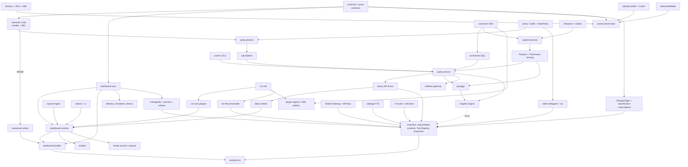

# 30 — Roadmap Arquitetural, Dependências, Stack Final e Resultado

> Seções do pedido: **§47 Development phases**, **§48 Dependency map**, **§49 Critical path**, **§50 Recommended starting implementation**, **§51 Final recommended technology stack**, §49 do pedido (arquitetura evolutiva), **§60 Resultado final**.

---

## 47. Development phases (arquitetura evolutiva)

Regra: **nenhuma fase produz código descartável.** Cada fase entrega componentes da arquitetura final em sua forma correta, com escopo funcional reduzido.

| Fase | Objetivo | Entregas principais (todas definitivas) | Critério de saída |
|---|---|---|---|
| **0 — Foundation** | Esqueleto correto de ponta a ponta | Monorepo + CI (afetados, segurança, SBOM); `packages/schema` (TypeBox → JSON Schema) e `proto/`; control plane (Fastify, módulos identity/tenancy/access/platform); Tenant Router + `cell_id`; Postgres com RLS e migrations expand/contract; identity broker (OIDC); Cedar; outbox; Temporal (Cloud); OpenTelemetry browser→Node→Rust; design tokens + `ui` base; esqueleto `query-service` (Axum) com auth; Compose de dev; IaC da cell. **Fundações de IA (só contratos):** `ChangeOrigin` em transações/eventos de auditoria, `context.via` no Cedar, regra de `description` obrigatória em schemas públicos, chaves de entitlement `ai.*`, metering com `unit` genérico | Usuário loga num tenant, vê workspace vazio; trace atravessa browser→CP→DP; testes de isolamento multi-tenant verdes |
| **1 — Core Data Platform** | Perguntar dados semanticamente | Connector SDK interno + conectores Postgres, ClickHouse, Snowflake/BigQuery (live); upload CSV/Parquet → Parquet curated → ClickHouse (Flow B); `semantic` crate (entidades, dimensões, measures, metrics simples/ratio, relações, RLS) + publicação/compilação; `query-planner` + `sql-dialects` (spike DataFusion IR) ; cache L2/L3 com fingerprint seguro; Query API Arrow; admission control básico; testes diferenciais. **IA (contratos):** `classification` de campos capturada na descoberta/upload e herdada pelo modelo; `synonyms` e bloco `ai` no schema semântico; `purpose`/`conversationId` e `options.egress` na QDL; tokens delegados com escopo no Query Service | QDL → resultado correto em ≥ 3 dialetos; RLS provada por testes de propriedade; CSV de milhões de linhas consultável |
| **2 — Dashboard Engine** | **Primeira versão utilizável** | `dashboard-core` (documento, comandos/ops, undo/redo, migrations, runtime state, interações, widget→QDL); `layout-engine` (grid + stack + tabs, breakpoints, mobile derivado); `dashboard-runtime`; `data-runtime` (worker pool, L1, Arrow decode); `viz-sdk` + plugins core (bar/line/area/pie/scatter/heatmap/KPI/table/pivot); filtros, parâmetros, cross-filter, drill-down; builder (canvas, inspector por schema, layers, copy/paste, atalhos); revisões draft/publish/rollback/diff; sharing interno; lineage extraído. **IA (fundações funcionais, úteis sem IA):** **ChangeSet** + camada de proposta + rebase no `dashboard-core` (usado por templates e paste entre dashboards); **Viz Recommender** ("Sugerir visualização"); manifests com `description`/`aiHints`; funções de resumo do documento | Flows A, B e D completos por usuários reais; performance budget da Fase 2 atendido |
| **3 — Advanced Analytics** | Profundidade analítica e distribuição | BEL completa (LOD, time intelligence, calculated fields) + editor com WASM; hierarquias e drill-through; preaggs declaradas + aggregate awareness; Transformation DAG (UI) + import incremental; mapas (choropleth, pontos, H3, viewport queries); exports CSV/Excel/PNG/PDF (render service) + relatórios agendados + alertas; DuckDB-WASM (Flow E); layout `free`; embed iframe com token assinado (Flow F); temas; catálogo/busca básicos; decisão Iceberg. **Trilha paralela AI v1** (time Assistant): Model Gateway (1 provedor via bake-off, `fast`/`standard`, egress guard, quotas, metering), `AIPolicy` (`disabled`/`metadata-only`/`aggregates`), Assistant API (SSE), Context Engine, Tool Registry (metadados, `run_query`, propostas de dashboard/widget/layout/filtro, novo dashboard por objetivo, explicar métrica, recomendar visualização), `assistant-ui` (painel, ações inline, ⌘K, preview), auditoria e telemetria GenAI, evals + red-team | Clientes pagantes em produção; embed em produção para um ISV piloto; **AI v1** com taxa de compilação de propostas ≥ meta dos evals e IA desligável sem regressões |
| **4 — Realtime & Insights** | Dados ao vivo e análise assistida | Kafka-API, ingest gateway, stream processor, ClickHouse MVs, NATS, Realtime Gateway (protocolo WebSocket), `applyDelta` nos plugins, CDC (Postgres/MySQL). **Insights Engine** determinístico + UI sem IA ("Explicar variação", anomalias). **AI v2:** ferramentas de insights com evidências + verificador de grounding, propostas de métricas/campos calculados (draft do modelo + impact analysis), propostas de transformação com preview, `ai.instructions`/`verifiedQuestions`, mapas avançados; pgvector se os evals exigirem | Flow C com SLO de latência; resume/resync testados com caos; Flows H–J com metas de correção nos evals |
| **5 — Extensibility** | Plataforma aberta | SDK público de plugins (viz, action, theme), Connector SDK público + conector declarativo YAML + containers, WASM UDFs, plugin registry com assinatura, sandbox iframe/WASM; Embed SDK JS/React completo (eventos bidirecionais); API pública + SDKs gerados; webhooks; comentários. **AI v3 (parte 1):** assistente em embeds (claim `assistant`), Tool Registry exposto via MCP/API para agentes externos (OAuth, mesmas políticas), ferramentas de IA contribuídas por plugins, narrativas em relatórios agendados e alertas explicados | Terceiro publica plugin e conector sem ajuda do time core |
| **6 — Enterprise** | Requisitos enterprise | SCIM; ABAC/CLS avançados com classificação; governança (certificação, deprecação, access requests, glossário); audit avançado/export SIEM; OpenLineage; **Kubernetes + Helm**; cells dedicadas; BYOK; private networking; self-hosted com licença offline; residência de dados; approvals. **AI v3 (parte 2):** BYO model/endpoints privados, allowlist de provedores e regiões, nível `row-level`, políticas por papel e auditoria de IA exportável | Primeiro cliente enterprise dedicado/self-hosted em produção |
| **7 — Scale & Collaboration** | Escala e colaboração | Multi-cell/multi-região automatizado; migração de tenants entre cells; preaggs recomendadas → automáticas; tier DuckDB; multiplayer (servidor autoritativo + Yjs para texto); change requests/branches; SQL API (Flight SQL/PG wire); WebGPU onde houver ganho. **AI v4:** IA como participante do multiplayer, insights proativos com orçamento, sugestões de preaggs/modelagem por uso, classe de modelo `deep` | Metas de escala de [23 §55](23-infrastructure-and-deployment.md) atingidas |

### Trilha de IA (transversal)

| Nível | Fase | Entrega | Não bloqueia | Bloqueado por |
|---|---|---|---|---|
| Fundações (contratos) | 0–1 | `ChangeOrigin`, `via`, `classification`, `description` obrigatória, QDL `purpose`/`egress`, tokens delegados, entitlements/metering | — (aditivos, baratos) | — |
| Fundações (funcionais) | 2 | ChangeSet/preview/rebase, Viz Recommender, resumos de documento | Core (têm valor próprio) | `dashboard-core` |
| AI v1 | 3 (paralelo) | Copiloto de criação, edição e descoberta | Fase 3 do core (time separado) | Fase 2 completa + catálogo FTS |
| AI v2 | 4 | Analista e modelador | Realtime | Insights Engine, time intelligence/preaggs, Transform DAG |
| AI v3 | 5–6 | Embedded, MCP, plugins, BYO, enterprise | — | Extensibility, Enterprise |
| AI v4 | 7 | Colaborativa e proativa | — | Multiplayer |

Detalhes: [31-ai-assistant](31-ai-assistant.md#22-evolução-por-fases) · Épicos: [32](32-epics-and-implementation-prompts.md).

---

## 48. Dependency map



### Dependency tree (texto)
```text
contratos (schemas, proto, QDL, VizHost)
├── control plane base ← tenancy/RLS/cells, identity broker, Cedar, outbox, OTel
│   ├── semantic authoring ← semantic crate (compile via gRPC/WASM)
│   ├── content (dashboards, revisões) ← dashboard-core
│   ├── pipelines orchestration ← Temporal ← ingest-executor
│   ├── sharing/embedding ← access control
│   └── delivery ← dashboard-core + query-service + render-service
├── data plane
│   ├── semantic → query-planner → sql-dialects
│   ├── connector-sdk → connectors → query-service (live) / ingest-executor (import)
│   ├── policy (Cedar + DataPolicy) → query-planner
│   ├── cache → query-service → Query API
│   ├── ingest-executor → Parquet → ClickHouse → query-service
│   ├── preagg ← planner (matching) + ingest (build)
│   └── realtime-gateway ← stream-processor ← bus
└── frontend
    ├── tokens/ui
    ├── data-runtime ← Query API
    ├── viz-sdk → viz-core / viz-geo
    ├── layout-engine
    ├── dashboard-core → dashboard-runtime → dashboard-builder
    └── embed-sdk ← dashboard-runtime

IA (opcional — nada acima depende disto)
├── fundações: ChangeOrigin, classification, descriptions, via, QDL purpose/egress  (Fases 0–1)
├── ChangeSet + preview + rebase ← dashboard-core                                  (Fase 2)
├── Viz Recommender ← viz-sdk manifests                                            (Fase 2/3)
├── Model Gateway ← AIPolicy, entitlements, metering, OTel                          (Fase 3)
├── Assistant ← Model Gateway, Tool Registry ← (Query API, semantic, content, catálogo, ChangeSet)
│   └── assistant-ui ← dashboard-runtime/builder
├── Insights Engine ← query-service, preaggs, time intelligence                    (Fase 4)
└── AI evals ← tenants fixture (testing/)
```

---

## 49. Critical path

```text
schemas/QDL  →  semantic crate  →  query-planner + sql-dialects (spike DataFusion)  →  query-service + 1 engine (ClickHouse)
   →  Query API (Arrow)  →  data-runtime  →  viz-sdk + 3 plugins  →  dashboard-core + runtime  →  builder (grid + inspector)
```
Paralelizáveis fora do caminho crítico: identity/tenancy/authz (Fase 0), design system, ingestão de arquivos, conectores adicionais, observabilidade, IaC.

**Caminho crítico da IA** (paralelo, não altera o caminho do core):
```text
fundações de contrato (F0–1) → ChangeSet no dashboard-core (F2) → Model Gateway + AIPolicy + egress guard
   → Context Engine + Tool Registry → Proposal Service → assistant-ui + preview → evals/red-team → AI v1
   → Insights Engine (F4) → AI v2
```
O risco principal da trilha de IA é **qualidade/grounding** — por isso os evals são construídos **antes** do lançamento do AI v1, e o bake-off de provedores usa a mesma suíte.

**Maior risco no caminho crítico:** corretude do planner semântico e cobertura de dialetos → por isso o spike e os testes diferenciais acontecem no início da Fase 1, não no fim.

---

## 50. Recommended starting implementation

### Times iniciais sugeridos (time médio/grande, misto)
| Time | Foco | Perfil |
|---|---|---|
| **Platform** | Fase 0: monorepo, CI, IaC, tenancy/RLS/cells, identity, Cedar, OTel, outbox, Temporal | TS + DevOps |
| **Semantic & Query** | semantic crate, BEL, planner, dialetos, query-service, cache, testes diferenciais | **Rust** sênior + analytics engineer |
| **Data Pipelines** | connector SDK, conectores, upload, ingest-executor, Parquet/ClickHouse | Rust + engenharia de dados |
| **Dashboard Engine** | dashboard-core, layout-engine, runtime, data-runtime, viz-sdk + plugins | TS sênior (frontend platform) |
| **Builder & UX** | builder, design system, inspector, editor de expressões | TS + design |
| **Assistant (a partir do fim da Fase 2)** | Model Gateway, orquestrador, Context Engine, Tool Registry, Proposal Service, `assistant-ui`, evals/red-team; depois Insights (junto ao time Semantic & Query) | TS sênior + engenharia de IA aplicada + 1 Rust (Insights) |

### Primeiras 8–12 semanas (ordem)
1. **Semana 1–2:** monorepo, CI, `packages/schema` com DashboardDefinition/QDL/SemanticModel v1 (a partir de [`schemas/`](schemas/)), **incluindo `ChangeOrigin`, `classification`, `description` obrigatória e QDL `purpose`**, `proto/` inicial, ADRs 0001–0010 e 0033–0035 aceitos.
2. **Semana 2–4:** tenancy + RLS + Tenant Router (1 cell) + login via broker; Cedar básico; OTel; esqueleto `query-service` autenticando JWT interno.
3. **Semana 2–6 (paralelo):** **spike do planner** — QDL → DataFusion LogicalPlan → SQL ClickHouse/Postgres; 50 queries de referência; oráculo DuckDB. Decisão registrada (ADR-0007 confirmado ou ajustado).
4. **Semana 4–8:** conector Postgres (live) + upload CSV → Parquet → ClickHouse; semantic model v1 publicável; Query API Arrow + cache L3.
5. **Semana 6–10:** `data-runtime` + `viz-sdk` + `core.bar`/`core.kpi`/`core.table`; `dashboard-core` com documento, comandos e geração de QDL; runtime renderizando um dashboard JSON.
6. **Semana 8–12:** builder mínimo (grid, field picker, inspector por schema, undo/redo), draft/publish → **Flow A e D de ponta a ponta**.

<a id="componentes-primeiro-commit"></a>
### Componentes que precisam nascer corretos desde o primeiro commit
| Componente | Por que não pode ser "corrigido depois" |
|---|---|
| `tenant_id` em toda tabela/chave/objeto + Postgres RLS + Tenant Router/cells | Retrofitar isolamento é reescrita e risco de vazamento |
| Schema de documentos com `schemaVersion`, IDs estáveis, mapas, `extensions` e framework de migrations | Documentos salvos viram dívida permanente |
| Semantic layer como **única** porta de dados + QDL | Se o frontend gerar SQL uma vez, isso se espalha |
| Injeção de políticas no plano lógico | Segurança "por fora" nunca fica correta |
| Fingerprint de cache sobre SQL pós-política | Cache errado = vazamento |
| Contrato `VisualizationPlugin` (até os gráficos core são plugins) | Acoplamento a biblioteca é a dívida mais comum em BI |
| Arrow como wire de dados | Trocar formato depois afeta todo o runtime |
| Propagação de `traceparent` e `tenant_id` em logs/traces | Observabilidade retrofitada fica incompleta |
| Envelope encryption de credenciais | Migrar segredos depois é arriscado |
| Audit log via outbox | Eventos perdidos não se recuperam |
| Jobs idempotentes com publicação atômica | Dados duplicados/corrompidos são irreversíveis |
| Migrations expand/contract | Downtime e rollbacks impossíveis |
| Entitlements como capabilities (separados de flags) | Edições viram `if`s espalhados |
| i18n e a11y no design system | Retrofit é caro em centenas de componentes |
| Versionamento de APIs públicas e contratos | Clientes externos quebram |
| `ChangeOrigin` em ops, revisões e auditoria | Sem isso, mudanças da IA (e de templates/API) ficam indistinguíveis no histórico |
| `context.via` no Cedar + tokens delegados com escopo | Retrofitar a delegação da IA exigiria revisar todos os pontos de autorização |
| `classification` de campos desde a ingestão | Mascaramento para IA/CLS depende de dados já classificados |
| `description` obrigatória em schemas públicos (plugins, ops, ferramentas) | Plugins publicados sem descrições ficam invisíveis à IA e ao inspector |
| ChangeSet como única via de mudanças programáticas no documento | Evita que a IA (ou automações) ganhe um caminho de mutação paralelo |
| Regra "nenhum módulo core depende da IA" (lint) | Dependência acidental tornaria a plataforma inoperante sem IA |

---

## 51. Final recommended technology stack

| Camada | Tecnologia |
|---|---|
| **Frontend** | React 19 + TypeScript (strict), Vite, TanStack Router/Query, Zustand (UI efêmera), DocumentStore próprio (Immer), React Aria Components, Tailwind v4 + CSS variables, DTCG tokens + Style Dictionary, CodeMirror 6, Vitest, Playwright |
| **Visualização** | Contrato `VisualizationPlugin`; Apache ECharts (adapter primário); TanStack Table/Virtual (tabela/pivot próprios); deck.gl (WebGL2 → WebGPU); Vega-Lite (opcional); D3 (utilitários) |
| **Mapas** | MapLibre GL JS, deck.gl, PMTiles (Protomaps/OSM), H3, Martin (MVT, quando necessário) |
| **Browser data** | Web Worker pool, Apache Arrow JS ou Flechette (decidir por benchmark), DuckDB-WASM (lazy), Rust→WASM (`semantic`, kernels geo via `h3o`) |
| **Control plane** | Node.js LTS + TypeScript, Fastify + TypeBox/Ajv, Kysely, Temporal TS SDK, Cedar (WASM), OpenFeature |
| **Data plane** | Rust (Tokio, Axum, Tonic), arrow-rs, DataFusion, Parquet, ADBC + drivers nativos, sqlparser-rs (via DataFusion), Cedar, wasmtime (plugins), rdkafka/async-nats (fase 4) |
| **Exceções** | Render service (Node + Playwright/Chromium), JDBC bridge (Kotlin + Arrow Flight SQL) |
| **Metadados** | PostgreSQL (gerenciado), RLS, PgBouncer/RDS Proxy |
| **Analytical** | ClickHouse (ClickHouse Cloud no SaaS; operador no self-hosted) |
| **Lake** | Object storage S3-compatível + Parquet (ZSTD); Iceberg a decidir na Fase 3 |
| **Cache/coord.** | Valkey |
| **Orquestração** | Temporal (Cloud no SaaS) + outbox/fila Postgres |
| **Streaming (fase 4)** | Kafka API (gerenciado no SaaS / Redpanda self-hosted), NATS, ClickHouse MVs, Debezium (CDC) |
| **Identidade** | Broker OIDC/SAML/MFA/SCIM: Zitadel ou Keycloak (self-hostable) / WorkOS (gerenciado) |
| **Segredos** | KMS (nuvem) / Vault Transit (self-hosted), envelope encryption |
| **Infra** | Docker; ECS Fargate/Cloud Run → Kubernetes + Helm (gatilho); OpenTofu/Terraform; CDN |
| **Observabilidade** | OpenTelemetry; backend OTLP (Grafana stack ou fornecedor); Sentry; query logs em ClickHouse |
| **CI/CD** | GitHub Actions, Turborepo cache, sccache, Semgrep/CodeQL, cargo-deny, osv-scanner, Trivy, Syft, cosign, Changesets |
| **Repositório** | Monorepo: pnpm workspaces + Turborepo, Cargo workspace, just, mise |
| **IA (opcional)** | Módulos `assistant` + `model-gateway` no control plane (loop próprio, adapters por provedor; provedor inicial por bake-off de evals), SSE, Tool Registry com JSON Schema, Insights Engine (Rust, `query-service`), Viz Recommender (TS), `assistant-ui`, pgvector apenas sob gatilho, OTel GenAI, evals em `testing/ai-evals` |

---

## 60. Resultado final

### Arquitetura recomendada (em uma frase)
**Dois monolitos modulares — control plane em TypeScript (isomórfico com o browser) e data plane em Rust (Arrow/DataFusion, compilador semântico compartilhado via WASM) — organizados em cells multi-tenant, com uma semantic layer obrigatória como única porta para os dados, um Dashboard Engine declarativo e headless, e visualizações intercambiáveis por contrato de plugin; storage em Parquet (verdade) + ClickHouse (serving) + warehouses do cliente (live); e um copiloto de IA opcional que orquestra essas mesmas capacidades com o principal do usuário, propondo mudanças como ChangeSets e narrando resultados determinísticos com evidências.**

### Tecnologias rejeitadas e por quê
| Tecnologia | Motivo |
|---|---|
| Microservices desde o início | Custo operacional e de coordenação sem benefício; fronteiras ainda instáveis |
| Highcharts | Licença comercial incompatível com distribuição self-hosted/embedded sem custo OEM |
| Plotly (núcleo) | Peso, estética difícil de alinhar ao design system |
| Mapbox GL v2+ | Licença proprietária e cobrança por uso |
| Druid / Pinot | Operação complexa, joins limitados; ClickHouse cobre os casos |
| Snowflake/BigQuery como store interno | Custo imprevisível por query para serving multi-tenant; lock-in (seguem como fontes) |
| PostgreSQL como warehouse | Não escala analiticamente |
| Polars como núcleo | API Rust instável/menos extensível que DataFusion; duplicaria semântica |
| Airflow / Dagster / Prefect | Orientados a times de dados internos, não a orquestração multi-tenant de produto |
| BullMQ / Celery / workers próprios | Durabilidade, workflows longos e visibilidade insuficientes |
| Pulsar | Operação complexa |
| GraphQL (API pública inicial) | Complexidade de autorização/custo e perda de cache HTTP sem demanda clara |
| CRDT na fundação | Custo alto (validação, migrations, persistência) sem colaboração simultânea ainda |
| Git como armazenamento interno | Multi-tenancy, permissões e consultas inadequadas |
| Kubernetes desde o início | Complexidade sem gatilho (adotar com cells dedicadas/self-hosted) |
| Nomad | Ecossistema menor; enterprise pede K8s |
| react-grid-layout como engine | Não suporta containers heterogêneos, aninhamento e canvas livre |
| Zustand como modelo do documento | Sem comandos, inversos, validação e migrations |
| SharedArrayBuffer como requisito | Exige cross-origin isolation, incompatível com embeds |
| WASM generalizado no browser | Cópias JS↔WASM anulam ganho para resultados agregados |
| Bazel (agora) | Custo de adoção alto para o tamanho atual |
| Construir SSO/SAML próprio | Commodity com alto risco de segurança |
| Text-to-SQL para a IA | Ignora a semantic layer, as métricas oficiais e a segurança compilada |
| IA gerando o documento de dashboard inteiro | Diffs gigantes, perda de edições, sem invariantes (usamos ChangeSets) |
| IA executando código gerado (Python/SQL/JS) | Risco de segurança; transformações usam o catálogo oficial de ops |
| Service account privilegiada para a IA | Violaria "nunca mais que o usuário" |
| Frameworks pesados de agentes no núcleo | Escondem política, egress, budget e auditoria; API instável |
| Banco vetorial dedicado | pgvector no Postgres existente cobre o caso, sob gatilho |
| Fine-tuning próprio (agora) | Custo e manutenção sem ganho comprovado sobre bom contexto |

### Maiores riscos técnicos
1. Corretude da semantic layer (fan-out, semi-aditivas, totais, LOD, time intelligence).
2. Cobertura de dialetos via DataFusion IR/unparser.
3. Densidade de engenheiros Rust.
4. ClickHouse com muitos tenants/tabelas pequenas.
5. Escopo de produto amplo diluindo foco.
6. Segurança de embeds/plugins e isolamento multi-tenant.
7. Qualidade/grounding da IA e vazamento de dados para provedores (R15–R19).
(Detalhes e mitigações em [26 §45](26-failures-and-risks.md).)

### Decisões que precisam ser tomadas agora
| Decisão | Por que agora | Recomendação |
|---|---|---|
| Linguagens por plano (TS control / Rust data) | Define times e contratação | Aceitar ADR-0001 |
| Formato do documento e QDL v1 | Todo o resto depende | Aceitar ADR-0002/0003/0006 |
| Modelo de multi-tenancy (cells + RLS) | Impossível retrofitar | Aceitar ADR-0016 |
| Engine de serving (ClickHouse) e lake (Parquet) | Fase 1 | Aceitar ADR-0009 |
| **Provedor de nuvem primário** | IaC, serviços gerenciados, KMS | Escolher (AWS é o default implícito deste blueprint; GCP equivalente) |
| **Modelo de licença do core** (open-core? Apache/AGPL/BSL) | Afeta dependências e estratégia | Decidir antes do primeiro release público; política de licenças no CI desde já |
| **Residência de dados inicial** (ex.: Brasil/LGPD) | Região da primeira cell | Definir mercado inicial |
| **Identity broker** (Zitadel vs Keycloak vs WorkOS) | Fase 0 | Zitadel se self-hosted for estratégico cedo; WorkOS se SaaS-only por 18+ meses |
| Fornecedor de observabilidade | Pode ser adiado (OTLP) | Começar com stack Grafana gerenciada |
| **IA como camada opcional, principal delegado e ChangeSets** | Afetam contratos do core desde a Fase 0 | Aceitar ADR-0033, 0034, 0035 |
| **Classificação de dados e descrições obrigatórias** | Dados e plugins criados sem elas viram dívida | Aceitar emendas de ADR-0003/0037 |
| **Postura de privacidade padrão da IA** (nível padrão do SaaS, retenção, logging de prompts) | Afeta contratos e termos com provedores | ✅ **Decidido (2026-10-06):** `aggregates`, retenção de 30 dias, logging `metadata` (sem conteúdo). Pendente apenas a ação de revisão jurídica dos termos com o provedor escolhido (DPA, retenção zero, região) |

<a id="decisoes-adiaveis"></a>
### Decisões que podem ser adiadas (com gatilho)
| Decisão | Gatilho de reavaliação |
|---|---|
| Kubernetes | Primeira cell dedicada/self-hosted; > ~8–10 serviços; operar OSS stateful por custo |
| Kafka/NATS | Início da Fase 4 (realtime) |
| Apache Iceberg | Fase 3: BYO lakehouse, commits concorrentes, maturidade iceberg-rust/catálogo |
| Tier DuckDB de serving | Nº de tabelas/parts ou custo de datasets pequenos no ClickHouse |
| Trino / federação pesada | Demanda recorrente por joins entre fontes grandes sem import |
| StarRocks | Workloads importados dominados por joins grandes com p95 fora do orçamento |
| CRDT / multiplayer | Fase 7 ou demanda comercial explícita |
| Zanzibar (SpiceDB/OpenFGA) | Grafo de compartilhamento grande demais para Postgres + cache |
| GraphQL | Demanda de integradores |
| Renderizadores WebGPU próprios | Visual específico com gargalo comprovado no deck.gl/ECharts |
| Preaggs automáticas | Fase 7 com dados de query log suficientes |
| Engine de busca dedicado | Relevância/volume insuficientes no Postgres FTS |
| Temporal Rust SDK | Quando atingir maturidade equivalente aos SDKs TS/Go |
| Arrow JS vs Flechette | Benchmark na Fase 1 |
| Provedor de modelo inicial | Início do AI v1: bake-off com a suíte de evals |
| Multi-provedor / classe `deep` | Evals mostrando ganho por tarefa, ou exigência de cliente |
| Busca vetorial (pgvector) | Recall insuficiente nos evals ou catálogos com milhares de campos |
| BYO model / endpoints privados | Primeiro cliente enterprise que exija (Fase 6) |
| MCP / Tools API externa | Fase 5, com demanda de agentes externos |
| Ferramentas de IA de plugins | Fase 5, após o sandbox de plugins |
| Extração do Model Gateway | Consumidores fora do control plane ou rede privada dedicada |
| Fine-tuning | Dados de evals mostrando ganho de custo/qualidade |

### Roadmap e ordem de implementação
Ver [§47](#47-development-phases-arquitetura-evolutiva), [§49](#49-critical-path) e [§50](#50-recommended-starting-implementation).

### ADRs iniciais
Ver [adr/README.md](adr/README.md) — 41 ADRs (0033–0041 cobrem a IA nativa; 18 ADRs anteriores receberam emendas aditivas). Épicos e prompts de implementação: [32](32-epics-and-implementation-prompts.md).
