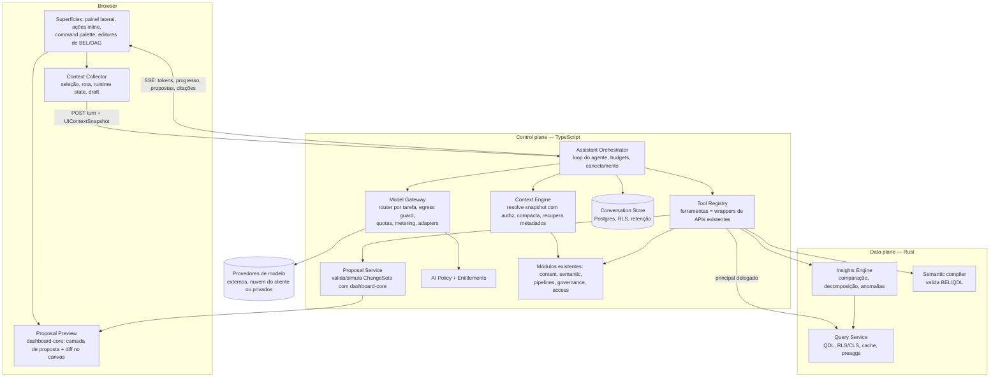
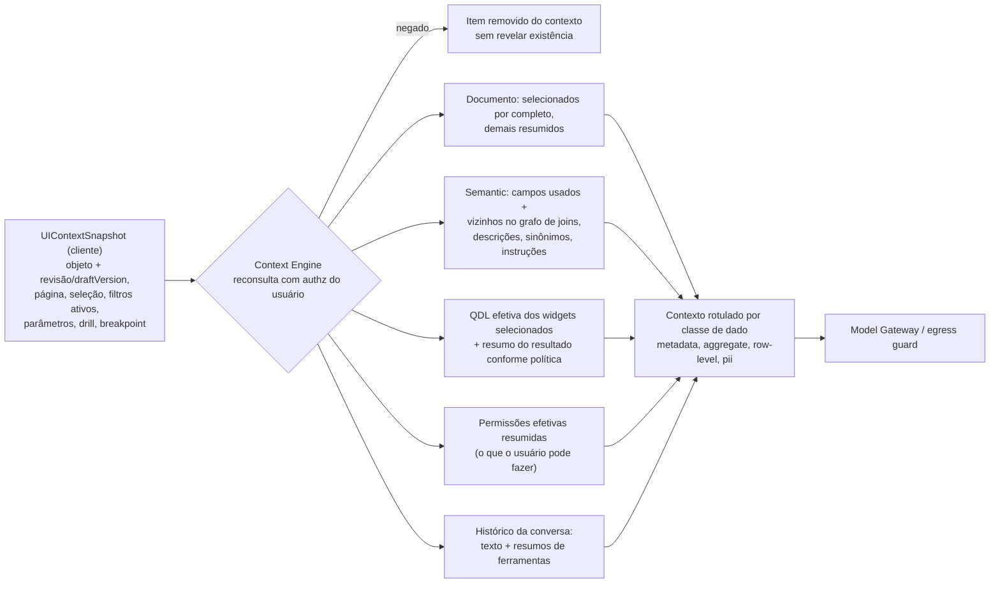
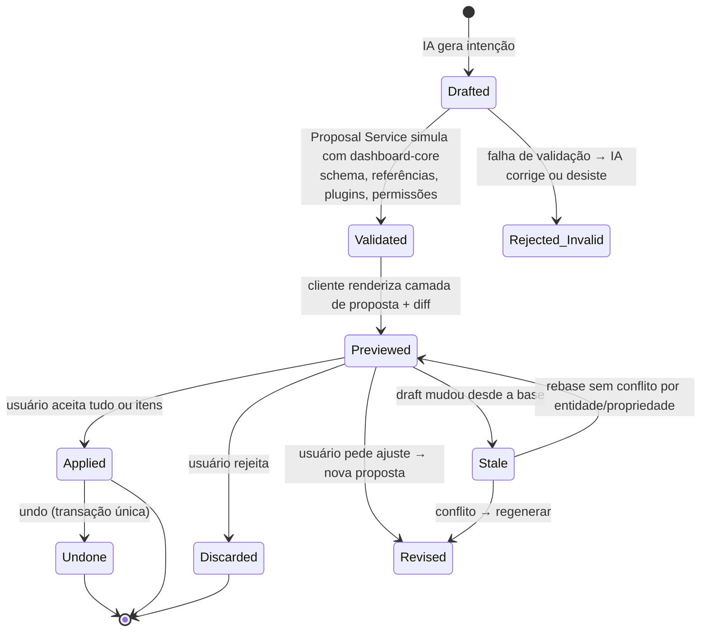

# 31 — IA Nativa: Copiloto Contextual da Plataforma

> Capacidade transversal. Este documento é o **centro de referência** da IA; os impactos estão incorporados em cada documento afetado (ver [§24 — Impacto por componente](#24-impacto-por-componente)). Contratos: [`schemas/assistant.ts`](schemas/assistant.ts). ADRs: [0033](adr/ADR-0033-ai-optional-orchestration-layer.md)–[0041](adr/ADR-0041-ai-quality-evals.md).

---

## 0. Decisões em uma página

| # | Decisão | ADR |
|---|---|---|
| 1 | A IA é uma **camada opcional de orquestração** sobre capacidades que já existem na plataforma. Ela não tem caminho privilegiado para dados ou documentos, e a plataforma funciona 100% sem ela | [0033](adr/ADR-0033-ai-optional-orchestration-layer.md) |
| 2 | A IA **age como o usuário, nunca acima dele**: usa um principal delegado (`via: assistant`) avaliado pelo Cedar e passa pelas mesmas RLS/CLS do Query Engine | [0034](adr/ADR-0034-ai-delegated-principal.md) |
| 3 | A IA **não muta estado diretamente**: gera **ChangeSets** (operações do próprio Dashboard Engine) que passam por preview, confirmação, rebase quando o estado mudou, undo e auditoria. Ela nunca publica, apaga objetos publicados, compartilha nem concede acesso | [0035](adr/ADR-0035-ai-change-proposals.md) |
| 4 | Todo acesso a modelos passa por um **Model Gateway** único (abstração de provedores, roteamento por classe de tarefa, *egress guard*, quotas, metering, telemetria) | [0036](adr/ADR-0036-model-gateway.md) |
| 5 | **Política de IA por tenant** com níveis de acesso a dados (`disabled` → `metadata-only` → `aggregates` → `row-level`), allowlist de provedores, modelo próprio (BYO), retenção e logging | [0037](adr/ADR-0037-ai-data-access-policy.md) |
| 6 | **A IA narra, a plataforma calcula.** Análises ("por que caiu?", outliers, comparação de períodos) e recomendações de visualização são capacidades **determinísticas** da plataforma (*Insights Engine*, *Viz Recommender*), também disponíveis sem IA | [0038](adr/ADR-0038-deterministic-insights-and-recommenders.md) |
| 7 | **Grounding por geração estruturada**: a IA produz QDL, BEL, ops de documento e ops de DAG, sempre validados pelos compiladores e schemas que já existem. Toda afirmação numérica cita a consulta que a sustenta | [0039](adr/ADR-0039-ai-grounding.md) |
| 8 | **Conversas pertencem ao usuário**, ficam no escopo do workspace e são ancoradas a objetos. O contexto é **remontado a cada turno** a partir do estado atual, e a retenção segue a política do tenant | [0040](adr/ADR-0040-ai-conversations.md) |
| 9 | **Qualidade como código**: prompts versionados, evals que bloqueiam o CI, red-team de injeção e vazamento, modelos fixados por rota | [0041](adr/ADR-0041-ai-quality-evals.md) |

**Quando:** as fundações baratas entram nas Fases 0–2 (sem bloquear o core). O **AI v1** (criação, edição e descoberta) entra na **Fase 3** como trilha paralela. O **AI v2** (análise investigativa, métricas, transformações) entra na **Fase 4**, junto com o Insights Engine. Embedded, BYO model, MCP e tools de plugins vêm nas Fases 5–6. Detalhes em [§22](#22-evolução-por-fases).

---

## 1. Papel da IA no produto

A IA é um **copiloto contextual**: um colaborador que vê o que o usuário vê, entende os conceitos da plataforma (dashboards, widgets, métricas, filtros, modelos, pipelines) e trabalha **com as mesmas ferramentas que o usuário**.

| Modo | Exemplos | O que a IA produz | Quem executa |
|---|---|---|---|
| **Criar** | "Crie um dashboard de vendas", "gráfico de faturamento por estado" | ChangeSet (novo dashboard/página/widgets) | Dashboard Engine, após confirmação |
| **Editar** | "Deixe horizontal", "metade da largura", "organize esses 4" | ChangeSet sobre o draft | Dashboard Engine (undo disponível) |
| **Analisar** | "Por que caiu?", "outliers?", "compare com o período anterior" | Narrativa sobre resultados do Insights Engine/QDL, com evidências | Query Engine + Insights Engine |
| **Descobrir** | "Onde está faturamento?", "o que significa essa métrica?" | Respostas citando objetos do catálogo/semantic layer | Semantic/Catalog APIs |
| **Preparar** | "Converta para data", "remova duplicados", "una datasets" | Proposta de ops de DAG com preview | Transformation Engine, após confirmação |
| **Modelar** | "Crie uma métrica de ticket médio" | Proposta de draft do modelo semântico (BEL) + impact analysis | Semantic compiler; publicação continua humana |

### Princípio fundador: *AI-native, AI-optional*
- Cada capacidade usada pela IA é **uma capacidade da plataforma exposta como ferramenta**. Se não existe sem IA, primeiro vira capacidade determinística (com API e, quando fizer sentido, UI própria), e só depois vira ferramenta.
- Desligar a IA (por tenant, edição ou incidente) **não degrada** Dashboard Engine, Query Engine, Semantic Layer, Builder nem Pipelines.
- A IA nunca é dependência síncrona de componentes core: nada no core chama o Model Gateway.

---

## 2. O que aprendemos com produtos modernos

| Produto/padrão | Lição incorporada |
|---|---|
| **Copilots de BI sobre camada semântica** (ex.: Looker + Gemini, dbt Semantic Layer, Cube AI) | Ancorar perguntas na camada semântica (métricas e dimensões governadas) melhora muito a precisão em comparação com text-to-SQL sobre tabelas brutas. **Nossa semantic layer obrigatória é o maior ativo para a IA** |
| **Espaços curados com instruções** (ex.: Databricks AI/BI Genie) | Admins/stewards fornecem instruções, glossário e **perguntas verificadas** (pergunta → consulta confiável). Adotado em [§13](#13-confiabilidade-e-grounding) |
| **"Explain the change" / key influencers** (Power BI, Tableau Explain Data, ThoughtSpot SpotIQ) | Explicações de variação usam algoritmos determinísticos (decomposição de contribuição, anomalias); o modelo de linguagem apenas narra. Adotado em [§9](#9-análise-de-dados) |
| **Copilots de criação de relatórios** (ex.: Power BI Copilot) | Gerar páginas inteiras exige um *contrato estruturado* do relatório. O nosso documento declarativo + comandos cumpre esse papel |
| **Editores de código com IA** (Copilot, Cursor, Claude Code) | Mudanças apresentadas como **diff aceitável/rejeitável**, com contexto explícito (arquivos ou seleção) e chips mostrando o que o modelo vê. Adotado em [§8](#8-ações-modelo-seguro-de-execução) e [§18](#18-experiência-de-uso) |
| **Ferramentas de design com IA** (Figma, Canva) | Seleção na tela como contexto principal ("melhore isso"); ação sobre a seleção. Adotado em [§6](#6-contexto) |
| **Protocolos de ferramentas** (Model Context Protocol) | Ferramentas descritas por JSON Schema e independentes do modelo; o mesmo registro serve o assistente interno e agentes externos (fase posterior) |

---

## 3. Desafios técnicos e arquiteturais

1. **Contexto rico sem estourar janela nem custo**: dashboards e modelos grandes; seleção visual; estado de runtime.
2. **Segurança**: a IA não pode ver nem fazer mais que o usuário; dados sensíveis e segredos não podem vazar para provedores externos; injeção de prompt via conteúdo (títulos, descrições, valores de dados).
3. **Ações confiáveis**: alterações acidentais, estado obsoleto, múltiplas mudanças, undo, auditoria.
4. **Alucinação**: métricas e campos inexistentes, relações falsas, números inventados, conclusões sem evidência.
5. **Análise real**: investigação exige consultas múltiplas, estatística e ranking de explicações, tudo respeitando RLS e custo.
6. **Provedores e modelos**: evolução rápida, preços diferentes, requisitos enterprise (BYO, região, retenção zero).
7. **Custo**: tokens, consultas extras, tamanho de contexto.
8. **Qualidade contínua**: mudanças de modelo/prompt regridem silenciosamente.
9. **Não bloquear o core** e não criar arquitetura paralela.

---

## 4. Abordagens comparadas

### 4.1 Estratégia de integração

| Abordagem | Descrição | Prós | Contras | Veredito |
|---|---|---|---|---|
| A. Chatbot RAG sobre documentação | Responde com base em docs e metadados | Simples | Não age, não analisa dados, não entende a tela | Insuficiente |
| B. Text-to-SQL | Modelo gera SQL sobre tabelas | Flexível | Ignora a semantic layer; risco de RLS; SQL errado e divergente das métricas oficiais; dialetos | **Rejeitado** (viola ADR-0005/0006) |
| C. **Agente com ferramentas sobre contratos da plataforma** | O modelo escolhe ferramentas que encapsulam APIs existentes e gera QDL/BEL/ops validados | Grounding forte, segurança herdada, sem duplicação, ações auditáveis | Exige contratos bem descritos e um catálogo de ferramentas | **Escolhido** |
| D. Modelo gera JSON livre do dashboard e substitui o documento | Geração direta do documento inteiro | Rápido de prototipar | Diffs enormes, perda de edições concorrentes, sem invariantes, validação tardia | Rejeitado (usamos ChangeSets de ops) |
| E. Modelo fine-tuned próprio | Treino específico | Potencial de custo/latência | Caro, dados de clientes, manutenção; ganho incerto contra modelos gerais + bom contexto | Adiado (reavaliar com dados de evals) |

### 4.2 Onde o loop do agente executa

| Opção | Prós | Contras | Veredito |
|---|---|---|---|
| No browser | Acesso direto ao estado da UI | Chaves de provedor expostas; políticas e auditoria contornáveis; embeds de terceiros | Rejeitado |
| No servidor, cego para a UI | Seguro | Não entende seleção ou estado não salvo | Insuficiente |
| **Híbrido: orquestração no servidor + contexto e preview no cliente** | Segurança, auditoria e quotas no servidor; o cliente envia o *UI Context Snapshot* (dica, nunca autoridade) e renderiza propostas com o mesmo `dashboard-core` | Protocolo cliente↔servidor a mais | **Escolhido** |

### 4.3 Onde no backend
**Control plane (TypeScript)**, como novo módulo `assistant` + módulo `model-gateway`. Motivos: o control plane já compartilha `dashboard-core` (consegue **simular e validar ChangeSets no servidor**), schemas, Cedar (WASM), Temporal e outbox; o ecossistema de SDKs de modelos é mais forte em TS. Capacidades de dados pesadas (Insights Engine) ficam no **data plane (Rust)**, no `query-service`, porque são orquestração de queries + estatística sobre Arrow. **Gatilho de extração** do Model Gateway como serviço próprio: outro consumidor fora do control plane, necessidade de rede dedicada para endpoints privados de clientes, ou volume que justifique escalar à parte.

### 4.4 Framework de orquestração
| Opção | Avaliação |
|---|---|
| Frameworks pesados de agentes/RAG | Abstrações amplas e mudanças frequentes de API; esconderiam pontos que precisamos controlar (política, egress, budget, auditoria) |
| SDKs/bibliotecas leves multi-provedor (TS) | Úteis para adapters, streaming, tool calling e structured output |
| **Loop próprio enxuto + interface `ModelGateway` própria** | Controle total de budgets, política, auditoria e telemetria; o loop do agente é pequeno |

**Decisão:** loop e interfaces **próprios**. Por trás da interface de adapters do gateway, pode-se usar SDKs oficiais ou uma biblioteca leve multi-provedor, decidido no spike do AI v1, **sem que tipos de terceiros vazem** para o resto do código.

---

## 5. Arquitetura recomendada

### Componentes

| Componente | Responsabilidade | Reutiliza |
|---|---|---|
| **Assistant UI** (`packages/assistant-ui`) | Painel, ações inline, chips de contexto, renderização de respostas (markdown seguro, citações, gráficos de evidência), preview de propostas | `ui`, `dashboard-runtime`, `viz-core` |
| **Context Collector** (no `dashboard-runtime`/`builder`) | Produz o `UIContextSnapshot`: rota, objeto, revisão/draftVersion, página, seleção, estado de runtime e breakpoint; descarrega o autosave antes de enviar | `RuntimeState`, estado do editor |
| **Assistant Orchestrator** | Loop: planejar → chamar ferramentas → observar → responder; limites de passos, tokens, tempo e custo de query; streaming; cancelamento | — |
| **Context Engine** | Reconsulta tudo do snapshot **com autorização do usuário**; monta um contexto compacto e rotulado por classe de dado; busca metadados relevantes | Content, Semantic, Catalog, Access |
| **Tool Registry** | Definições versionadas (JSON Schema, efeito colateral, permissão Cedar, classe de egress e de custo). Implementações chamam módulos e APIs **existentes** | Todos os módulos |
| **Proposal Service** | Converte intenções em ChangeSets; simula com `dashboard-core` (valida schema, referências, compatibilidade de plugins); calcula o diff; marca o risco | `dashboard-core`, semantic compiler, transform engine |
| **Model Gateway** | Interface única de modelos; roteamento por classe de tarefa; *egress guard*; quotas; metering; cache de prefixo; telemetria GenAI | Entitlements, metering, OTel |
| **Conversation Store** | Conversas, turnos, chamadas de ferramenta (por referência), propostas; retenção por política | Postgres + RLS |
| **Insights Engine** (data plane) | Algoritmos determinísticos executando QDL pelo Query Service | Query Service, semantic |
| **Viz Recommender** (`packages/viz-recommender`, isomórfico) | Ranqueia visualizações por forma dos dados × `dataRequirements`/`aiHints` dos manifests; usado pelo botão "Sugerir visualização" e pela IA | `viz-sdk` manifests |

---

## 6. Contexto

### 6.1 UI Context Snapshot → contexto do modelo

Regras:
1. **O snapshot é dica, não autoridade.** Cada ID é reconsultado com o principal do usuário. Seleção de algo sem acesso equivale a contexto vazio.
2. **Referências dêiticas** ("isso", "esses gráficos", "essa métrica") resolvem para a seleção atual. Sem seleção, para o objeto em foco e o último objeto citado. Se houver ambiguidade, a IA pergunta.
3. **Contexto remontado a cada turno**, sempre do estado atual. O histórico guarda texto e resumos, **nunca** estado de documento antigo como verdade.
4. **Draft como base**: o cliente descarrega o autosave e informa `draftVersion`; propostas usam essa versão como base.
5. **Orçamento de contexto** por classe de tarefa: o widget selecionado vai completo; o restante do dashboard vai em resumo estrutural (tipos, campos e títulos). Do modelo semântico vão só os campos relevantes, e o resto é obtido sob demanda por ferramentas (`search_fields`, `describe_model`).
6. **Chips de contexto** visíveis ao usuário mostram o que a IA está considerando (dashboard, seleção, filtros); o usuário pode remover itens.

### 6.2 Recuperação de metadados
- **Fase 3:** busca lexical (Postgres FTS + trigram, a mesma do catálogo) sobre nomes, labels, descrições, sinônimos e glossário, mais navegação por ferramentas no grafo semântico.
- **Gatilho para busca vetorial:** evals mostrando recall insuficiente em modelos grandes, ou catálogos com milhares de campos. Nesse caso, **pgvector no próprio Postgres** (RLS por tenant, embeddings **apenas de metadados**, gerados por modelo compatível com a política do tenant). Nenhum banco vetorial novo.
- **Valores de dimensão** ("São Paulo" → valor do filtro): resolvidos **sob demanda via QDL** (`contains` + `limit`) com o principal do usuário. Por isso respeitam RLS por construção. Não há índice global de valores.

---

## 7. Ferramentas (Tool Registry)

Cada ferramenta encapsula uma capacidade existente. Não há lógica de negócio nova nas ferramentas.

| Ferramenta | Encapsula | Efeito | Permissão (Cedar) | Fase |
|---|---|---|---|---|
| `get_ui_context` / `get_object` | Content/Semantic APIs | read | `*:view` | v1 |
| `search_catalog` / `search_fields` | Catálogo (FTS) + semantic | read | view no recurso | v1 |
| `describe_metric` / `describe_model` / `explain_relationship` | Semantic snapshot + lineage | read | `model:view` | v1 |
| `list_visualizations` / `recommend_visualization` | Manifests + Viz Recommender | read | — | v1 |
| `run_query` | **Query API (QDL)** com principal delegado | read (dados) | `model:query` + política de IA | v1 (`aggregates`) |
| `lookup_dimension_values` | QDL `contains` + limit | read (dados) | `model:query` | v1 |
| `propose_dashboard_changes` | Proposal Service → ChangeSet (ops do `dashboard-core`) | propose | `dashboard:edit` | v1 |
| `propose_new_dashboard` | Idem + templates | propose | `dashboard:create` | v1 |
| `validate_expression` | Compilador BEL | read | — | v1 |
| `explain_change` / `compare_periods` / `detect_anomalies` / `find_outliers` | **Insights Engine** | read (dados) | `model:query` | v2 |
| `propose_metric` / `propose_calculated_field` | Draft do modelo semântico + compile + impact analysis | propose | `model:edit` | v2 |
| `propose_transformation` / `preview_transformation` | Op catalog do Transformation Engine + preview | propose / read | `pipeline:edit` | v2 |
| `get_lineage` / `impact_analysis` | Governance | read | view | v2 |
| `create_schedule` / `create_alert` | Delivery | propose | `schedule:create` | v3 |
| Ferramentas de plugins | Plugins com permissões declaradas | conforme manifest | conforme manifest | v3+ |

**Ferramentas que não existem, por desenho:** publicar, apagar objetos publicados, compartilhar ou conceder acesso, gerenciar conexões ou credenciais, executar SQL bruto, executar código arbitrário, fazer HTTP para URLs arbitrárias, alterar políticas ou configurações de segurança.

---

## 8. Ações: modelo seguro de execução

### 8.1 Classes de efeito

| Classe | Exemplos | Execução |
|---|---|---|
| **read** | metadados, `run_query` dentro do orçamento, insights | Automática, auditada, com orçamento de custo por turno |
| **propose → draft pessoal** | editar widget, layout, filtro, novo dashboard | ChangeSet com **preview no canvas**. Aplicar = uma transação de undo. Opção do usuário: "aplicar automaticamente mudanças de baixo risco no meu draft" |
| **propose → objeto compartilhado/governado** | métrica no modelo semântico, transformação de pipeline | ChangeSet num **draft do objeto**, com impact analysis (lineage) e confirmação explícita. A publicação segue o fluxo humano normal |
| **proibido** | publicar, apagar publicados, compartilhar, permissões, credenciais | Não há ferramenta |

### 8.2 Ciclo de vida de um ChangeSet

| Risco | Mitigação |
|---|---|
| Alterações acidentais | Preview obrigatório (salvo opt-in para baixo risco no draft pessoal); tudo vai para o **draft**, nunca para o publicado |
| Ações destrutivas | Remoções aparecem destacadas no diff; propostas com remoção nunca são autoaplicadas; nenhum objeto publicado é apagado |
| Fora da permissão | Ferramentas checam Cedar com principal delegado; o Proposal Service revalida no apply; o `dashboard-core` revalida invariantes |
| Estado desatualizado | ChangeSet guarda `baseVersion` e as entidades tocadas; no apply há rebase por entidade/propriedade (a mesma regra prevista para colaboração) ou regeneração |
| Muitas mudanças de uma vez | ChangeSet agrupado por itens com justificativa; aceitar/rejeitar por item; limite de itens por proposta |
| Undo/redo | Um ChangeSet aplicado é **uma transação** na pilha de undo, com rótulo "IA: …" |
| Auditoria | Ops e revisões carregam `origin: assistant` (conversa, proposta, modelo); eventos `assistant.proposal.*` |

---

## 9. Análise de dados

**A IA não calcula; ela investiga com as ferramentas da plataforma e narra resultados verificáveis.**

### Insights Engine (determinístico, data plane)
| Capacidade | Método (determinístico) | Também disponível sem IA |
|---|---|---|
| Comparação de períodos | QDL com modificador PoP; deltas absolutos e % | Menu de contexto "Comparar com período anterior" |
| Explicar variação ("por que caiu?") | **Decomposição de contribuição**: para dimensões candidatas (hierarquias, dimensões conformadas com cardinalidade limitada), calcula o delta por membro, ranqueia por contribuição absoluta e testa efeitos de mix vs. taxa para métricas de razão | "Explicar variação" num ponto de dados |
| Anomalias em séries | Decomposição sazonal robusta + limiares (ex.: z-score robusto/MAD), respeitando o grain | Selo de anomalia em gráficos de linha; alertas (Delivery) |
| Outliers | IQR/MAD em distribuições agregadas | Destaque em scatter/tabelas |
| Drivers ("quais produtos explicam") | Ranking de contribuição em dimensões solicitadas | Idem |

- Executa **somente QDL** pelo Query Service, com o principal do usuário (RLS/CLS, cache, preaggs, cost guard).
- **Orçamento por investigação** (número de queries e bytes).
- Retorna um resultado estruturado com **evidências** (`queryId`s, valores, método, limitações como "apenas 3 meses de histórico").
- A IA escolhe o método, as dimensões candidatas (com a ajuda das hierarquias e descrições), narra e sugere próximos passos (ex.: "criar widget com essa decomposição" vira um ChangeSet).

### Respostas analíticas fundamentadas
- Todo número na resposta tem que vir de um resultado de ferramenta. A resposta é estruturada com **citações** (`evidence: queryId`), e a UI mostra "ver consulta" e "abrir como widget".
- Um **verificador de grounding** confere números citados contra os resultados das ferramentas e marca afirmações sem evidência.
- Com a política `metadata-only`, a IA pode montar a consulta e a visualização, mas **os valores não entram no contexto do modelo**: o usuário vê os dados renderizados, e a IA não narra valores.

---

## 10. Descoberta e entendimento

Ferramentas sobre o catálogo, a semantic layer e o lineage: "onde está faturamento" retorna metrics/dimensions (certificadas primeiro, com owners, descrições e uso); "essas tabelas se relacionam?" consulta o grafo de relacionamentos (e nunca inventa: se não existe relacionamento, a IA diz que não existe e pode **propor** um); "receita bruta vs líquida" usa as descrições de negócio e as fórmulas reais (measures/BEL) do modelo.

---

## 11. Transformação de dados

- A IA gera **operações do catálogo oficial** do Transformation Engine ([10 §13.2](10-transformation-engine.md#132-transformation-dag-ir)), cada uma com JSON Schema e descrição. Expressões são **BEL** validadas pelo typechecker.
- **Preview** em amostra (infra existente) antes de confirmar. A confirmação cria uma revisão draft do pipeline; a execução segue Temporal e os mesmos controles.
- **Sem código arbitrário**: sem Python/JS/SQL gerado. `RAW_SQL` e UDFs não ficam disponíveis para a IA. UDFs de plugins só se instaladas, permitidas e expostas como ferramenta.

---

## 12. Visualizações e mapas

- Manifests de visualização ganham `description` e `aiHints` (bom para, evitar quando, formas de dados suportadas, limites). Os `configSchema` exigem `description` por propriedade. Isso dá à IA conhecimento **real** das capacidades instaladas, inclusive de plugins de terceiros.
- **Viz Recommender** determinístico: forma dos dados (tipos e cardinalidade das dimensões, número de métricas, temporal, geo role) × `dataRequirements` → ranking explicável. A IA usa e justifica.
- Mapas: a IA usa `geo.role` e `boundarySet` do modelo semântico para escolher entre choropleth, pontos e H3. Se não existe fronteira para o nível pedido (ex.: municípios de um país sem `boundarySet`), a IA informa a limitação em vez de improvisar.

---

## 13. Confiabilidade e grounding

| Problema | Mecanismo |
|---|---|
| Métricas/campos inexistentes | IA só referencia **IDs** obtidos por ferramentas; QDL/BEL/ops validados pelos compiladores; erro de compilação volta para a IA corrigir (com limite de tentativas) |
| Interpretação errada de campos | Metadados ricos e obrigatórios para objetos certificados (descrição, unidade, moeda, aditividade, sinônimos); **instruções de IA** por modelo/workspace (glossário, regras como "receita = líquida por padrão") |
| Consultas incorretas | QDL semântica (sem SQL) + semântica de agregação correta do planner; **perguntas verificadas** como exemplos; "ver consulta" sempre disponível |
| Relações falsas | Só o grafo de relacionamentos do modelo; propor relação é ChangeSet no modelo, nunca suposição silenciosa |
| Conclusões sem evidência | Insights determinísticos + citações + verificador de grounding; linguagem de incerteza quando a evidência é fraca |
| Ambiguidade | A IA pergunta (ex.: "faturamento bruto ou líquido?") em vez de escolher às cegas quando as instruções não resolvem |

**Ativos curados** (contexto Semantic/Governance): `aiInstructions` (por modelo e por workspace, versionadas com a revisão), `verifiedQuestions` (pergunta → QDL aprovada por steward), `synonyms` por campo. A certificação de metrics prioriza objetos confiáveis nas respostas.

---

## 14. Segurança, privacidade e multi-tenancy

### 14.1 Principal delegado
- A IA **sempre** age com o principal do usuário + `context.via = "assistant"` no Cedar. Políticas podem **restringir** o que se faz via IA (ex.: "IA não propõe métricas neste workspace"), nunca ampliar.
- No data plane, `run_query`/insights usam um **token delegado de vida curta** (claims do usuário + `via: assistant` + escopo de ferramenta). O Query Service aplica as mesmas RLS/CLS, o cost guard e as quotas, além de **limites de egress** (linhas e colunas máximas que podem voltar ao modelo).
- Não existe service account da IA com acesso amplo.

### 14.2 Egress guard (no Model Gateway)
Todo fragmento de contexto carrega um **rótulo de classe**: `metadata`, `document`, `aggregate-result`, `row-level`, `pii`, `secret`. Antes de qualquer chamada a provedor:
1. aplica a **política de IA** do tenant/workspace (nível de acesso a dados e provedores permitidos);
2. **remove** classes não permitidas; mascara colunas classificadas como PII ou sensíveis (classificação de campos da governança);
3. aplica detecção de padrões (e-mail, CPF/CNPJ, cartões, tokens) como **defesa em profundidade**;
4. registra o que foi enviado (classes e contagens, não o conteúdo, salvo política de logging).

**Segredos:** garantia arquitetural. Credenciais só existem decifradas no data plane ([ADR-0019](adr/ADR-0019-envelope-encryption-secrets.md)), e o assistente roda no control plane sem acesso a plaintext. Nenhuma ferramenta retorna `secretRef`/configs sensíveis.

### 14.3 Níveis de acesso a dados (política do tenant)

| Nível | O modelo vê | Casos |
|---|---|---|
| `disabled` | — | IA desligada (padrão do self-hosted sem configuração) |
| `metadata-only` | Estrutura de documentos, semantic layer, catálogo; **nenhum valor de dado** | Bancos, saúde, governo: a IA cria e edita, mas não lê resultados |
| `aggregates` | + resultados agregados com limites de linhas e colunas; PII mascarada; tamanho mínimo de grupo opcional | **Padrão do SaaS** (decidido) |
| `row-level` | + amostras de linhas dentro dos limites | Tenants que optam explicitamente |

**Postura padrão do SaaS (decidida em 2026-10-06):** `aggregates` + retenção de 30 dias + logging `metadata` (sem conteúdo). Endurecer é livre para o tenant; afrouxar exige opt-in de admin auditado ([ADR-0037](adr/ADR-0037-ai-data-access-policy.md)).

Mais: **allowlist de provedores e regiões**, **BYO model** (endpoint do tenant: nuvem própria do cliente ou modelo privado, com credencial no cofre), **retenção** de conversas (dias, ou modo efêmero sem persistência), **logging de prompts** (`metadata` — padrão, sem conteúdo; `sampled-content`; `full-content`), toggles por modo (análise, criação, modelagem, transformação) e por papel.

### 14.4 Injeção de prompt e saída
- Conteúdo de documentos (títulos, descrições, textos), metadados e **valores de dados** são **não confiáveis**: entram delimitados como dados e nunca como instruções.
- Mitigação estrutural mais forte: **mutações sempre exigem confirmação humana** e não existem ferramentas de exfiltração (sem HTTP arbitrário, sem compartilhamento, sem envio de e-mail sem confirmação).
- Saída renderizada com **markdown seguro**: sem HTML bruto e sem imagens ou links remotos auto-carregados (bloqueia exfiltração por URL); links internos validados.
- Red-team contínuo ([§20](#20-observabilidade-e-qualidade)).

### 14.5 Multi-tenancy
Conversas, turnos e propostas com `tenant_id` + RLS; quotas e metering por tenant/usuário; cache de prefixo do provedor nunca compartilha conteúdo entre tenants (prefixos estáveis só com conteúdo da plataforma ou do próprio tenant); BYO model por tenant; o Model Gateway roteia por região de acordo com a cell (residência de dados).

---

## 15. Provedores e modelos

- **Agora (AI v1):** interface `ModelGateway` com capacidades declaradas (tool calling, structured output por JSON Schema, streaming, cache de prefixo) e **duas classes de tarefa**: `fast` (classificação de intenção, títulos, resumos curtos) e `standard` (agente principal). Um provedor inicial escolhido por **bake-off de evals** no início do AI v1. Critérios: qualidade em tool use e saídas estruturadas nos nossos evals, latência, custo, termos de retenção zero, processamento regional e disponibilidade via marketplaces de nuvem (para BYO futuro).
- **Preparado, não implementado:** classe `deep` (investigações longas), adapters adicionais, adapter genérico para endpoints compatíveis com APIs populares (cobre muitos modelos privados/self-hosted), BYO por tenant.
- **Roteamento por configuração** (tarefa → modelo/versão fixada), nunca hardcoded; troca de modelo passa por evals e canário via feature flag.
- Fine-tuning: adiado.

---

## 16. Custo

| Alavanca | Mecanismo |
|---|---|
| Medição | Eventos de uso por turno: tokens de entrada, saída e cache, modelo, custo estimado, queries executadas, tenant, usuário e superfície → **metering existente** (ClickHouse) |
| Limites | Entitlements: créditos/mês por tenant, rate limit por usuário, limite por turno (passos, tokens, queries/bytes); estimativa antes da chamada no gateway |
| Modelos | Roteamento `fast` vs `standard`; `deep` só sob demanda |
| Contexto | Contexto mínimo + ferramentas sob demanda; resumos de metadados **cacheados por hash de revisão**; prefixo estável (instruções do sistema + definições de ferramentas + metadados do modelo) para aproveitar **cache de prompt** dos provedores |
| Consultas repetidas | `run_query` e insights usam o **cache L2/L3 e as preaggs** do Query Engine |
| O que não cachear | Respostas finais do modelo entre usuários (contexto e permissões diferem). Exceção: artefatos persistidos como objetos (ex.: descrição sugerida aceita) |
| Visibilidade | Custo por tenant/feature no dashboard interno de FinOps; alertas de orçamento; kill switch |

---

## 17. Conversas e histórico

| Questão | Decisão |
|---|---|
| Dono | **Usuário** (privada), dentro de um **workspace** (tenant) |
| Âncora | Opcional: dashboard, modelo, dataset ou pipeline. Uma conversa pode trocar de âncora, e cada turno registra o objeto e a revisão de contexto |
| Trocar de dashboard | A conversa continua; o turno seguinte recebe o novo contexto e um aviso "contexto mudou". Referências antigas ficam no histórico, marcadas com a revisão |
| Persistência | Postgres (`assistant.conversations/turns/tool_calls/proposals`), RLS; resultados de ferramentas guardados **por referência** (queryId + metadados), não dados brutos |
| Retenção | **30 dias por padrão no SaaS**; configurável pelo tenant (N dias) ou **modo efêmero** (nada persistido além de auditoria em metadados) |
| Contexto obsoleto | Remontado por turno; propostas validadas no apply; histórico longo **resumido** (modelo `fast`) mantendo IDs citados |
| Compartilhar | Fase posterior: "compartilhar conversa" vira artefato (snapshot) ou comentário no objeto, com revalidação de permissões de quem recebe |

---

## 18. Experiência de uso

Uma única "inteligência", em várias superfícies:

| Superfície | Uso | Por quê |
|---|---|---|
| **Painel lateral (dock)** persistente entre rotas, com chips de contexto | Conversa, investigação, criação guiada | Continuidade e transparência do contexto |
| **Ações inline contextuais** | Menu do widget ("Explicar", "Melhorar", "Trocar visualização"), barra flutuante de multi-seleção ("Organizar"), ponto de dados ("Explicar variação"), métrica ("Explicar"), dataset ("Que análises posso fazer?") | Contexto implícito pela seleção, sem precisar descrever |
| **Command palette (⌘K)** com linguagem natural | Edições rápidas ("metade da largura", "adicionar filtro de período") | Fluxo de teclado do builder |
| **Editores especializados** | BEL (descrever → fórmula), DAG ("descreva a transformação"), modelo semântico (sugerir descrições e sinônimos) | IA dentro da ferramenta certa |
| **Estado vazio** | "Criar dashboard a partir de um objetivo" | Onboarding |

**Propostas** aparecem como **camada de preview no canvas** (widgets fantasmas, diff colorido como no diff de revisões), com aceitar, rejeitar ou ajustar por item. Respostas analíticas incluem mini-visualizações de evidência, renderizadas pelos **mesmos plugins** de visualização.

---

## 19. Auditoria

| Evento | Conteúdo (sempre) | Conteúdo (se a política permitir) |
|---|---|---|
| `assistant.turn.completed` | usuário, tenant, conversa, superfície, modelo/provedor/região, classes de dados enviadas, tokens, custo, ferramentas chamadas | Texto do prompt e da resposta |
| `assistant.query.executed` | queryId, hash da QDL, modelo semântico/revisão, linhas devolvidas ao modelo | — |
| `assistant.proposal.created/applied/discarded/undone` | ChangeSet (ops resumidas), objeto/revisão base, itens aceitos | — |
| `assistant.policy.blocked` | egress removido, ferramenta negada, quota | — |
| Mudanças em objetos | `origin: {kind: "assistant", conversationId, proposalId, model}` nas ops/revisões | — |

Mesmo pipeline de auditoria (outbox → audit log → SIEM). Exportável no enterprise.

---

## 20. Observabilidade e qualidade

- **Traces:** turno → chamadas de modelo (convenções semânticas GenAI do OpenTelemetry: modelo, tokens, latência) → ferramentas → `query.request` → engine. **O trace de uma resposta da IA chega até o SQL executado.**
- **Métricas:** tempo até o primeiro token, latência do turno, erros por provedor, erros de ferramenta, **taxa de falha de compilação** de QDL/BEL/ops gerados, taxa de aceitação/rejeição/undo de propostas, custo por turno/tenant, bloqueios do egress guard, quotas atingidas, feedback (👍/👎).
- **Evals como código** (`testing/ai-evals/`): tenants fixture com modelos semânticos e dados sintéticos; tarefas golden (pergunta → QDL/ChangeSet/fatos numéricos esperados); métricas de correção; **gate no CI** para mudanças de prompt, ferramentas ou modelo; canário por flag.
- **Red-team:** injeção via títulos/descrições/valores; tentativas de vazamento entre tenants e de violar RLS/CLS; pedidos de ações proibidas; exfiltração por links.

---

## 21. Embedded, plugins, MCP e colaboração

| Tema | Decisão | Fase |
|---|---|---|
| **Embedded** | ISV habilita o assistente para usuários finais com ferramentas restritas (análise e descoberta; edição só em visões pessoais); claim `assistant` no token de embed; custo atribuído ao tenant do ISV; política do ISV | 5–6 |
| **Plugins** | Viz plugins fornecem `aiHints`. Plugins podem **contribuir ferramentas** com permissões declaradas e aprovadas pelo admin, executadas nos sandboxes existentes | 5+ |
| **MCP / agentes externos** | O **mesmo Tool Registry** exposto como servidor MCP/API para agentes externos autenticados como o usuário (OAuth), com as mesmas políticas. Consumir ferramentas MCP externas dentro do assistente: adiado (risco de injeção) | 5–6 |
| **Colaboração** | A IA vira participante: no multiplayer, suas ops passam pelo merge autoritativo, com presença "IA editando"; comentários podem ser resumidos | 7 |
| **Versionamento** | Mudanças da IA vão para drafts; revisões registram a participação da IA; publicar continua humano | v1 |
| **Delivery** | Narrativas automáticas em relatórios agendados; alertas de anomalia com explicação (Insights + `fast`) | 5–6 |

---

## 22. Evolução por fases

| Nível | Fase | Capacidades | Depende de |
|---|---|---|---|
| **Fundações (sem IA visível)** | 0–2 | `origin` em ops/revisões/auditoria; principal delegado no Cedar (`via`); ChangeSet/camada de proposta no `dashboard-core`; `description` obrigatória em schemas de plugins/ops; classificação de campos (PII/sensível); `purpose`/`conversationId` na QDL; chaves de entitlement `ai.*`; unidades de metering genéricas | Nada novo — ajustes de contrato |
| **AI v1 — Copiloto de construção e descoberta** | 3 (trilha paralela) | Painel + ações inline + ⌘K; contexto da UI; ferramentas de metadados, `run_query` (`aggregates`), propostas de dashboard/widget/layout/filtro, novo dashboard por objetivo, explicar métrica/dashboard, Viz Recommender; Model Gateway (1 provedor, `fast`+`standard`, egress guard, quotas, metering); política (`disabled`/`metadata-only`/`aggregates`); auditoria; evals | Fase 2 completa (`dashboard-core`, builder, Query API, semantic) + catálogo FTS |
| **AI v2 — Analista e modelador** | 4 | Insights Engine (comparação, explicar variação, anomalias, outliers); respostas com evidência e verificador; propostas de métricas/campos calculados; propostas de transformação com preview; instruções e perguntas verificadas; mapas avançados; busca vetorial se os evals pedirem | Preaggs + time intelligence (Fase 3), Transform DAG (Fase 3) |
| **AI v3 — Plataforma e enterprise** | 5–6 | Embedded assistant; MCP/API de ferramentas; ferramentas de plugins; BYO model, allowlist e região; nível `row-level`; narrativas em relatórios; alertas explicados; schedules/alertas por IA | Extensibility (5), Enterprise (6) |
| **AI v4 — Colaborativa e proativa** | 7 | IA no multiplayer; insights proativos (com orçamento); sugestões de preaggs/modelagem por uso | Fase 7 |

### O que deve ser ajustado agora no core (lista executável)
1. `packages/schema`: tipo `ChangeOrigin` e `origin` em transações/revisões; `QueryRequest.context.purpose` com `"assistant"` + `conversationId`/`toolCallId`; `description` obrigatória em `configSchema` de plugins e no catálogo de ops; `aiHints` opcional em manifests; `classification` em campos.
2. `dashboard-core`: **ChangeSet** como cidadão de primeira classe (aplicar como transação, camada de preview efêmera, rebase por entidade). Isso também serve para templates, importação, paste entre dashboards e colaboração futura.
3. Access Control: `context.via` nas políticas Cedar; tokens delegados de vida curta no data plane.
4. Audit/outbox: campo `origin` nos eventos.
5. Metering: esquema de eventos com `unit` genérico (tokens incluídos).
6. Entitlements: capabilities `ai.assistant`, `ai.analysis`, `ai.modeling`, `ai.transform`, `ai.byo_model` e limites.
7. Semantic: `synonyms`, `aiInstructions`, `verifiedQuestions` no schema (preenchimento depois).

Custo estimado dessas fundações: pequeno. São extensões aditivas de contrato que já têm valor sem IA (origin = auditoria; ChangeSet = templates/paste/colaboração; descriptions = inspector e documentação; classificação = governança).

---

## 23. Riscos adicionados

| Risco | Mitigação |
|---|---|
| Respostas analíticas erradas com aparência confiável | Insights determinísticos, citações, verificador de grounding, "ver consulta", linguagem de incerteza |
| Vazamento de dados para provedores | Egress guard com classificação, níveis de política, BYO, retenção zero contratual, auditoria de egress |
| Injeção de prompt levando a ações indesejadas | Confirmação humana para mutações, ausência de ferramentas de exfiltração, conteúdo tratado como dado, red-team |
| Custo descontrolado | Quotas, budgets por turno, roteamento, cache, kill switch, FinOps |
| Regressões por mudança de modelo | Versões fixadas, evals no CI, canário |
| Dependência de fornecedor | Model Gateway com adapters; roteamento por configuração |
| IA virar caminho paralelo ao core | Regra arquitetural: ferramentas só encapsulam APIs existentes; revisão de ADR para nova ferramenta |
| Expectativa de autonomia total | UX de proposta/preview; limites claros comunicados pela própria IA |

---

## 24. Impacto por componente

| Componente | Mudança | Onde |
|---|---|---|
| Princípios e capability map | P16 (*AI-native, AI-optional*), novos ramos no mapa | [00](00-executive-summary.md) |
| Arquitetura geral | Assistant + Model Gateway + Insights no diagrama; regras de placement | [01](01-high-level-architecture.md) |
| Domínio | Novo contexto **Assistant**; Insights no Query & Acceleration; eventos `assistant.*` | [02](02-domain-architecture.md) |
| Frontend | `assistant-ui`, Context Collector, camada de proposta | [04](04-frontend-architecture.md) |
| Dashboard Engine | ChangeSet, `origin`, rebase | [05](05-dashboard-engine.md) |
| Builder | Preview no canvas, seleção → contexto, ⌘K | [06](06-dashboard-builder.md) |
| Visualização / mapas | `aiHints`, `description` obrigatória, Viz Recommender | [07](07-visualization-engine.md), [08](08-geospatial.md) |
| Conectores / ingestão | Descrições de conectores e streams; nenhum acesso da IA a credenciais | [09](09-ingestion-and-connectors.md) |
| Transformação | Catálogo de ops com schema/descrição; propostas com preview | [10](10-transformation-engine.md) |
| Semantic layer | Sinônimos, instruções, perguntas verificadas, classificação | [11](11-semantic-layer.md) |
| Query Engine | `purpose: assistant`, limites de egress, Insights Engine | [12](12-query-engine.md) |
| Backend | Módulos `assistant`, `model-gateway`; Insights no `query-service` | [15](15-backend.md) |
| Multi-tenancy | Isolamento de conversas, quotas, BYO por tenant, roteamento regional | [16](16-multi-tenancy.md) |
| Segurança | Principal delegado, egress guard, injeção de prompt | [17](17-security-and-permissions.md) |
| Plugins | `aiHints`, ferramentas de plugins | [18](18-plugins.md) |
| Embedded | Claim `assistant` | [19](19-embedded-analytics.md) |
| APIs e contratos | Assistant API (SSE), Tool Registry, MCP, novos contratos | [20](20-api-and-contracts.md) |
| Versionamento / colaboração | `origin`, IA como participante | [21](21-versioning-and-collaboration.md) |
| Observabilidade / governança | GenAI telemetry, auditoria, instruções curadas | [22](22-observability-lineage-governance.md) |
| Infra / custo | Centro de custo IA, egress para provedores | [23](23-infrastructure-and-deployment.md) |
| Testes / flags / edições | Evals, red-team, entitlements `ai.*` | [24](24-testing-and-cicd.md) |
| Repositório | Novos pacotes/módulos/crates | [25](25-repository.md) |
| Riscos | Novos cenários de falha e riscos | [26](26-failures-and-risks.md) |
| Avaliação tecnológica | Frameworks, busca vetorial, provedores | [27](27-technology-evaluation.md) |
| Fluxos | Flows G–J | [28](28-flows.md) |
| Schemas | `assistant.ts` + extensões | [29](29-schemas.md) |
| Roadmap / caminho crítico / épicos | Fases, dependências, decisões | [30](30-roadmap.md), [32](32-epics-and-implementation-prompts.md) |
